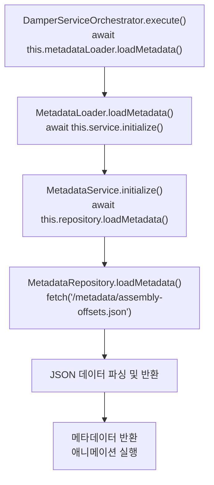

# Metadata 로드 호출 흐름 분석

## 1. 호출 흐름 다이어그램



## 2. 상세 호출 순서

| 순서 | 클래스 | 메서드 | 역할 |
|------|--------|--------|------|
| 1 | `DamperServiceOrchestrator` | `execute()` | 오케스트레이터 실행, 메타데이터 선행 로드 보장 |
| 2 | `MetadataLoader` | `loadMetadata()` | 메타데이터 서비스 초기화 및 원본 데이터 반환 |
| 3 | `MetadataService` | `initialize()` | 레포지토리에 데이터 로딩 요청 |
| 4 | `MetadataRepository` | `loadMetadata()` | JSON 파일을 HTTP fetch로 로드하고 캐싱 |

## 3. 코드 위치

### DamperServiceOrchestrator.ts (Line 83)
```typescript
await this.metadataLoader.loadMetadata();
```

### MetadataLoader.ts (Line 27-31)
```typescript
public async loadMetadata(): Promise<AssemblyOffsetMetadata> {
    await this.service.initialize();
    return (this.service as any).repository.getRawMetadata() as AssemblyOffsetMetadata;
}
```

### MetadataService.ts (Line 28-30)
```typescript
public async initialize(): Promise<void> {
    await this.repository.loadMetadata();
}
```

### MetadataRepository.ts (Line 24-42)
```typescript
public async loadMetadata(): Promise<AssemblyOffsetMetadata> {
    if (this.metadata) {
        return this.metadata;
    }
    try {
        const cacheBuster = `?t=${Date.now()}`;
        const response = await fetch(this.filePath + cacheBuster);
        this.metadata = await response.json() as AssemblyOffsetMetadata;
        return this.metadata;
    } catch (error) {
        console.error('메타데이터 로딩 실패:', error);
        throw error;
    }
}
```

## 4. 핵심 포인트

1. **선행 로드 보장**: `DamperServiceOrchestrator.execute()` 메서드 시작 시점에 `await this.metadataLoader.loadMetadata()`를 호출하여 모든 후속 애니메이션 작업 전에 메타데이터가 로드됨을 보장

2. **캐싱机制**: `MetadataRepository`는 첫 로드 시 JSON 파일을 fetch하고 `this.metadata`에 캐싱하여 중복 로드 방지

3. **캐시 버스터**: 브라우저 캐시를 우회하기 위해 `?t=${Date.now()}` 쿼리 파라미터 추가
