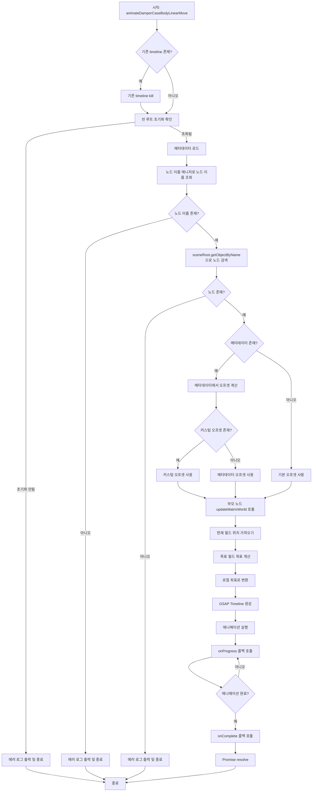
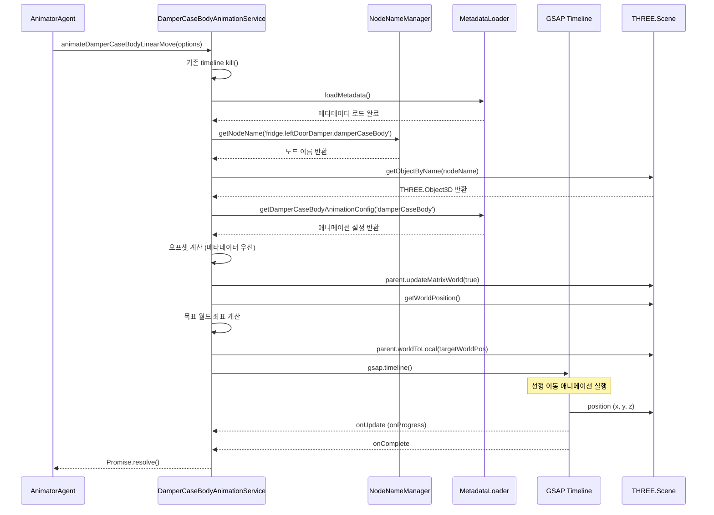

---
tags:
상태: Todo
중요:
생성일: 26-02-04T16:54:55
수정일: 26-02-10T16:22:10
종료일:
라벨:
  - 냉장고
  - codeRef
summary:
---
## 0. 참고 레퍼런스
- 
##  ■■ Description ■■
- 
# DamperCaseBody 선형 이동 애니메이션 구현 계획서
## 1. 개요
### 1-1 목적
- `damperCaseBody` 노드를 힌지 반대 방향으로 선형 이동시켜 분리했던 스크류 바로 옆의 구멍과 일치시키는 애니메이션 구현
- 재사용 가능한 컴포넌트로 구현하여 유지보수성 향상
- 기존 프로젝트의 유틸리티와 서비스를 적극 활용
### 1-2 요구사항
1. `public/metadata/node-names.json`에 `fridge.leftDoorDamper.damperCaseBody`에 `MBN66561101_Case,Body_18065`가 추가됨
2. `damperCaseBody` 노드를 힌지 반대 방향으로 약간 옮겨 분리했던 스크류 바로 옆의 구멍과 일치하도록 선형이동
3. `src/services/AnimatorAgent.ts:1001`에 `damperCaseBody 힌지 반대 방향으로 선형이동 애니메이션` 주석 아래에 코드 추가
4. 선형이동 코드는 새로운 컴포넌트 파일로 작성하여 관리
5. 프로젝트에서 재활용 가능한 속성이나 함수 등을 찾아보고 활용
6. `src/shared/utils/NodeNameManager.ts`를 임포트하여 `private nodeNameManager = getNodeNameManager();`로 노드를 호출하여 사용
### 1-3. Todo 리스트
1. **메타데이터 설정 확인 및 추가**
    - `node-names.json`에 `damperCaseBody` 노드 이름 확인
    - `assembly-offsets.json`에 `damperCaseBodyAnimations` 섹션 추가
    - `MetadataLoader.ts`에 `getDamperCaseBodyAnimationConfig()` 메서드 추가
2. **새로운 서비스 파일 생성**
    - `DamperCaseBodyAnimationService.ts` 파일 생성
    - `NodeNameManager`를 활용하여 노드 이름 관리
    - `animateDamperCaseBodyLinearMove()` 메서드 구현
3. **AnimatorAgent.ts 통합**
    - 서비스 인스턴스 추가
    - 초기화 코드 추가
    - line 1001 주석 아래에 애니메이션 실행 코드 추가
4. **테스트**
    - 힌지 반대 방향으로 이동하는지 확인
    - 스크류 바로 옆의 구멍과 일치하는지 확인
## 2. 기존 프로젝트 분석
### 2.1 재활용 가능한 유틸리티 및 서비스
#### 2.1.1 `PartAssemblyService.ts`
- `movePartRelative(nodeName, offset, duration)`: 
	- 특정 노드를 현재 위치에서 상대적으로 이동시키는 메서드
- **장점**: 이미 구현된 상대적 이동 로직을 재사용 가능
- **사용 예시**:
  ```typescript
  await this.partAssemblyService.movePartRelative(
      damperCaseBodyNodeName,
      offsetVector,
      duration
  );
  ```

#### 2.1.2 `CoordinateTransformUtils.ts`
- `getWorldCenter(object)`: 객체의 정확한 월드 중심점 계산
- `worldToLocal(worldPosition, parentObject)`: 월드 좌표를 로컬 좌표로 변환
- `getLocalOffset(source, target)`: 두 객체 간 로컬 오프셋 계산
- **장점**: 정밀한 좌표 변환 로직 제공
#### 2.1.3 `animationUtils.ts`
- `createAnimationTimeline(targetObj, config, callbacks)`: 회전+이동 동시 애니메이션 생성
- `CinematicSequence`: 시네마틱 카메라 시퀀스 빌더
- **장점**: GSAP Timeline 기반의 복잡한 애니메이션 관리
#### 2.1.4 `ScrewAnimationService.ts`
- `animateScrewRotation(nodePath, metadataKey, options)`: 스크류 회전+이동 동시 애니메이션
- **장점**: 메타데이터 기반의 애니메이션 설정 패턴 참고 가능
#### 2.1.5 `DamperCoverAssemblyService.ts`
- `assembleDamperCover(options)`: 댐퍼 커버 조립 로직
- **장점**: 돌출부(Plug)와 홈(Hole) 탐지 및 매칭 로직 참고 가능
### 2.2 메타데이터 구조
#### 2.2.1 `assembly-offsets.json` (스크류 애니메이션 구조 참고)
```json
{
    "screwAnimations": {
        "screw1Customized": {
            "rotationAxis": "z",
            "rotationAngle": 720,
            "extractDirection": [0, 0, 1],
            "extractDistance": 10,
            "duration": 1500,
            "easing": "power2.inOut"
        }
    }
}
```
#### 2.2.2 `damperCaseBodyAnimations` 섹션 추가 (스크류와 유사한 구조)
```json
{
    "damperCaseBodyAnimations": {
        "damperCaseBody": {
            "moveDirection": [-1, 0, 0],  // 힌지 반대 방향 (X축 음수 방향)
            "moveDistance": 0.05,          // 이동 거리 (미터)
            "duration": 1500,              // 애니메이션 시간 (ms)
            "easing": "power2.inOut",
            "offsetAdjustment": 0.0005     // 미세 조정 오프셋 (선택적)
        }
    }
}
```
**메타데이터 구조 설계 원칙:**
- 스크류 애니메이션과 일관된 구조 유지
- `moveDirection`: 월드 좌표계 기준 방향 벡터 [x, y, z]
- `moveDistance`: 이동 거리 (미터 단위)
- `offsetAdjustment`: 완전한 일치를 방지하기 위한 미세 조정값 (선택적)
- `duration`: 애니메이션 시간 (밀리초)
- `easing`: GSAP 이징 함수 이름
## 3. 설계
### 3.0 동작 흐름도


### 3.1 새로운 서비스 파일: `DamperCaseBodyAnimationService.ts`
#### 3.1.1 파일 위치
- `src/services/fridge/DamperCaseBodyAnimationService.ts`
#### 3.1.2 클래스 구조
```typescript
export class DamperCaseBodyAnimationService {
    private sceneRoot: THREE.Object3D | null = null;
    private nodeNameManager = getNodeNameManager();
    private metadataLoader = getMetadataLoader();
    private timeline: gsap.core.Timeline | null = null;
    private isAnimating: boolean = false;

    // 초기화 메서드
    public initialize(sceneRoot: THREE.Object3D): void

    // damperCaseBody 선형 이동 메서드
    public async animateDamperCaseBodyLinearMove(options?: {
        duration?: number;
        offset?: THREE.Vector3;
        onComplete?: () => void;
    }): Promise<void>

    // 기타 유틸리티 메서드
    public isPlaying(): boolean
    public getProgress(): number
    public dispose(): void
}
```
#### 3.1.3 핵심 메서드 설계
**`animateDamperCaseBodyLinearMove` 메서드**
1. 노드 이름 매니저에서 `damperCaseBody` 노드 이름 가져오기
2. 메타데이터에서 이동 오프셋 설정 가져오기 (없으면 기본값 사용)
3. `PartAssemblyService.movePartRelative` 또는 직접 GSAP 애니메이션으로 선형 이동
4. 힌지 반대 방향으로 이동 (오프셋 벡터 활용)
### 3.2 메타데이터 추가
#### 3.2.1 `assembly-offsets.json`에 추가
```json
{
    "damperCaseBodyAnimations": {
        "damperCaseBody": {
            "moveDirection": [-1, 0, 0],  // 힌지 반대 방향 (X축 음수 방향)
            "moveDistance": 0.05,          // 이동 거리 (미터)
            "duration": 1500,              // 애니메이션 시간 (ms)
            "easing": "power2.inOut"
        }
    }
}
```
### 3.3 `AnimatorAgent.ts` 통합
#### 3.3.1 서비스 인스턴스 추가
```typescript
private damperCaseBodyAnimationService = getDamperCaseBodyAnimationService();
```
#### 3.3.2 초기화
```typescript
// initialize 메서드 또는 생성자에서
this.damperCaseBodyAnimationService.initialize(sceneRoot);
```
#### 3.3.3 애니메이션 실행 (line 1001 주석 아래)
```typescript
// damperCaseBody 힌지 반대 방향으로 선형이동
try {
    await this.damperCaseBodyAnimationService.animateDamperCaseBodyLinearMove({
        duration: 1500,
        onComplete: () => {
            console.log('DamperCaseBody 선형 이동 완료');
        }
    });
} catch (error) {
    console.error('DamperCaseBody 선형 이동 실패:', error);
}
```
## 4. 구현 단계
### 4.1 단계 1: `DamperCaseBodyAnimationService.ts` 파일 생성
- [ ] 파일 생성: `src/services/fridge/DamperCaseBodyAnimationService.ts`
- [ ] 클래스 구조 정의
- [ ] `initialize` 메서드 구현
- [ ] `animateDamperCaseBodyLinearMove` 메서드 구현
- [ ] 유틸리티 메서드 구현 (`isPlaying`, `getProgress`, `dispose`)
- [ ] 싱글톤 패턴으로 인스턴스 관리
### 4.2 단계 2: `assembly-offsets.json`에 메타데이터 추가
- [ ] `damperCaseBodyAnimations` 섹션 추가
- [ ] `damperCaseBody` 설정 추가
- [ ] 이동 방향, 거리, 시간, 이징 설정
### 4.3 단계 3: `AnimatorAgent.ts`에 통합
- [ ] 서비스 인스턴스 추가
- [ ] 초기화 코드 추가
- [ ] line 1001 주석 아래에 애니메이션 실행 코드 추가
- [ ] 에러 처리 추가
### 4.4 단계 4: 테스트 및 디버깅
- [ ] 애니메이션 정상 동작 확인
- [ ] 힌지 반대 방향으로 이동하는지 확인
- [ ] 스크류 바로 옆의 구멍과 일치하는지 확인
- [ ] 콘솔 로그 확인
## 5. 기술적 고려사항
### 5.1 힌지 반대 방향 결정
- **냉장고 문의 힌지 위치**: 보통 문의 왼쪽 또는 오른쪽에 위치
- **왼쪽 문의 경우**:
  - 힌지는 왼쪽에 있으므로 힌지 반대 방향은 오른쪽 (+X 방향)
  - `moveDirection: [1, 0, 0]` 설정
- **오른쪽 문의 경우**:
  - 힌지는 오른쪽에 있으므로 힌지 반대 방향은 왼쪽 (-X 방향)
  - `moveDirection: [-1, 0, 0]` 설정
- **현재 구현**: 왼쪽 문(`leftDoorDamper`)이므로 +X 방향으로 이동
- **향후 확장성**: 문 타입에 따라 동적으로 방향 결정 가능

### 5.2 오프셋 계산
- **기본 오프셋**: 메타데이터에서 설정된 `moveDistance`를 기본값으로 사용
- **동적 오프셋 계산** (선택적 구현):
  1. 스크류 노드의 현재 위치 가져오기
  2. 스크류가 분리된 거리 계산
  3. damperCaseBody가 이동해야 할 거리 = 스크류 분리 거리 + 여유 공간
  4. `CoordinateTransformUtils.getWorldDistance()` 활용
- **오프셋 기반 미세 조정** (돌출부 노드를 홈 노드로 결합 코드 분석 참고):
  - **목적**: 완전한 일치를 방지하거나 삽입 깊이 조절
  - **방식**: 이동 거리에서 `offsetAdjustment`만큼 감소
  - **계산**: `normalize().multiplyScalar(reducedDistance)`
  - **기본값**: 0.0005 (실제 모델링 스케일에 따른 상대적 값)
- **오프셋 계산 코드 예시**:
```typescript
// 오프셋 계산 (메타데이터 우선)
let offsetDistance = metadata?.moveDistance ?? 0.05;

// 오프셋 조정 적용
const offsetAdjustment = metadata?.offsetAdjustment ?? 0.0005;
const reducedDistance = Math.max(0, offsetDistance - offsetAdjustment);

// 방향 벡터 계산
const moveDirection = new THREE.Vector3(
    metadata?.moveDirection[0] ?? -1,
    metadata?.moveDirection[1] ?? 0,
    metadata?.moveDirection[2] ?? 0
).normalize();

// 최종 오프셋 벡터
const offsetVector = moveDirection.clone().multiplyScalar(reducedDistance);
```
- **여유 공간**: 구멍과 완벽하게 일치시키기 위해 약간의 여유 공간 필요
- **기본값**: 0.05m (5cm) - 실제 테스트 후 조정 필요

### 5.3 좌표계 고려사항
- **월드 좌표계 vs 로컬 좌표계**:
  - **월드 좌표계**: 씬(Scene) 기준의 절대 좌표
  - **로컬 좌표계**: 부모 노드 기준의 상대 좌표
- **좌표 변환 과정** (Bounding Box & Offset 기반 방식 참고):
  1. damperCaseBody의 현재 월드 위치 가져오기
  2. 오프셋 벡터를 월드 좌표로 계산
  3. 목표 월드 위치 = 현재 월드 위치 + 오프셋
  4. **부모 노드의 `updateMatrixWorld(true)` 호출** (좌표 변환 오차 방지)
  5. 목표 월드 위치를 로컬 좌표로 변환
  6. `CoordinateTransformUtils.worldToLocal()` 활용
- **`PartAssemblyService.movePartRelative`**: 로컬 좌표계 기준으로 동작
- **주의사항**:
  - 부모 노드의 회전/스케일이 적용된 로컬 좌표로 변환해야 함
  - `updateMatrixWorld(true)`를 호출하여 최신 행렬 정보를 반영해야 함
  - 월드 좌표계 기준으로 타겟의 위치를 계산하고 순차적으로 실행해야 함 (카메라 이동 고려사항 참고)
- **좌표계 변환 코드 예시**:
```typescript
// 부모 노드의 월드 매트릭스 업데이트 (좌표 변환 오차 방지)
if (damperCaseBodyNode.parent) {
    damperCaseBodyNode.parent.updateMatrixWorld(true);
}

// 목표 월드 좌표 계산
const targetWorldPos = currentWorldPos.clone().add(offsetVector);

// 로컬 좌표로 변환
const targetLocalPos = damperCaseBodyNode.parent
    ? damperCaseBodyNode.parent.worldToLocal(targetWorldPos.clone())
    : targetWorldPos;
```

### 5.4 애니메이션 이징
- **`power2.inOut`**: 부드러운 가속/감속 (가장 일반적)
  - 시작: 천천히 가속
  - 중간: 최대 속도
  - 끝: 천천히 감속
- **다른 이징 함수**:
  - `linear`: 일정한 속도 (기계적인 느낌)
  - `power1.inOut`: 더 부드러운 가속/감속
  - `elastic.out`: 끝에서 약간 튕김 효과
  - `bounce.out`: 끝에서 바운스 효과
- **선택 기준**: 사용자 경험과 부품의 물리적 특성 고려

### 5.5 메타데이터 로더 확장
- **`MetadataLoader.ts`에 메서드 추가 필요**:
  ```typescript
  getDamperCaseBodyAnimationConfig(key: string): DamperCaseBodyAnimationConfig | null
  ```
- **인터페이스 정의**:
  ```typescript
  interface DamperCaseBodyAnimationConfig {
      moveDirection: [number, number, number];
      moveDistance: number;
      duration: number;
      easing: string;
      offsetAdjustment?: number;
  }
  ```
- **기존 패턴**: `getScrewAnimationConfig()`와 동일한 패턴 따르기
- **구현 예시** (스크류 애니메이션 구현 분석 참고):
```typescript
// MetadataLoader.ts에 추가
public getDamperCaseBodyAnimationConfig(key: string): DamperCaseBodyAnimationConfig | null {
    if (!this.metadata) {
        console.warn('[MetadataLoader] 메타데이터가 로드되지 않았습니다.');
        return null;
    }

    const damperCaseBodyAnimations = this.metadata.damperCaseBodyAnimations;
    if (!damperCaseBodyAnimations) {
        console.warn('[MetadataLoader] damperCaseBodyAnimations 섹션이 없습니다.');
        return null;
    }

    const config = damperCaseBodyAnimations[key];
    if (!config) {
        console.warn(`[MetadataLoader] ${key}에 대한 설정이 없습니다.`);
        return null;
    }

    return config;
}
```
- **메타데이터 로드 구조**:
```typescript
// MetadataLoader.ts의 메타데이터 타입 정의
interface AssemblyOffsetsMetadata {
    screwAnimations?: Record<string, ScrewAnimationConfig>;
    damperCaseBodyAnimations?: Record<string, DamperCaseBodyAnimationConfig>;
    // ... 다른 애니메이션 설정들
}
```

### 5.6 에러 처리 및 예외 상황
- **노드를 찾을 수 없는 경우**:
  - `nodeNameManager.getNodeName()`가 null 반환
  - 콘솔에 에러 로그 출력
  - 애니메이션 중단
- **메타데이터 로드 실패**:
  - 기본값 사용 (오프셋: [0.05, 0, 0], duration: 1500, easing: 'power2.inOut')
  - 콘솔에 경고 로그 출력
- **씬 루트가 초기화되지 않은 경우**:
  - `initialize()` 메서드가 호출되지 않음
  - 콘솔에 에러 로그 출력
  - 애니메이션 중단
- **이미 애니메이션이 실행 중인 경우** (스크류 애니메이션 구현시 고려사항 참고):
  - **기존 타임라인 정리 필수**: 새 애니메이션 시작 전 기존 timeline을 `kill()`해야 함
  - 메모리 누수 방지
  - 기존 애니메이션이 강제로 중단되지 않아 예상치 못한 동작 발생 방지
  - 새로운 애니메이션 시작
- **Promise reject 처리**:
  - `try-catch` 블록으로 감싸기
  - 에러 메시지를 상위로 전파
- **에러 처리 코드 예시**:
```typescript
public async animateDamperCaseBodyLinearMove(options?: {
    duration?: number;
    offset?: THREE.Vector3;
    onComplete?: () => void;
}): Promise<void> {
    // 기존 timeline 정리 (메모리 누수 방지)
    if (this.timeline) {
        this.timeline.kill();
        this.timeline = null;
    }

    try {
        // ... 애니메이션 로직
    } catch (error) {
        console.error('[DamperCaseBodyAnimation] 애니메이션 실행 중 에러 발생:', error);
        throw error; // 상위로 에러 전파
    }
}
```

### 5.7 성능 고려사항
- **메모리 관리**:
  - `dispose()` 메서드에서 타임라인 정리
  - 불필요한 참조 제거
- **캐싱**:
  - 노드 이름 캐싱 (NodeNameManager에서 이미 처리됨)
  - 메타데이터 캐싱 (MetadataLoader에서 이미 처리됨)
- **애니메이션 최적화**:
  - GSAP의 내부 최적화 활용
  - 불필요한 업데이트 방지
- **좌표 계산 최적화**:
  - `updateMatrixWorld(true)` 호출 최소화
  - 필요한 경우에만 호출

### 5.8 테스트 시나리오
- **기본 테스트**:
  1. 애니메이션이 정상적으로 시작됨
  2. damperCaseBody가 힌지 반대 방향으로 이동함
  3. 애니메이션이 지정된 시간 내에 완료됨
  4. `onComplete` 콜백이 호출됨
- **오프셋 테스트**:
  1. 메타데이터 오프셋이 적용됨
  2. 커스텀 오프셋이 메타데이터를 덮어씀
  3. 기본 오프셋이 메타데이터가 없을 때 적용됨
  4. 오프셋 조정(offsetAdjustment)이 정확하게 적용됨
- **에러 처리 테스트**:
  1. 노드를 찾을 수 없을 때 에러가 처리됨
  2. 씬 루트가 초기화되지 않았을 때 에러가 처리됨
  3. 메타데이터 로드 실패 시 기본값이 사용됨
  4. 애니메이션 재호출 시 기존 timeline이 정상적으로 정리됨
- **좌표계 테스트**:
  1. 월드 좌표가 정확하게 계산됨
  2. 로컬 좌표 변환이 정확함
  3. 부모 노드의 회전/스케일이 고려됨
  4. `updateMatrixWorld(true)` 호출로 좌표 변환 오차가 방지됨
- **성능 테스트**:
  1. 애니메이션 중 프레임 드랍 없음
  2. 메모리 누수 없음 (timeline.kill() 확인)
  3. 여러 번 실행 시 성능 저하 없음
  4. 연속 애니메이션 호출 시 메모리 누수 없음
- **진행률 테스트**:
  1. `onProgress` 콜백이 정상적으로 호출됨
  2. `getProgress()` 메서드가 정확한 진행률 반환
  3. `isPlaying()` 메서드가 정확한 상태 반환

## 6. 시퀀스 다이어그램



## 7. 코드 예시

### 6.1 `DamperCaseBodyAnimationService.ts` 예시
```typescript
import * as THREE from 'three';
import gsap from 'gsap';
import { getNodeNameManager } from '../../shared/utils/NodeNameManager';
import { getMetadataLoader } from '../../shared/utils/MetadataLoader';

// 메타데이터 인터페이스 정의
export interface DamperCaseBodyAnimationConfig {
    moveDirection: [number, number, number];
    moveDistance: number;
    duration: number;
    easing: string;
    offsetAdjustment?: number;
}

export interface DamperCaseBodyAnimationOptions {
    duration?: number;
    offset?: THREE.Vector3;
    onComplete?: () => void;
    onProgress?: (progress: number) => void;
}

export class DamperCaseBodyAnimationService {
    private sceneRoot: THREE.Object3D | null = null;
    private nodeNameManager = getNodeNameManager();
    private metadataLoader = getMetadataLoader();
    private timeline: gsap.core.Timeline | null = null;
    private isAnimating: boolean = false;

    public initialize(sceneRoot: THREE.Object3D): void {
        this.sceneRoot = sceneRoot;
        this.loadMetadata();
    }

    private async loadMetadata(): Promise<void> {
        if (!this.metadataLoader.isLoaded()) {
            try {
                await this.metadataLoader.loadMetadata('/metadata/assembly-offsets.json');
                console.log('[DamperCaseBodyAnimation] 메타데이터 로드 완료');
            } catch (error) {
                console.error('[DamperCaseBodyAnimation] 메타데이터 로드 실패:', error);
            }
        }
    }

    public async animateDamperCaseBodyLinearMove(
        options: DamperCaseBodyAnimationOptions = {}
    ): Promise<void> {
        // 기존 timeline 정리 (메모리 누수 방지)
        if (this.timeline) {
            this.timeline.kill();
            this.timeline = null;
        }

        if (!this.sceneRoot) {
            console.error('[DamperCaseBodyAnimation] Scene root not initialized.');
            return;
        }

        await this.loadMetadata();

        const damperCaseBodyNodePath = 'fridge.leftDoorDamper.damperCaseBody';
        const damperCaseBodyNodeName = this.nodeNameManager.getNodeName(damperCaseBodyNodePath);

        if (!damperCaseBodyNodeName) {
            console.error(`[DamperCaseBodyAnimation] 노드 이름을 찾을 수 없습니다: ${damperCaseBodyNodePath}`);
            return;
        }

        const damperCaseBodyNode = this.sceneRoot.getObjectByName(damperCaseBodyNodeName);
        if (!damperCaseBodyNode) {
            console.error(`[DamperCaseBodyAnimation] 노드를 찾을 수 없습니다: ${damperCaseBodyNodeName}`);
            return;
        }

        // 메타데이터에서 설정 가져오기
        const metadata = this.metadataLoader.getDamperCaseBodyAnimationConfig('damperCaseBody');
        
        // 오프셋 계산 (메타데이터 우선)
        let offsetVector: THREE.Vector3;
        
        if (options.offset) {
            offsetVector = options.offset;
        } else if (metadata) {
            // 오프셋 조정 적용
            const offsetAdjustment = metadata.offsetAdjustment ?? 0.0005;
            const reducedDistance = Math.max(0, metadata.moveDistance - offsetAdjustment);
            
            offsetVector = new THREE.Vector3(
                metadata.moveDirection[0],
                metadata.moveDirection[1],
                metadata.moveDirection[2]
            ).normalize().multiplyScalar(reducedDistance);
        } else {
            // 기본 오프셋 (메타데이터가 없는 경우)
            offsetVector = new THREE.Vector3(0.05, 0, 0); // 힌지 반대 방향 (+X)
        }

        const duration = options.duration ?? metadata?.duration ?? 1500;
        const easing = metadata?.easing ?? 'power2.inOut';

        // 부모 노드의 월드 매트릭스 업데이트 (좌표 변환 오차 방지)
        if (damperCaseBodyNode.parent) {
            damperCaseBodyNode.parent.updateMatrixWorld(true);
        }

        // 현재 월드 위치 가져오기
        const currentWorldPos = new THREE.Vector3();
        damperCaseBodyNode.getWorldPosition(currentWorldPos);

        // 목표 월드 좌표 계산
        const targetWorldPos = currentWorldPos.clone().add(offsetVector);

        // 로컬 좌표로 변환
        const targetLocalPos = damperCaseBodyNode.parent
            ? damperCaseBodyNode.parent.worldToLocal(targetWorldPos.clone())
            : targetWorldPos;

        // GSAP 애니메이션
        return new Promise<void>((resolve) => {
            this.timeline = gsap.timeline({
                onStart: () => {
                    this.isAnimating = true;
                    console.log(`[DamperCaseBodyAnimation] ${damperCaseBodyNodeName} 선형 이동 시작`);
                },
                onUpdate: () => {
                    options.onProgress?.(this.timeline?.progress() || 0);
                },
                onComplete: () => {
                    this.isAnimating = false;
                    console.log(`[DamperCaseBodyAnimation] ${damperCaseBodyNodeName} 선형 이동 완료`);
                    options.onComplete?.();
                    resolve();
                }
            });

            this.timeline.to(damperCaseBodyNode.position, {
                x: targetLocalPos.x,
                y: targetLocalPos.y,
                z: targetLocalPos.z,
                duration: duration / 1000,
                ease: easing
            });
        });
    }

    public isPlaying(): boolean {
        return this.isAnimating;
    }

    public getProgress(): number {
        return this.timeline?.progress() || 0;
    }

    public dispose(): void {
        if (this.timeline) {
            this.timeline.kill();
            this.timeline = null;
        }
        this.sceneRoot = null;
        this.isAnimating = false;
    }
}

let damperCaseBodyAnimationServiceInstance: DamperCaseBodyAnimationService | null = null;

export function getDamperCaseBodyAnimationService(): DamperCaseBodyAnimationService {
    if (!damperCaseBodyAnimationServiceInstance) {
        damperCaseBodyAnimationServiceInstance = new DamperCaseBodyAnimationService();
    }
    return damperCaseBodyAnimationServiceInstance;
}
```

### 6.2 `AnimatorAgent.ts` 통합 예시
```typescript
// import 추가
import { getDamperCaseBodyAnimationService } from './fridge/DamperCaseBodyAnimationService';

export class AnimatorAgent {
    // 기존 속성들...
    private damperCaseBodyAnimationService = getDamperCaseBodyAnimationService();

    // 초기화 메서드에 추가
    public async initialize(sceneRoot: THREE.Object3D): Promise<void> {
        // 기존 초기화 코드...
        this.damperCaseBodyAnimationService.initialize(sceneRoot);
    }

    // executeAnimationCommand 메서드 내 line 1001 주석 아래
    // damperCaseBody 힌지 반대 방향으로 선형이동
    try {
        await this.damperCaseBodyAnimationService.animateDamperCaseBodyLinearMove({
            duration: 1500,
            onProgress: (progress) => {
                console.log(`DamperCaseBody 선형 이동 진행률: ${(progress * 100).toFixed(1)}%`);
            },
            onComplete: () => {
                console.log('DamperCaseBody 선형 이동 완료');
            }
        });
    } catch (error) {
        console.error('DamperCaseBody 선형 이동 실패:', error);
    }
}
```
**통합 시 고려사항**:
- 스크류 분리 애니메이션과 유사한 패턴으로 통합
- `try-catch` 블록으로 에러 처리
- `onProgress` 콜백을 통해 진행률 모니터링 가능
- `onComplete` 콜백을 통해 다음 애니메이션 순차 실행 가능

## 8. 검증 체크리스트
### 8-1. 파일 생성 및 설정
- [ ] `DamperCaseBodyAnimationService.ts` 파일이 정상적으로 생성됨
- [ ] `assembly-offsets.json`에 `damperCaseBodyAnimations` 섹션이 추가됨
- [ ] `damperCaseBody` 설정이 메타데이터에 추가됨 (moveDirection, moveDistance, duration, easing, offsetAdjustment)
- [ ] `MetadataLoader.ts`에 `getDamperCaseBodyAnimationConfig()` 메서드가 추가됨

### 8-2. AnimatorAgent.ts 통합
- [ ] `AnimatorAgent.ts`에 서비스 인스턴스가 추가됨
- [ ] `AnimatorAgent.ts`에 초기화 코드가 추가됨
- [ ] `AnimatorAgent.ts` line 1001 주석 아래에 애니메이션 실행 코드가 추가됨
- [ ] `try-catch` 블록으로 에러 처리가 추가됨

### 8-3. 기능 구현
- [ ] `NodeNameManager`를 통해 노드 이름을 가져오는 방식으로 구현됨
- [ ] 기존 프로젝트의 유틸리티와 서비스가 적극적으로 활용됨
- [ ] 메타데이터 우선 설정이 적용됨
- [ ] 기존 timeline 정리 로직이 구현됨 (메모리 누수 방지)
- [ ] `updateMatrixWorld(true)` 호출로 좌표 변환 오차가 방지됨
- [ ] 오프셋 조정(offsetAdjustment)이 정확하게 적용됨

### 8-4. 애니메이션 동작
- [ ] 애니메이션이 정상적으로 실행됨
- [ ] damperCaseBody가 힌지 반대 방향으로 이동함
- [ ] 스크류 바로 옆의 구멍과 일치하는 위치로 이동함
- [ ] `onProgress` 콜백이 정상적으로 호출됨
- [ ] `onComplete` 콜백이 정상적으로 호출됨
- [ ] `isPlaying()` 메서드가 정확한 상태 반환
- [ ] `getProgress()` 메서드가 정확한 진행률 반환

### 8-5. 에러 처리
- [ ] 노드를 찾을 수 없을 때 에러가 처리됨
- [ ] 씬 루트가 초기화되지 않았을 때 에러가 처리됨
- [ ] 메타데이터 로드 실패 시 기본값이 사용됨
- [ ] 애니메이션 재호출 시 기존 timeline이 정상적으로 정리됨

### 8-6. 좌표계 및 성능
- [ ] 월드 좌표가 정확하게 계산됨
- [ ] 로컬 좌표 변환이 정확함
- [ ] 부모 노드의 회전/스케일이 고려됨
- [ ] 애니메이션 중 프레임 드랍 없음
- [ ] 메모리 누수 없음
- [ ] 여러 번 실행 시 성능 저하 없음

## 9. 참고 자료
- `.kilocode/rules/README_2601231159.md`: 카메라 이동 고려사항
- `.kilocode/rules/README_2601231158.md`: 카메라 이동시 의도한 궤적을 따라 이동하지 않는 문제
- `src/shared/utils/NodeNameManager.ts`: 노드 이름 관리자
- `src/services/fridge/PartAssemblyService.ts`: 부품 조립 서비스
- `src/shared/utils/CoordinateTransformUtils.ts`: 좌표계 변환 유틸리티
- `src/shared/utils/animationUtils.ts`: GSAP 기반 애니메이션 유틸리티

## 10. 공통 재활용 코드 분석 (스크류 애니메이션 구현 분석 참고)
### 9-1. 이미 독립적으로 분리된 공통 모듈
| 모듈                            | 파일                                             | 용도                         |
| ----------------------------- | ---------------------------------------------- | -------------------------- |
| **isFastenerNodeName()**      | `src/shared/utils/isFastener.ts`               | 노드 이름으로 나사/볼트인지 검증         |
| **isFastenerNode()**          | `src/shared/utils/isFastener.ts`               | THREE.Object3D가 나사/볼트인지 검증 |
| **MetadataLoader**            | `src/shared/utils/MetadataLoader.ts`           | 메타데이터 로딩 및 캐싱              |
| **getScrewAnimationConfig()** | `src/shared/utils/MetadataLoader.ts:269`       | 스크류 애니메이션 설정 조회            |
| **AssemblyStateManager**      | `src/shared/utils/AssemblyStateManager.ts`     | 진행률 및 재생 상태 관리             |
| **ScrewAnimationService**     | `src/services/fridge/ScrewAnimationService.ts` | 스크류 애니메이션 핵심 로직            |

### 9-2. DamperCaseBody 애니메이션에서 재활용 가능한 코드 조각
#### 9-2-1. 노드 경로 → 실제 노드 이름 변환
```typescript
// ManualAssemblyManager.ts:161 (재활용 가능)
function resolveNodeName(nodePath: string): string {
    const nodeNameLoader = getNodeNameLoader();
    return nodeNameLoader.getNodeName(nodePath) || nodePath;
}
```
#### 9-2-2. 메타데이터 키 추출
```typescript
// ManualAssemblyManager.ts:170-172 (재활용 가능)
function extractMetadataKey(nodePath: string): string {
    return nodePath.includes('.')
        ? nodePath.split('.').pop() || nodePath
        : nodePath;
}
```
#### 9-2-3. GSAP Timeline 생성 (ScrewAnimationService에서 분리 가능)
```typescript
// ScrewAnimationService.ts:152-176 (독립 함수로 분리 가능)
function createLinearMoveTimeline(
    targetObj: THREE.Object3D,
    targetPos: THREE.Vector3,
    config: {
        duration: number;
        easing: string;
    },
    callbacks?: {
        onStart?: () => void;
        onComplete?: () => void;
        onProgress?: (progress: number) => void;
    }
): gsap.core.Timeline {
    const timeline = gsap.timeline({
        onStart: callbacks?.onStart,
        onComplete: callbacks?.onComplete,
        onUpdate: () => {
            callbacks?.onProgress?.(timeline.progress() || 0);
        }
    });

    timeline.to(targetObj.position, {
        x: targetPos.x,
        y: targetPos.y,
        z: targetPos.z,
        duration: config.duration / 1000,
        ease: config.easing
    });

    return timeline;
}
```
#### 9-2-4. 오프셋 계산 유틸리티
```typescript
// ScrewAnimationService.ts:139-147 (재활용 가능)
function calculateOffsetDistance(
    options: { offset?: THREE.Vector3 },
    metadata: { moveDistance?: number; moveDirection?: [number, number, number] } | null,
    defaultDistance: number
): THREE.Vector3 {
    if (options.offset) {
        return options.offset;
    } else if (metadata?.moveDistance && metadata?.moveDirection) {
        return new THREE.Vector3(
            metadata.moveDirection[0],
            metadata.moveDirection[1],
            metadata.moveDirection[2]
        ).normalize().multiplyScalar(metadata.moveDistance);
    } else {
        return new THREE.Vector3(defaultDistance, 0, 0);
    }
}
```

### 9-3. 추천 공통관리 파일
현재 코드에서 재활용 가능한 코드들을 아래와 같이 공통 파일로 분리할 것을 권장합니다:

| 파일명 | 위치 | 포함 함수/클래스 |
|-------|------|----------------|
| `linearMoveAnimationUtils.ts` | `src/shared/utils/` | `createLinearMoveTimeline`, `calculateOffsetDistance`, `resolveNodeName`, `extractMetadataKey` |
| `gsapAnimationUtils.ts` | `src/shared/utils/` | `createAnimationTimeline`, `degreesToRadians` |

### 9-4. 현재 공통관리 파일 상태 요약
- ✅ **isFastener.ts**: 이미 독립적인 유틸리티로 분리됨
- ✅ **MetadataLoader.ts**: 싱글톤으로 관리, `getScrewAnimationConfig()` 제공
- ✅ **AssemblyStateManager.ts**: 진행률/상태 관리 독립화
- ⚠️ **ScrewAnimationService**: 핵심 로직 포함, 분리 필요 시 함수 추출 가능
- ⚠️ **DamperCaseBodyAnimationService**: 새로운 서비스로 구현 예정, 공통 유틸리티 활용 권장

## 11. 결론 및 권장사항
1. **메타데이터 우선 설정**: JSON 설정파일로 애니메이션 파라미터 관리
2. **월드 좌표계 기준 계산**: 카메라 이동 고려사항 참고하여 월드 좌표계 기준으로 타겟 위치 계산
3. **좌표계 변환 오차 방지**: `updateMatrixWorld(true)` 호출로 최신 행렬 정보 반영
4. **오프셋 기반 미세 조정**: 완전한 일치를 방지하기 위한 오프셋 조정값 적용
5. **애니메이션 lifecycle 관리**: 새 애니메이션 시작 전 기존 timeline 정리 필수
6. **메모리 관리**: `timeline.kill()`로 메모리 누수 방지
7. **공통 유틸리티 활용**: 스크류 애니메이션과 공통 코드 재사용
8. **테스트 케이스 확장**: 다양한 상황에 대한 테스트 필수

## 12. 보완 내용 요약
본 계획서는 docs 폴더 내의 다음 참고 자료들을 바탕으로 보완되었습니다:

### 12-1. 추가된 참고 자료
- `docs/(Ref) 스크류 분리 애니메이션 코드 분석.md` - GSAP Timeline 기반 애니메이션 구현 패턴
- `docs/(Ref) 스크류-분리-애니메이션-구현-분석.md` - 메타데이터 우선 설정 및 공통 재활용 코드
- `docs/(Ref) 돌출부 노드를 홈 노드로 결합 코드 분석.md` - 월드 좌표계 기반 벡터 계산 및 오프셋 조정
- `docs/(Ref) Bounding Box & Offset 기반 + Metadata Mapping 방식.md` - 좌표계 변환 및 메타데이터 활용
- `.kilocode/rules/README_2601231159.md` - 카메라 이동 고려사항 (월드 좌표계 기준)
- `.kilocode/rules/home-area-identification-and-protrusion-insertion.md` - 홈 영역 파악 및 오프셋 계산

### 12-2. 주요 보완 사항
1. **메타데이터 구조 개선**: 스크류 애니메이션과 유사한 구조로 통일, `offsetAdjustment` 필드 추가
2. **좌표계 변환 로직 강화**: `updateMatrixWorld(true)` 호출, `worldToLocal()` 변환 과정 상세화
3. **오프셋 계산 방식 개선**: 오프셋 기반 미세 조정 로직 추가, 코드 예시 제공
4. **에러 처리 강화**: 기존 timeline 정리 로직 추가, 메모리 누수 방지 강조
5. **코드 예시 개선**: 인터페이스 정의 추가, `onProgress` 콜백 추가, 좌표계 변환 로직 포함
6. **메타데이터 로더 확장**: `getDamperCaseBodyAnimationConfig()` 메서드 구현 예시 추가
7. **테스트 시나리오 확장**: 진행률 테스트, 메모리 누수 테스트 추가
8. **동작 흐름도 추가**: Mermaid flowchart로 전체 동작 과정 시각화
9. **시퀀스 다이어그램 추가**: Mermaid sequence diagram으로 컴포넌트 간 상호작용 시각화
10. **공통 재활용 코드 분석 추가**: 스크류 애니메이션에서 재활용 가능한 코드 조각 정리

### 12-3. 기술적 개선점
- **GSAP Timeline 관리**: 기존 timeline 정리 로직으로 메모리 누수 방지
- **월드 좌표계 기준 계산**: 카메라 이동 고려사항 참고하여 일관된 좌표계 사용
- **오프셋 조정값**: 완전한 일치를 방지하기 위한 미세 조정값 적용
- **진행률 모니터링**: `onProgress` 콜백을 통해 애니메이션 진행률 실시간 모니터링 가능
- **공통 유틸리티 활용**: 스크류 애니메이션과 공통 코드 재사용으로 유지보수성 향상
