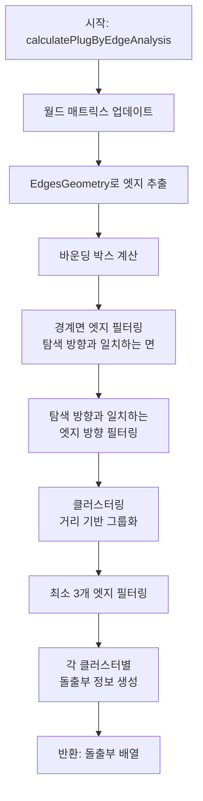

---
tags:
상태: Todo
중요: 1
생성일: 26-01-30T14:12:09
수정일: 26-01-30T16:12:13
종료일:
라벨:
  - Ref
  - 냉장고
---
## 0. 참고 레퍼런스
- 
##  ■■ Description ■■
- 
## 1. 개요
- `calculatePlugByEdgeAnalysis` 함수는 **노드의 바깥쪽 테두리(Edge)에서 돌출된 부분(Plug)을 탐지**하는 알고리즘이다.
- 이 함수는 `NormalBasedHighlight.ts`에 정의되어 있으며, `GrooveDetectionUtils.ts`를 통해 호출된다.
### 1-1. `calculatePlugByEdgeAnalysis` 함수는 '**엣지 기반 탐지 + 메타데이터 파라미터 제공**'으로 구현되어 있다.
- **핵심 기술**: `EdgesGeometry`를 사용하여 엣지 추출
- **탐지 로직**: 바운딩 박스 경계면의 엣지 중 탐색 방향과 일치하는 엣지만 필터링
- **그룹화**: 엣지 중심점 거리 기반 클러스터링
### 1-2. `calculatePlugByEdgeAnalysis` 함수는 돌출부(Plug) 탐지에는 자동으로 가능하지만, 홈(Groove/Hole) 탐지에는 적합하지 않다.
### 돌출부(Plug) 탐지 - ✅ 자동 탐지 가능
```txt
┌─────────────────┐
│                 │
│   ┌─────┐       │  ← 돌출부: 바깥쪽으로 튀어나온 부분
│   │  █  │       │     엣지가 명확하게 존재
│   └─────┘       │     바운딩 박스 경계면에 엣지 존재
│                 │
└─────────────────┘
```
- **특징**: 바깥쪽으로 튀어나온 형상
- **엣지**: 바운딩 박스 경계면에 명확하게 존재
- **탐지**: 엣지 기반 필터링이 효과적
### 홈(Groove/Hole) 탐지 - ❌ 엣지 기반으로 어려움
```txt
┌─────────────────┐
│                 │
│   ┌─────┐       │  ← 홈: 안쪽으로 들어간 부분
│   │     │       │     엣지가 내부에 존재
│   │  ▽  │       │     바운딩 박스 경계면에 엣지가 없을 수 있음
│   └─────┘       │     내부 구조 파악 필요
│                 │
└─────────────────┘
```
- **특징**: 안쪽으로 들어간 형상
- **엣지**: 내부에 존재하거나 경계면에 없을 수 있음
- **탐지**: 엣지 기반 필터링으로는 내부 구조 파악 어려움
## 2. 함수 시그니처
```typescript
public static calculatePlugByEdgeAnalysis(
    targetNode: THREE.Object3D,
    searchDirection: THREE.Vector3 = new THREE.Vector3(0, 1, 0),
    edgeThreshold: number = 30,
    clusterThreshold: number = 0.02
): Array<{
    position: THREE.Vector3;
    rotationAxis: THREE.Vector3;
    insertionDirection: THREE.Vector3;
    filteredVerticesCount: number;
}>
```

## 3. 파라미터
| 파라미터               | 타입               | 기본값         | 설명                   |
| ------------------ | ---------------- | ----------- | -------------------- |
| `targetNode`       | `THREE.Object3D` | -           | 분석할 대상 노드            |
| `searchDirection`  | `THREE.Vector3`  | `(0, 1, 0)` | 탐색 방향 (기본: 위쪽 Y축)    |
| `edgeThreshold`    | `number`         | `30`        | 엣지로 간주할 최소 각도 (도 단위) |
| `clusterThreshold` | `number`         | `0.02`      | 클러스터링 거리 임계값 (미터 단위) |
## 4. 반환값
돌출부(Plug) 정보 배열:
- `position`: 돌출부의 중심 위치 (월드 좌표)
- `rotationAxis`: 회전축 방향
- `insertionDirection`: 삽입 방향
- `filteredVerticesCount`: 필터링된 정점 수
## 5. 동작 순서
## 1단계: 월드 매트릭스 업데이트
```typescript
targetNode.updateMatrixWorld(true);
```
- 대상 노드의 월드 매트릭스를 강제 업데이트하여 정확한 좌표 추출을 보장
## 2단계: 엣지 추출 (EdgesGeometry 사용)
```typescript
const edgesGeometry = new THREE.EdgesGeometry(geometry, edgeThreshold);
```
- 노드의 모든 자식 메쉬를 순회하며 [`EdgesGeometry`](src/shared/utils/NormalBasedHighlight.ts:1002)를 사용하여 엣지 추출
- `edgeThreshold` 파라미터로 지정된 각도 이상의 엣지만 추출
- 각 엣지에 대해 다음 정보를 수집:
  - `start`: 시작점 (월드 좌표)
  - `end`: 끝점 (월드 좌표)
  - `center`: 중심점
  - `direction`: 방향 벡터
  - `length`: 길이

## 3단계: 바운딩 박스 계산
```typescript
const boundingBox = new THREE.Box3();
edges.forEach(edge => {
    boundingBox.expandByPoint(edge.start);
    boundingBox.expandByPoint(edge.end);
});
```
- 모든 엣지의 시작점과 끝점을 포함하는 바운딩 박스 계산
- 바운딩 박스의 중심점(`boxCenter`)과 크기(`boxSize`) 추출
## 4단계: 경계면 엣지 필터링 (탐색 방향 기반)
```typescript
const borderThreshold = Math.min(boxSize.x, boxSize.y, boxSize.z) * 0.15;

const borderEdges = edges.filter(edge => {
    const dists = [
        { val: Math.abs(edge.center.x - boundingBox.min.x), dir: new THREE.Vector3(-1, 0, 0) },
        { val: Math.abs(edge.center.x - boundingBox.max.x), dir: new THREE.Vector3(1, 0, 0) },
        { val: Math.abs(edge.center.y - boundingBox.min.y), dir: new THREE.Vector3(0, -1, 0) },
        { val: Math.abs(edge.center.y - boundingBox.max.y), dir: new THREE.Vector3(0, 1, 0) },
        { val: Math.abs(edge.center.z - boundingBox.min.z), dir: new THREE.Vector3(0, 0, -1) },
        { val: Math.abs(edge.center.z - boundingBox.max.z), dir: new THREE.Vector3(0, 0, 1) }
    ];

    return dists.some(d => d.val < borderThreshold && d.dir.dot(searchDirection) > 0.5);
});
```
- `borderThreshold`: 바운딩 박스 최소 크기의 15%를 경계면 임계값으로 설정
- 바운딩 박스의 6개 면(X-, X+, Y-, Y+, Z-, Z+) 중에서:
  - 엣지 중심점이 경계면 임계값 내에 있는지 확인
  - **탐색 방향(`searchDirection`)과 일치하는 면의 엣지만 선택** (내적값 > 0.5)
- 예: `searchDirection`이 위쪽(0, 1, 0)이면 상단 경계면(Y+)의 엣지만 선택
## 5단계: 탐색 방향과 일치하는 엣지 필터링
```typescript
const filteredEdges = borderEdges.filter(edge => {
    const edgeDirection = edge.direction.clone();
    const dotProduct = Math.abs(edgeDirection.dot(searchDirection));
    return dotProduct > 0.5; // 탐색 방향과 60도 이내의 엣지만 선택
});
```
- 경계면 엣지 중에서 엣지의 방향 벡터가 탐색 방향과 60도 이내인 엣지만 필터링
- 내적값 > 0.5 (cos(60°) = 0.5)
## 6단계: 클러스터링 (엣지 중심점 거리 기반)
```typescript
const clusters: Array<{ edges: EdgeInfo[] }> = [];

for (const edge of filteredEdges) {
    let targetCluster = null;

    for (const cluster of clusters) {
        for (const clusterEdge of cluster.edges) {
            if (edge.center.distanceTo(clusterEdge.center) < clusterThreshold) {
                targetCluster = cluster;
                break;
            }
        }
        if (targetCluster) break;
    }

    if (targetCluster) {
        targetCluster.edges.push(edge);
    } else {
        clusters.push({ edges: [edge] });
    }
}
```
- `clusterThreshold` (기본 0.02m = 2cm) 내에 있는 엣지들을 같은 클러스터로 그룹화
- 인접한 엣지들을 하나의 돌출부로 인식
## 7단계: 각 클러스터별 돌출부 정보 생성
```typescript
return clusters
    .filter(cluster => cluster.edges.length >= 3) // 최소 3개의 엣지가 필요
    .map(cluster => {
        const clusterBox = new THREE.Box3();
        const avgDirection = new THREE.Vector3();

        cluster.edges.forEach(edge => {
            clusterBox.expandByPoint(edge.start);
            clusterBox.expandByPoint(edge.end);
            avgDirection.add(edge.direction);
        });

        const position = new THREE.Vector3();
        clusterBox.getCenter(position);

        avgDirection.divideScalar(cluster.edges.length).normalize();

        const worldUp = new THREE.Vector3(0, 1, 0);
        let rotationAxis = new THREE.Vector3().crossVectors(avgDirection, worldUp).normalize();
        if (rotationAxis.length() < 0.01) {
            rotationAxis = new THREE.Vector3().crossVectors(avgDirection, new THREE.Vector3(1, 0, 0)).normalize();
        }

        return {
            position,
            rotationAxis,
            insertionDirection: avgDirection,
            filteredVerticesCount: cluster.edges.length * 2
        };
    });
```
- 최소 3개 이상의 엣지를 포함한 클러스터만 유효한 돌출부로 간주
- 각 클러스터에 대해:
  - **`position`**: 클러스터 엣지들의 바운딩 박스 중심점
  - **`avgDirection`**: 모든 엣지 방향 벡터의 평균 (정규화)
  - **`rotationAxis`**: 평균 방향과 월드 Up(0, 1, 0)의 외적 (회전축)
  - **`filteredVerticesCount`**: 엣지 수 × 2 (각 엣지는 2개의 정점)
## 6. 동작 흐름도



## 7. 핵심 특징
### 7-1. 방향성 기반 탐색
- 단순히 모든 경계면을 찾는 것이 아니라, **탐색 방향(`searchDirection`) 쪽의 경계면을 우선시**
- 예: 아래쪽으로 돌출된 부분을 찾을 때는 하단 경계면의 엣지만 분석
### 7-2. 이중 필터링
1. **위치 필터링**: 경계면 임계값 내에 있는 엣지
2. **방향 필터링**: 탐색 방향과 60도 이내의 엣지
### 7-3. 클러스터링 기반 그룹화
- 인접한 엣지들을 하나의 돌출부로 인식
- `clusterThreshold`로 그룹화 범위 조절 가능
### 7-4. 최소 엣지 수 요구
- 최소 3개 이상의 엣지가 필요하여 노이즈 필터링
## 8. 장점과 한계
### 장점
- ✅ **방향성 탐색**: 특정 방향의 돌출부만 정밀하게 탐지 가능
- ✅ **자동 클러스터링**: 복잡한 형상에서도 돌출부를 자동으로 그룹화
- ✅ **EdgesGeometry 활용**: Three.js의 최적화된 엣지 추출 기능 사용
### 한계
- ⚠️ **엣지 의존성**: 엣지가 명확하지 않은 부드러운 형상에서는 성능 저하 가능
- ⚠️ **파라미터 민감도**: `edgeThreshold`, `clusterThreshold` 등 파라미터 튜닝 필요
- ⚠️ **최소 엣지 수**: 3개 미만의 엣지로 구성된 작은 돌출부는 탐지 불가
## 참고 파일
- `NormalBasedHighlight.ts` - 함수 구현
- `GrooveDetectionUtils.ts` - 래퍼 함수
- `DamperCoverAssemblyService.ts` - 사용 예시
