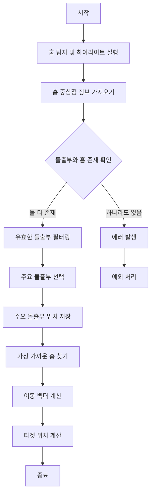

---
tags:
상태: Todo
중요: 1
생성일: 26-01-30T15:01:51
수정일: 26-01-30T15:12:30
종료일:
라벨:
  - Ref
  - 냉장고
---
## 0. 참고 레퍼런스
- 
##  ■■ Description ■■
- 아래 코드는 댐퍼 어셈블리 노드에서 **홈(Groove)을 탐지하고, 그 중심점을 계산** 하는 코드이다.
## 0. 핵심 기술 포인트
### 1. 법선 벡터 기반 필터링
- 카메라 방향과 면 법선의 내적을 통해 카메라를 향하는 면 식별
- 정확한 홈 영역 식별을 위해 법선 허용 오차(tolerance) 적용
### 2. 클러스터링 알고리즘
- 인접한 면들을 그룹화하여 홈 영역 식별
- 거리 기반 클러스터링으로 복잡한 형상의 홈도 탐지 가능
### 3. 경계선 루프 탐지
- 엣지 카운트를 통해 내부 구멍 식별
- 바깥쪽 테두리와 내부 구멍 구분
### 4. 거리 기반 매칭
- 돌출부와 홈 간의 거리 계산
- 가장 가까운 홈을 선택하여 정확한 조립 위치 계산
## 1. 동작 순서
### 1단계: 홈 탐지 및 하이라이트 실행
```typescript
await this.grooveDetectionService.detectAndHighlightGrooves(
    nodeNameManager.getNodeName('fridge.leftDoor.damperAssembly')!
);
```
**동작 내용:**
- `GrooveDetectionService.detectAndHighlightGrooves()` 메서드 호출
- 댐퍼 어셈블리 노드를 대상으로 홈 탐지 수행
- 탐지된 홈 영역을 시각적으로 하이라이트
### 2단계: 탐지된 홈 중심점 정보 가져오기
```typescript
const holeCenters = this.grooveDetectionService.getHoleCenters();
holeWorldPositions = holeCenters.map(h => h.position);
```
**동작 내용:**
- `GrooveDetectionService.getHoleCenters()` 메서드 호출
- `HoleCenterManager`에서 저장된 홈 중심점 정보 가져오기
- 각 홈의 위치(position)를 `holeWorldPositions` 배열에 저장
### 3단계: 돌출부(Plug)와 홈(Hole) 매칭 (112-136 라인)
### 3-1. 유효한 돌출부 필터링 (115-118 라인)
```typescript
const validPlugs = plugAnalyses.filter(p => p.filteredVerticesCount < 2000);
const primaryPlug = validPlugs.length > 0
    ? validPlugs.sort((a, b) => b.position.y - a.position.y)[0]
    : plugAnalyses[0];
```
**동작 내용:**
- 정점 수가 2000개 미만인 돌출부만 유효한 것으로 필터링
- 유효한 돌출부 중 Y축 위치가 가장 높은 것을 주요 돌출부(primaryPlug)로 선택
- 유효한 돌출부가 없으면 첫 번째 돌출부 사용
### 3-2. 주요 돌출부 위치 저장
```typescript
plugWorldPos = primaryPlug.position;
```
**동작 내용:**
- 주요 돌출부의 월드 좌표 위치 저장
### 3-3. 가장 가까운 홈 찾기
```typescript
const primaryHoleWorldPos = holeWorldPositions.sort((a, b) => {
    const distA = a.distanceTo(currentPlugPos!);
    const distB = b.distanceTo(currentPlugPos!);
    return distA - distB;
})[0];
```
**동작 내용:**
- 모든 홈 중심점과 돌출부 위치 간의 거리 계산
- 거리 기준 오름차순 정렬
- 가장 가까운 홈을 주요 홈(primaryHoleWorldPos)으로 선택
### 3-4. 타겟 위치 계산
```typescript
const moveDelta = new THREE.Vector3().subVectors(primaryHoleWorldPos, currentPlugPos!);
const currentCoverPos = coverNode.position.clone();
targetPosition.addVectors(currentCoverPos, moveDelta);
```
**동작 내용:**
- 주요 홈 위치에서 돌출부 위치를 뺀 이동 벡터(moveDelta) 계산
- 현재 커버 위치에 이동 벡터를 더하여 최종 타겟 위치 계산
## 4. 상세 동작 흐름도



## 5. 관련 클래스 및 메서드
### GrooveDetectionService
- **파일:** `src/shared/utils/GrooveDetectionService.ts`
- **주요 메서드:**
  - `detectAndHighlightGrooves()`: 홈 탐지 및 하이라이트 실행
  - `getHoleCenters()`: 홈 중심점 정보 반환

### HoleCenterManager
- **파일:** `src/shared/utils/HoleCenterManager.ts`
- **역할:** 탐지된 홈 중심점 정보를 저장하고 관리
- **주요 메서드:**
  - `visualizeHoleCenters()`: 홈 중심점 시각화 및 저장
  - `getHoleCenters()`: 저장된 홈 중심점 정보 반환
### NormalBasedHighlight
- **파일:** `src/shared/utils/NormalBasedHighlight.ts`
- **역할:** 법선 벡터 기반 필터링 및 클러스터링 수행
- **주요 메서드:**
  - `highlightFacesByCameraFilter()`: 카메라 방향 기반 면 필터링
  - `clusterFaces()`: 면 클러스터링 수행
  - `detectHolesInCluster()`: 클러스터 내부 구멍 탐지
## 6. 홈 탐지 알고리즘 상세
### 1단계: 카메라 방향 기반 면 필터링
- `NormalBasedHighlight.highlightFacesByCameraFilter()` 호출
- 카메라 방향 벡터와 각 면의 법선 벡터 내적 계산
- 내적이 -0.5 미만인 면(카메라를 향하는 면)을 정면으로 식별
- 정면 면: 빨간색 하이라이트, 나머지 면: 노란색 하이라이트
### 2단계: 클러스터링
- `NormalBasedHighlight.clusterFaces()` 호출
- 인접한 면들을 클러스터링하여 홈 영역 식별
- 클러스터링 거리 임계값: 0.02m (기본값)
### 3단계: 구멍(Hole) 탐지
- `NormalBasedHighlight.detectHolesInCluster()` 호출
- 각 클러스터 내부의 경계선 루프(Boundary Loop) 탐지
- 엣지 카운트를 통해 내부 구멍 식별
- 가장 큰 루프(바깥쪽 테두리)를 제외한 나머지 루프를 구멍으로 간주
### 4단계: 중심점 계산
- 각 구멍의 경계 루프 중심점 계산
- `HoleCenterManager.visualizeHoleCenters()`를 통해 시각적 마커 생성
- 홈 중심점 정보 저장 (위치, 색상, 회전축, 삽입 방향 등)
## 8. 참고 파일
- `DamperCoverAssemblyService.ts`: 메인 조립 서비스
- `GrooveDetectionService.ts`: 홈 탐지 서비스
- `HoleCenterManager.ts`: 홈 중심점 관리자
- `NormalBasedHighlight.ts`: 법선 기반 하이라이트
- `GrooveDetectionUtils.ts`: 홈 탐지 유틸리티
