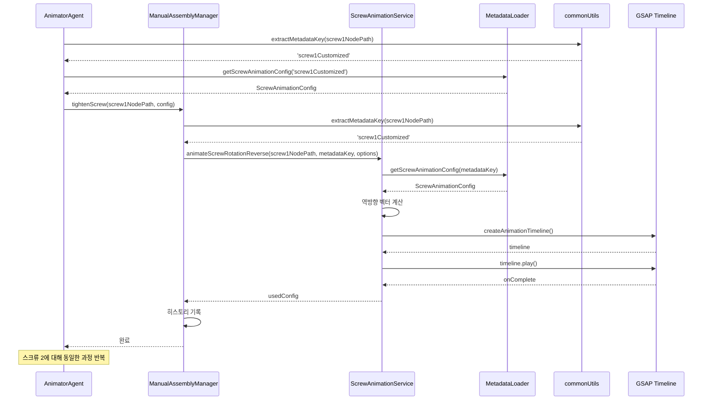

---
tags:
상태: Todo
중요:
생성일: 26-02-10T17:01:58
수정일: 26-02-10T17:06:15
종료일:
라벨:
  - 냉장고
  - codeRef
summary:
---
## 0. 참고 레퍼런스
- 
##  ■■ Description ■■
- 아래 코드는 스크류 노드(1,2)를 다시 조이는 코드이다.
## 1. 코드 구조 (AnimatorAgent.ts:1147-1172)
```typescript
// 스크류 노드(1,2)를 다시 조이는 코드
try {
    console.log('스크류 조립 애니메이션 시작!!!');

    // 왼쪽 스크류 1 조립 (회전+이동 역방향)
    if (screw1NodeName) {
        const metadataKey1 = extractMetadataKey(screw1NodePath);
        const config1 = getMetadataLoader().getScrewAnimationConfig(metadataKey1);
        await this.manualAssemblyManager.tightenScrew(screw1NodePath, config1 || {});
        console.log('Left screw 1 tightened');
    }

    // 왼쪽 스크류 2 조립 (회전+이동 역방향) - 선형 이동한 위치에서 조립
    if (screw2NodeName) {
        const metadataKey2 = extractMetadataKey(screw2NodePath);
        const config2 = getMetadataLoader().getScrewAnimationConfig(metadataKey2);
        await this.manualAssemblyManager.tightenScrew(screw2NodePath, config2 || {});
        console.log('Left screw 2 tightened');
    }

    console.log('스크류 조립 애니메이션 완료!!!');
} catch (error) {
    console.error('Error during screw tightening:', error);
}
```
## 2. extractMetadataKey 함수 (commonUtils.ts)
### 2-1. 구현 방식
```typescript
export function extractMetadataKey(nodePath: string): string {
    return nodePath.includes('.')
        ? nodePath.split('.').pop() || nodePath
        : nodePath;
}
```
### 동작 설명
- **입력**: 노드 경로 문자열 (예: `'fridge.leftDoorDamper.screw1Customized'`)
- **출력**: 메타데이터 키 (예: `'screw1Customized'`)
- **로직**:
  1. 경로에 `.`이 포함되어 있는지 확인
  2. 포함되어 있으면 `.`으로 분리하여 마지막 요소 반환
  3. 포함되어 있지 않으면 원본 문자열 반환
### 2-2. 사용 예시
| 입력                                         | 출력                   |
| ------------------------------------------ | -------------------- |
| `'fridge.leftDoorDamper.screw1Customized'` | `'screw1Customized'` |
| `'fridge.leftDoorDamper.screw2Customized'` | `'screw2Customized'` |
| `'screw1'`                                 | `'screw1'`           |
## 3. getScrewAnimationConfig 함수 (MetadataLoader.ts)
### 3-1. 구현 방식
```typescript
public getScrewAnimationConfig(nodeName: string): ScrewAnimationConfig | null {
    if (!this.metadata?.screwAnimations) {
        return null;
    }

    // 직접 일치하는 이름 검색
    if (this.metadata.screwAnimations[nodeName]) {
        return this.metadata.screwAnimations[nodeName];
    }

    // 노드 이름의 일부로 검색 (예: screw1Customized -> screw_1)
    const shortName = nodeName;
    for (const [key, config] of Object.entries(this.metadata.screwAnimations)) {
        const keyLower = key.toLowerCase();
        if (keyLower === shortName ||
            shortName.includes(keyLower) ||
            keyLower.includes(shortName)) {
            return config;
        }
    }

    return null;
}
```
### 3-2. ScrewAnimationConfig 인터페이스
```typescript
export interface ScrewAnimationConfig {
    rotationAxis: 'x' | 'y' | 'z';      // 회전축
    rotationAngle: number;               // 회전 각도 (도)
    extractDirection: [number, number, number]; // 추출 방향 (로컬 좌표계)
    extractDistance: number;             // 추출 거리
    duration: number;                    // 애니메이션 지속 시간 (ms)
    easing: string;                      // 이징 함수
}
```
### 동작 설명
1. **메타데이터 확인**: `screwAnimations` 객체가 존재하는지 확인
2. **직접 일치 검색**: 노드 이름과 정확히 일치하는 키 검색
3. **부분 일치 검색**: 대소문자 무시하고 부분 일치 검색
4. **결과 반환**: 일치하는 설정 반환, 없으면 `null`
## 4. tightenScrew 함수 (ManualAssemblyManager.ts)
### 4-1. 구현 방식
```typescript
public async tightenScrew(
    screwNodePath: string,
    options?: {
        duration?: number;
        rotationAngle?: number;
        rotationAxis?: 'x' | 'y' | 'z';
        pullDistance?: number;
        screwPitch?: number;
        onComplete?: () => void;
    }
): Promise<void> {
    // 1. 경로를 실제 노드 이름으로 변환
    const actualNodeName = this.nodeNameManager.getNodeName(screwNodePath);

    if (!actualNodeName) {
        console.warn(`${screwNodePath}에 해당하는 노드 이름을 찾을 수 없음`);
        return;
    }

    // 2. 스크류 노드인지 확인
    if (!this.screwAnimationService.isScrewNode(actualNodeName)) {
        console.warn(`${actualNodeName}은 Screw 노드가 아님`);
        return;
    }

    // 3. 메타데이터 키 추출
    const metadataKey = extractMetadataKey(screwNodePath);

    // 4. 역방향 회전 애니메이션 실행
    const usedConfig = await this.screwAnimationService.animateScrewRotationReverse(
        screwNodePath,
        metadataKey,
        options
    );

    // 5. 애니메이션 히스토리 기록
    if (this.animationHistoryService) {
        const screwMessage = `${actualNodeName} 스크류 조립 완료`;
        this.animationHistoryService.addAnimationHistory(
            {
                door: 'top_left' as any,
                action: AnimationAction.SCREW_TIGHTEN,
                duration: usedConfig.duration,
                easing: usedConfig.easing,
                rotationAngle: usedConfig.rotationAngle,
                rotationAxis: usedConfig.rotationAxis,
                extractDirection: usedConfig.extractDirection,
                translationDistance: usedConfig.extractDistance,
                position: usedConfig.finalPosition ? {
                    x: usedConfig.finalPosition.x,
                    y: usedConfig.finalPosition.y,
                    z: usedConfig.finalPosition.z
                } : undefined
            },
            screwMessage
        );
    }
}
```
### 동작 순서
1. **노드 이름 변환**: 경로(`'fridge.leftDoorDamper.screw1Customized'`)를 실제 노드 이름으로 변환
2. **스크류 노드 확인**: 해당 노드가 스크류 노드인지 검증
3. **메타데이터 키 추출**: 경로에서 메타데이터 키 추출
4. **역방향 애니메이션 실행**: `animateScrewRotationReverse` 호출
5. **히스토리 기록**: 애니메이션 히스토리 서비스에 기록
## 5. animateScrewRotationReverse 함수 (ScrewAnimationService.ts)
### 5-1. 구현 방식
```typescript
public async animateScrewRotationReverse(
    nodePath: string,
    metadataKey: string,
    options: ScrewAnimationOptions = {}
): Promise<ScrewAnimationMetadata> {
    // 1. 기존 애니메이션 정리
    if (this.timeline) {
        this.timeline.kill();
        this.timeline = null;
    }

    // 2. 메타데이터 로드
    await this.loadMetadata();

    // 3. 메타데이터에서 설정 가져오기
    const metadata = this.metadataLoader.getScrewAnimationConfig(metadataKey);

    // 4. 옵션과 메타데이터 병합
    const config = {
        duration: options.duration ?? 1500,
        rotationAngle: options.rotationAngle ?? 720,
        screwPitch: options.screwPitch ?? 0.005,
        rotationAxis: options.rotationAxis ?? 'z',
        easing: options.easing ?? 'power2.inOut',
        extractDirection: options.extractDirection ?? [0, 0, 1],
        ...options
    };

    // 5. 노드 객체 가져오기
    const screwNodeName = this.nodeNameManager.getNodeName(nodePath);
    const screwNodeObj = this.sceneRoot.getObjectByName(screwNodeName);

    // 6. 이동 거리 계산
    const translationDistance = options.pullDistance 
        ?? metadata?.extractDistance 
        ?? (config.rotationAngle! / 360) * config.screwPitch!;

    // 7. 역방향 벡터 계산
    const reverseDirection = new THREE.Vector3(...config.extractDirection!).negate();

    // 8. GSAP 타임라인 생성 및 실행
    const animationResult = createAnimationTimeline(
        screwNodeObj,
        {
            rotationAxis: config.rotationAxis!,
            rotationAngle: config.rotationAngle!,
            extractDirection: reverseDirection,  // 역방향
            translationDistance,
            duration: config.duration!,
            easing: config.easing!
        },
        {
            onStart: () => {
                this.isAnimating = true;
                console.log(`${screwNodeName} 조립 시작`);
            },
            onComplete: () => {
                this.isAnimating = false;
                console.log(`${screwNodeName} 조립 완료`);
                usedConfig.finalPosition = screwNodeObj.position.clone();
                usedConfig.finalRotation = screwNodeObj.rotation.clone();
                config.onComplete?.();
                resolve(usedConfig);
            }
        }
    );

    this.timeline = animationResult.timeline;
    this.timeline.play();
}
```
### 동작 순서
1. **기존 애니메이션 정리**: 이전 타임라인 종료
2. **메타데이터 로드**: 메타데이터 파일 로드
3. **설정 병합**: 옵션과 메타데이터 병합
4. **노드 객체 가져오기**: 씬에서 스크류 노드 검색
5. **이동 거리 계산**: `pullDistance` → `metadata.extractDistance` → `screwPitch` 기반 계산
6. **역방향 벡터 계산**: `extractDirection`의 음수 벡터 생성
7. **GSAP 타임라인 생성**: 회전+이동 동시 애니메이션 생성
8. **애니메이션 실행**: 타임라인 재생 시작
## 6. 전체 동작 순서도

## 7. 주요 특징
### 7-1 역방향 애니메이션
- **분해(Loosen)**: 스크류를 돌려서 빼는 애니메이션
- **조립(Tighten)**: 스크류를 돌려서 조이는 애니메이션 (역방향)
- **역방향 벡터**: `extractDirection`의 음수 벡터 사용
### 7-2 메타데이터 기반 설정
- 메타데이터 파일(`assembly-offsets.json`)에서 애니메이션 설정 로드
- 옵션으로 메타데이터 덮어쓰기 가능
- 부분 일치 검색으로 유연한 매칭
### 7-3 GSAP 타임라인 사용
- 회전과 이동을 동시에 처리
- 부드러운 이징 효과 적용
- 진행률 추적 및 콜백 지원
### 7-4 히스토리 기록
- 애니메이션 완료 후 히스토리 서비스에 기록
- 최종 위치와 회전값 저장
- 재생 및 되돌리기 기능 지원
