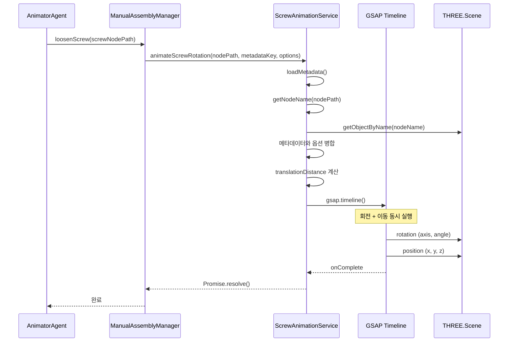

# 스크류 분리 애니메이션 구현 분석

## 1. 개요

`AnimatorAgent.ts` (lines 980-999) 에서 호출되는 스크류 분리 애니메이션은 **GSAP Timeline**을 활용한 회전+이동 동시 애니메이션으로 구현됩니다. 메타데이터 기반 설정을 우선 사용하며, 메타데이터가 없는 경우 기본값을 적용합니다.

## 2. 호출 흐름

```
AnimatorAgent.ts
    └─> loosenScrew(screw1NodePath)
        └─> ManualAssemblyManager.ts
            └─> loosenScrew(nodePath, metadataKey, options)
                └─> ScrewAnimationService.ts
                    └─> animateScrewRotation(nodePath, metadataKey, options)
                        └─> GSAP Timeline 애니메이션 실행
```

## 3. 구현 방식

### 3-1. GSAP Timeline 기반 동시 애니메이션

회전(Rotation)과 이동(Translation)을 **동시에** 수행하는 Timeline을 생성합니다:

```typescript
// ScrewAnimationService.ts (lines 152-176)
this.timeline = gsap.timeline({
    onStart: () => { /* 시작 로그 */ },
    onComplete: () => { /* 완료 콜백 */ },
    onUpdate: () => { /* 진행률 업데이트 */ }
});
```

### 3-2. 메타데이터 우선 설정 적용

`assembly-offsets.json`에서 메타데이터를 우선 로드하고, 없는 경우 기본값을 사용합니다:

```typescript
// ScrewAnimationService.ts (lines 113-122)
const config = {
    duration: options.duration ?? metadata?.duration ?? 1500,      // 기본 1500ms
    rotationAngle: options.rotationAngle ?? metadata?.rotationAngle ?? 720,  // 기본 720도 (2바퀴)
    screwPitch: options.screwPitch ?? 0.005,                       // 기본 0.005m
    rotationAxis: options.rotationAxis ?? metadata?.rotationAxis ?? 'z',   // 기본 Z축
    easing: metadata?.easing ?? 'power2.inOut',                    // 기본 ease-in-out
    extractDirection: options.extractDirection ?? metadata?.extractDirection ?? [0, 0, 1],
    ...options
};
```

### 3-3. 애니메이션 계산 로직

**이동 거리 계산 우선순위:**
1. `options.pullDistance` (직접 지정)
2. `metadata.extractDistance` (메타데이터)
3. 계산값: `(rotationAngle / 360) * screwPitch` (회전각도에 비례)

```typescript
// ScrewAnimationService.ts (lines 139-147)
if (options.pullDistance !== undefined) {
    translationDistance = options.pullDistance;
} else if (metadata?.extractDistance !== undefined) {
    translationDistance = metadata.extractDistance;
} else {
    translationDistance = (config.rotationAngle! / 360) * config.screwPitch!;
}
```

## 4. 동작 순서 (애니메이션 실행 흐름)

### Step 1: 노드 경로 변환 및 검증
```
1-1. screwNodePath를 실제 노드 이름으로 변환 (NodeNameLoader 사용)
1-2. isScrewNode()로 Screw 노드인지 확인
1-3. 메타데이터 키 추출 (경로의 마지막 요소 사용)
```

### Step 2: 메타데이터 로드
```
2-1. MetadataLoader를 통해 assembly-offsets.json 로드
2-2. 메타데이터에서 해당 screw의 애니메이션 설정 가져오기
2-3. 옵션과 메타데이터 병합 (메타데이터 우선)
```

### Step 3: 대상 노드 탐색
```
3-1. nodeNameManager.getNodeName()으로 실제 노드 이름 조회
3-2. sceneRoot.getObjectByName()으로 THREE.js 객체获取
3-3. 객체가 없으면 에러 로그 출력 후 종료
```

### Step 4: GSAP Timeline 생성
```
4-1. 기존 Timeline이 있으면 kill() (메모리 누수 방지)
4-2. 새 Timeline 생성 (onStart, onComplete, onUpdate 콜백 설정)
```

### Step 5: 회전 애니메이션 추가
```
5-1. 지정된 축(axis: x/y/z)으로 회전
5-2. 각도: config.rotationAngle (라디안 변환: * Math.PI / 180)
5-3._duration: config.duration (ms → s 변환)
5-4. 이징: config.easing (power2.inOut)
```

### Step 6: 이동 애니메이션 추가
```
6-1. extractDirection을 로컬 좌표계 벡터로 변환
6-2. translationDistance만큼 스케일링
6-3. 현재 위치 + 이동 벡터로 목표 위치 계산
6-4. 회전과 동시에 이동 실행 (timeline의 같은 timestamp)
```

### Step 7: 애니메이션 실행 및 완료 대기
```
7-1. Promise를 반환하여 비동기 완료 대기
7-2. timeline.eventCallback('onComplete', resolve) 설정
7-3. 애니메이션 완료 후 resolve 호출
```

## 5. 애니메이션 파라미터 상세

| 파라미터 | 타입 | 기본값 | 설명 |
|---------|------|--------|------|
| `duration` | number | 1500ms | 전체 애니메이션 시간 |
| `rotationAngle` | number | 720도 | 회전 각도 (2바퀴) |
| `rotationAxis` | 'x' \| 'y' \| 'z' | 'z' | 회전축 |
| `screwPitch` | number | 0.005m | 나사산 간격 |
| `extractDirection` | [x, y, z] | [0, 0, 1] | 빼내는 방향 (로컬) |
| `extractDistance` | number | 계산값 | 빼내는 거리 |
| `easing` | string | 'power2.inOut' | 이징 함수 |

## 6. AnimatorAgent.ts 호출 코드 (lines 980-999)

```typescript
// 스크류 분리 애니매이션 실행
try {
    const screw1NodePath = 'fridge.leftDoorDamper.screw1Customized';
    const screw2NodePath = 'fridge.leftDoorDamper.screw2Customized';

    // 왼쪽 스크류 1 분리
    if (screw1NodeName) {
        console.log(screw1NodeName, ' Screw1를 돌려서 빼는 애니메이션을 실행!');
        await this.manualAssemblyManager.loosenScrew(screw1NodePath);
        console.log('Left screw 1 loosened');
    }

    // 왼쪽 스크류 2 분리
    if (screw2NodeName) {
        await this.manualAssemblyManager.loosenScrew(screw2NodePath);
        console.log('Left screw 2 loosened');
    }
} catch (error) {
    console.error('Error during screw loosening:', error);
}
```

## 7. 시퀀스 다이어그램



## 8. 공통 재활용 코드 분석

### 8-1. 이미 독립적으로 분리된 공통 모듈

| 모듈 | 파일 | 용도 |
|-----|------|-----|
| **isFastenerNodeName()** | `src/shared/utils/isFastener.ts` | 노드 이름으로 나사/볼트인지 검증 |
| **isFastenerNode()** | `src/shared/utils/isFastener.ts` | THREE.Object3D가 나사/볼트인지 검증 |
| **MetadataLoader** | `src/shared/utils/MetadataLoader.ts` | 메타데이터 로딩 및 캐싱 |
| **getScrewAnimationConfig()** | `src/shared/utils/MetadataLoader.ts:269` | 스크류 애니메이션 설정 조회 |
| **AssemblyStateManager** | `src/shared/utils/AssemblyStateManager.ts` | 진행률 및 재생 상태 관리 |
| **ScrewAnimationService** | `src/services/fridge/ScrewAnimationService.ts` | 스크류 애니메이션 핵심 로직 |

### 8-2. 재활용 가능한 코드 조각

#### 8-2-2. 메타데이터 키 추출

```typescript
// ManualAssemblyManager.ts:170-172 (재활용 가능)
function extractMetadataKey(nodePath: string): string {
    return nodePath.includes('.')
        ? nodePath.split('.').pop() || nodePath
        : nodePath;
}
```

#### 8-2-3. Screw 노드 검증

```typescript
// src/shared/utils/isFastener.ts (이미 분리됨)
export function isFastenerNodeName(nodeName: string): boolean {
    return /screw|bolt/i.test(nodeName);
}
```

#### 8-2-4. GSAP Timeline 생성 (ScrewAnimationService에서 분리 가능)

```typescript
// ScrewAnimationService.ts:152-176 (독립 함수로 분리 가능)
function createAnimationTimeline(
    targetObj: THREE.Object3D,
    config: {
        rotationAxis: string;
        rotationAngle: number;
        extractDirection: THREE.Vector3;
        translationDistance: number;
        duration: number;
        easing: string;
    },
    callbacks?: {
        onStart?: () => void;
        onComplete?: () => void;
        onProgress?: (progress: number) => void;
    }
): gsap.core.Timeline {
    const axis = config.rotationAxis as 'x' | 'y' | 'z';
    const timeline = gsap.timeline({
        onStart: callbacks?.onStart,
        onComplete: callbacks?.onComplete,
        onUpdate: () => {
            callbacks?.onProgress?.(timeline.progress() || 0);
        }
    });

    // 회전 애니메이션
    timeline.to(targetObj.rotation, {
        [axis]: -config.rotationAngle * (Math.PI / 180),
        duration: config.duration / 1000,
        ease: config.easing
    }, 0);

    // 이동 애니메이션 (로컬 좌표계)
    timeline.to(targetObj.position, {
        x: targetObj.position.x + config.extractDirection.x * config.translationDistance,
        y: targetObj.position.y + config.extractDirection.y * config.translationDistance,
        z: targetObj.position.z + config.extractDirection.z * config.translationDistance,
        duration: config.duration / 1000,
        ease: config.easing
    }, 0);

    return timeline;
}
```

#### 8-2-5. 이동 거리 계산 유틸리티

```typescript
// ScrewAnimationService.ts:139-147 (재활용 가능)
function calculateTranslationDistance(
    options: { pullDistance?: number },
    metadata: { extractDistance?: number } | null,
    screwPitch: number,
    rotationAngle: number
): number {
    if (options.pullDistance !== undefined) {
        return options.pullDistance;
    } else if (metadata?.extractDistance !== undefined) {
        return metadata.extractDistance;
    } else {
        return (rotationAngle / 360) * screwPitch;
    }
}
```

#### 8-2-6. 회전축 → 라디안 변환

```typescript
// ScrewAnimationService.ts:180 (재활용 가능)
function degreesToRadians(degrees: number): number {
    return degrees * (Math.PI / 180);
}
```

### 8-3. 추천 공통化管理 파일

현재 코드에서 재활용 가능한 코드들을 아래와 같이 공통 파일로 분리할 것을 권장합니다:

| 파일명 | 위치 | 포함 함수/클래스 |
|-------|------|----------------|
| `screwAnimationUtils.ts` | `src/shared/utils/` | `calculateTranslationDistance`, `extractMetadataKey`, |
| `gsapAnimationUtils.ts` | `src/shared/utils/` | `createAnimationTimeline`, `degreesToRadians` |

### 8-4. 현재 공통化管理 상태 요약

- ✅ **isFastener.ts**: 이미 독립적인 유틸리티로 분리됨
- ✅ **MetadataLoader.ts**: 싱글톤으로 관리, `getScrewAnimationConfig()` 제공
- ✅ **AssemblyStateManager.ts**: 진행률/상태 관리 독립화
- ⚠️ **ScrewAnimationService**: 핵심 로직 포함, 분리 필요 시 함수 추출 가능
- ⚠️ **ManualAssemblyManager**: `loosenScrew()` 메서드에서 일부 로직 분리 가능

## 9. 핵심 구현 포인트

1. **동시 애니메이션**: 회전과 이동을 같은 timestamp에 추가하여 동시에 실행
2. **메타데이터 우선**: JSON 설정파일로 애니메이션 파라미터 관리
3. **로컬 좌표계 유지**: extractDirection을 로컬 벡터로 변환하여 노드의 방향 따름
4. **이징 적용**: power2.inOut으로 시작/끝 부드럽게 처리
5. **메모리 관리**: 기존 Timeline kill() 후 새 Timeline 생성
