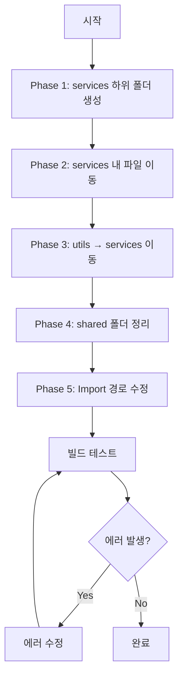

# Services 및 Utils 폴더 구조 개선 실행 계획

## 1. 분석 결과 요약

### 1-1. `shared/utils` 내 파일 성격 분석 결과

| 파일명 | 현재 위치 | 실제 성격 | 이동 필요 |
|--------|----------|----------|----------|
| [`GrooveDetectionService.ts`](src/shared/utils/GrooveDetectionService.ts) | utils | **Service** (상태: sceneRoot, cameraControls, normalBasedHighlight) | ✅ 이동 |
| [`MetadataLoader.ts`](src/shared/utils/MetadataLoader.ts) | utils | **Service** (싱글톤, 상태: cache, metadata) | ✅ 이동 |
| [`NormalBasedHighlight.ts`](src/shared/utils/NormalBasedHighlight.ts) | utils | **Service** (상태: sceneRoot, activeHighlights) | ✅ 이동 |
| [`HoleCenterManager.ts`](src/shared/utils/HoleCenterManager.ts) | utils | **Service** (상태: holeCenters) | ✅ 이동 |
| [`AssemblyPathVisualizer.ts`](src/shared/utils/AssemblyPathVisualizer.ts) | utils | **Service** (상태: sceneRoot) | ✅ 이동 |
| [`AssemblyStateManager.ts`](src/shared/utils/AssemblyStateManager.ts) | utils | **Service** (상태: assemblyProgress, isAssemblyPlaying) | ✅ 이동 |
| [`NodeNameManager.ts`](src/shared/utils/NodeNameManager.ts) | utils | **Service** (상태: nodeNameMap) | ✅ 이동 |
| [`NodeNameLoader.ts`](src/shared/utils/NodeNameLoader.ts) | utils | **Service** (상태: nodeNames) | ✅ 이동 |
| [`SelectionHandler.ts`](src/shared/utils/SelectionHandler.ts) | utils | **Service** (상태: selectedObject) | ✅ 이동 |
| [`DebugObjectManager.ts`](src/shared/utils/DebugObjectManager.ts) | utils | **Service** (상태: debugObjects) | ✅ 이동 |
| [`ClickPointMarker.ts`](src/shared/utils/ClickPointMarker.ts) | utils | **Service** (상태: markers) | ✅ 이동 |
| [`SnapDetectionUtils.ts`](src/shared/utils/SnapDetectionUtils.ts) | utils | **Service** (다른 서비스 의존, GSAP 사용) | ✅ 이동 |
| [`findNodeHeight.ts`](src/shared/utils/findNodeHeight.ts) | utils | **Service** (NodeNameManager 의존) | ✅ 이동 |
| [`GrooveDetectionUtils.ts`](src/shared/utils/GrooveDetectionUtils.ts) | utils | **Service** (상태: sceneRoot) | ✅ 이동 |
| [`StencilOutlineHighlight.ts`](src/shared/utils/StencilOutlineHighlight.ts) | utils | **Service** (상태: scene, mesh) | ✅ 이동 |
| [`CoordinateTransformUtils.ts`](src/shared/utils/CoordinateTransformUtils.ts) | utils | **Utils** (정적 메서드만 사용) | ❌ 유지 |
| [`commonUtils.ts`](src/shared/utils/commonUtils.ts) | utils | **Utils** (순수 함수) | ❌ 유지 |
| [`animationUtils.ts`](src/shared/utils/animationUtils.ts) | utils | **Utils** (순수 함수 + 클래스) | ❌ 유지 |
| [`fridgeConstants.ts`](src/shared/utils/fridgeConstants.ts) | utils | **Constants** | ✅ constants 폴더로 |
| [`isFastener.ts`](src/shared/utils/isFastener.ts) | utils | **Utils** (순수 함수) | ❌ 유지 |
| [`screwAnimationUtils.ts`](src/shared/utils/screwAnimationUtils.ts) | utils | **Utils** (순수 함수) | ❌ 유지 |
| [`highlightTreeNode.ts`](src/shared/utils/highlightTreeNode.ts) | utils | **Utils** (순수 함수) | ❌ 유지 |
| [`removeClickedNode.ts`](src/shared/utils/removeClickedNode.ts) | utils | **Utils** (순수 함수) | ❌ 유지 |

---

## 2. 제안하는 새로운 폴더 구조

```
src/
├── services/                          # 비즈니스 로직 서비스
│   ├── core/                          # 핵심 서비스
│   │   ├── AnimatorAgent.ts
│   │   └── AnimationHistoryService.ts
│   │
│   ├── camera/                        # 카메라 관련 서비스
│   │   └── CameraMovementService.ts
│   │
│   ├── assembly/                      # 조립/분해 관련 서비스
│   │   ├── DamperAssemblyService.ts
│   │   ├── DamperCoverAssemblyService.ts
│   │   ├── PartAssemblyService.ts
│   │   └── ManualAssemblyManager.ts
│   │
│   ├── animation/                     # 애니메이션 관련 서비스
│   │   ├── DamperAnimationService.ts
│   │   ├── DamperCaseBodyAnimationService.ts
│   │   ├── ScrewAnimationService.ts
│   │   └── ScrewLinearMoveAnimationService.ts
│   │
│   ├── detection/                     # 탐지 관련 서비스
│   │   ├── GrooveDetectionService.ts
│   │   ├── GrooveDetectionUtils.ts    # 이름 유지 (의존성 고려)
│   │   ├── SnapDetectionService.ts    # 이름 변경
│   │   ├── SelectionHandler.ts
│   │   └── NodeHeightDetector.ts      # findNodeHeight.ts에서 이름 변경
│   │
│   ├── visualization/                 # 시각화 관련 서비스
│   │   ├── NormalBasedHighlightService.ts  # 이름 변경
│   │   ├── AssemblyPathVisualizer.ts
│   │   ├── StencilOutlineHighlight.ts
│   │   ├── ClickPointMarker.ts
│   │   └── DebugObjectManager.ts
│   │
│   └── data/                          # 데이터 관련 서비스
│       ├── MetadataLoader.ts
│       ├── NodeNameManager.ts
│       ├── NodeNameLoader.ts
│       ├── HoleCenterManager.ts
│       └── AssemblyStateManager.ts
│
├── shared/
│   ├── utils/                         # 순수 함수형 유틸리티
│   │   ├── commonUtils.ts
│   │   ├── animationUtils.ts
│   │   ├── coordinateUtils.ts         # CoordinateTransformUtils.ts에서 이름 변경
│   │   ├── screwAnimationUtils.ts
│   │   ├── geometryUtils.ts           # 새로 생성 (필요시)
│   │   ├── isFastener.ts
│   │   ├── highlightTreeNode.ts
│   │   └── removeClickedNode.ts
│   │
│   ├── constants/                     # 상수 정의
│   │   └── fridgeConstants.ts
│   │
│   └── types/                         # 타입 정의
│       └── three-examples.d.ts
```

---

## 3. 상세 실행 계획

### Phase 1: services 폴더 내 하위 폴더 구조 생성

1. `services/core/` 폴더 생성
2. `services/camera/` 폴더 생성
3. `services/assembly/` 폴더 생성
4. `services/animation/` 폴더 생성
5. `services/detection/` 폴더 생성
6. `services/visualization/` 폴더 생성
7. `services/data/` 폴더 생성

### Phase 2: services 폴더 내 파일 이동

| 원본 위치 | 이동 위치 |
|----------|----------|
| `services/AnimatorAgent.ts` | `services/core/AnimatorAgent.ts` |
| `services/AnimationHistoryService.ts` | `services/core/AnimationHistoryService.ts` |
| `services/fridge/CameraMovementService.ts` | `services/camera/CameraMovementService.ts` |
| `services/fridge/DamperAssemblyService.ts` | `services/assembly/DamperAssemblyService.ts` |
| `services/fridge/DamperCoverAssemblyService.ts` | `services/assembly/DamperCoverAssemblyService.ts` |
| `services/fridge/PartAssemblyService.ts` | `services/assembly/PartAssemblyService.ts` |
| `services/fridge/ManualAssemblyManager.ts` | `services/assembly/ManualAssemblyManager.ts` |
| `services/fridge/DamperAnimationService.ts` | `services/animation/DamperAnimationService.ts` |
| `services/fridge/DamperCaseBodyAnimationService.ts` | `services/animation/DamperCaseBodyAnimationService.ts` |
| `services/fridge/ScrewAnimationService.ts` | `services/animation/ScrewAnimationService.ts` |
| `services/fridge/ScrewLinearMoveAnimationService.ts` | `services/animation/ScrewLinearMoveAnimationService.ts` |

### Phase 3: shared/utils → services 이동

| 원본 위치 | 이동 위치 | 비고 |
|----------|----------|------|
| `shared/utils/GrooveDetectionService.ts` | `services/detection/GrooveDetectionService.ts` | |
| `shared/utils/GrooveDetectionUtils.ts` | `services/detection/GrooveDetectionUtils.ts` | |
| `shared/utils/SnapDetectionUtils.ts` | `services/detection/SnapDetectionService.ts` | 이름 변경 |
| `shared/utils/SelectionHandler.ts` | `services/detection/SelectionHandler.ts` | |
| `shared/utils/findNodeHeight.ts` | `services/detection/NodeHeightDetector.ts` | 이름 변경 |
| `shared/utils/NormalBasedHighlight.ts` | `services/visualization/NormalBasedHighlightService.ts` | 이름 변경 |
| `shared/utils/AssemblyPathVisualizer.ts` | `services/visualization/AssemblyPathVisualizer.ts` | |
| `shared/utils/StencilOutlineHighlight.ts` | `services/visualization/StencilOutlineHighlight.ts` | |
| `shared/utils/ClickPointMarker.ts` | `services/visualization/ClickPointMarker.ts` | |
| `shared/utils/DebugObjectManager.ts` | `services/visualization/DebugObjectManager.ts` | |
| `shared/utils/MetadataLoader.ts` | `services/data/MetadataLoader.ts` | |
| `shared/utils/NodeNameManager.ts` | `services/data/NodeNameManager.ts` | |
| `shared/utils/NodeNameLoader.ts` | `services/data/NodeNameLoader.ts` | |
| `shared/utils/HoleCenterManager.ts` | `services/data/HoleCenterManager.ts` | |
| `shared/utils/AssemblyStateManager.ts` | `services/data/AssemblyStateManager.ts` | |

### Phase 4: shared 폴더 정리

| 원본 위치 | 이동 위치 | 비고 |
|----------|----------|------|
| `shared/utils/fridgeConstants.ts` | `shared/constants/fridgeConstants.ts` | constants 폴더 생성 |
| `shared/utils/CoordinateTransformUtils.ts` | `shared/utils/coordinateUtils.ts` | 이름 변경 |

### Phase 5: Import 경로 수정

모든 파일의 import 경로를 새로운 구조에 맞게 수정합니다.

**주요 수정 대상 파일:**
- [`ModelViewer.tsx`](src/components/shared/viewer/ModelViewer.tsx)
- [`ManualEditorPage.tsx`](src/pages/ManualEditorPage.tsx)
- [`AnimatorAgent.ts`](src/services/AnimatorAgent.ts)
- 모든 서비스 파일들의 내부 import

---

## 4. 주의사항

1. **순환 참조 방지**: 서비스 간 의존성을 분석하여 순환 참조가 발생하지 않도록 합니다.
2. **점진적 적용**: 한 번에 모든 파일을 이동하지 않고 단계적으로 진행합니다.
3. **테스트 필수**: 각 단계마다 기능 동작을 확인합니다.
4. **기존 fridge 폴더**: `services/fridge/` 폴더는 모든 파일 이동 후 삭제합니다.

---

## 5. 실행 순서 다이어그램



---

## 6. 다음 단계

이 계획에 동의하시면 Code 모드로 전환하여 실제 파일 이동 및 import 경로 수정 작업을 진행하겠습니다.
