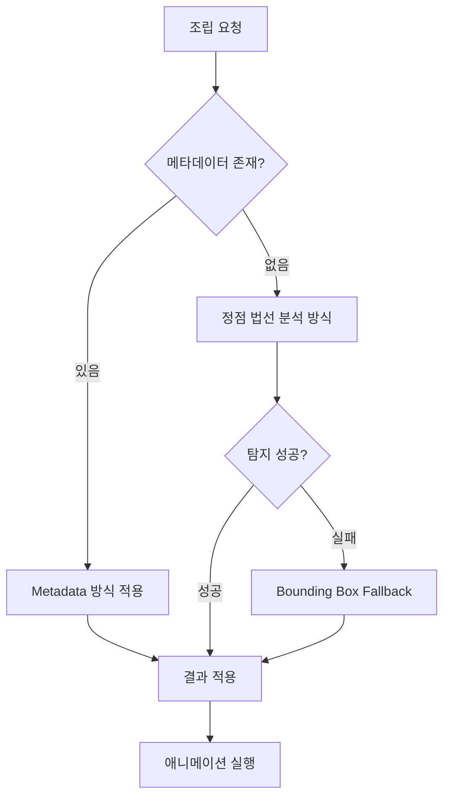

# 조립 방식 비교 및 추천

## 개요

본 문서는 `assembleDamperCover` 함수의 구현 방식을 분석하고, 엔터프라이즈급 3D 조립 시스템에 적합한 방식을 추천합니다.

---

## 1. 현재 구현 방식 분석

### 1.1 정점 법선 벡터 분석을 통한 가상 피벗 방식

**구현 위치:** [`ManualAssemblyManager.ts`](../src/services/fridge/ManualAssemblyManager.ts:421)

**동작 원리:**
- 돌출부(Plug) 탐지: [`calculatePlugByEdgeAnalysis`](../src/shared/utils/NormalBasedHighlight.ts:698) 사용
  - 엣지 기반으로 돌출부 자동 탐지
  - 바운딩 박스 테두리에서 탐색 방향과 일치하는 엣지 필터링
  - 클러스터링을 통해 유의미한 돌출부 그룹화

- 홈(Hole) 탐지: [`calculateMultipleVirtualPivotsByNormalAnalysis`](../src/shared/utils/NormalBasedHighlight.ts:451) 사용
  - 법선 벡터 기반으로 홈 영역 필터링
  - 면(Face) 중심점 거리 기반 클러스터링
  - 인접한 클러스터 병합 로직

**하드코딩된 매개변수:**
```typescript
// 돌출부 탐지
const plugAnalyses = GrooveDetectionUtils.calculatePlugByEdgeAnalysis(
    coverNode,
    new THREE.Vector3(0, -1, 0), // 위쪽 방향 탐색
    60,  // 엣지 각도 임계값
    0.0055 // 클러스터링 거리 임계값 (5.5mm)
);

// 홈 탐지
const holeAnalysesRaw = GrooveDetectionUtils.calculateMultipleVirtualPivotsByNormalAnalysis(
    assemblyNode,
    new THREE.Vector3(0, 0, 1),
    0.2,  // 평면도 임계값 (20%)
    0.005 // 클러스터링 거리 임계값 (5mm)
);
```

**중요:** 이 매개변수들은 **메타데이터가 아니라 알고리즘의 설정값**입니다. 외부 JSON 파일에서 로드하는 것이 아니라 코드 내에 직접 작성된 파라미터입니다.

### 1.2 MetadataLoader 사용 여부

[`ManualAssemblyManager.ts`](../src/services/fridge/ManualAssemblyManager.ts:11)에서 `MetadataLoader`를 import하고 있지만, **`assembleDamperCover` 함수 내에서는 전혀 사용되지 않습니다.**

```typescript
import { getMetadataLoader } from '../../shared/utils/MetadataLoader';
// ... 하지만 assembleDamperCover 함수 내에서는 사용되지 않음
```

### 1.3 Fallback 메커니즘

[`assembleDamperCover`](../src/services/fridge/ManualAssemblyManager.ts:523) 함수에는 정점 분석이 실패할 경우를 대비한 Fallback 로직이 있습니다:

```typescript
} else {
    console.warn('[Assembly] Auto-Snap: 정점 분석 실패. Fallback(BoundingBox) 실행.');
    
    // Fallback: 기존 Bounding Box 방식
    const holeCenter = GrooveDetectionUtils.calculateGrooveCenterByBoundingBox(assemblyNode);
    // ...
}
```

---

## 2. 두 방식 비교 분석

### 2.1 정점 법선 벡터 분석 방식

| 항목 | 설명 |
|------|------|
| **데이터 소스** | 3D 모델의 정점/법선 데이터 |
| **매개변수** | 코드 내 하드코딩된 알고리즘 파라미터 |
| **자동화** | ✅ 자동으로 돌출부/홈 탐지 |
| **정확성** | ⚠️ 복잡한 형상에서 오탐지 가능성 |
| **성능** | ⚠️ 대규모 모델에서 정점 분석에 시간 소요 |
| **유지보수** | ✅ 새로운 부품 추가 시 코드 수정 불필요 |
| **확장성** | ✅ 다양한 형상의 부품에 적용 가능 |
| **디버깅** | ❌ 파라미터 튜닝이 복잡함 |

**장점:**
- ✅ **자동화**: 모델링 데이터만 있으면 자동으로 돌출부/홈 탐지
- ✅ **유연성**: 새로운 부품 추가 시 코드 수정 불필요
- ✅ **확장성**: 다양한 형상의 부품에 적용 가능

**단점:**
- ❌ **정확성 문제**: 복잡한 형상에서 오탐지 가능성
- ❌ **성능**: 대규모 모델에서 정점 분석에 시간 소요
- ❌ **디버깅 어려움**: 파라미터 튜닝이 복잡함

### 2.2 Metadata Mapping 방식

| 항목 | 설명 |
|------|------|
| **데이터 소스** | 외부 JSON 파일 (`assembly-offsets.json`) |
| **매개변수** | JSON 파일에 저장된 오프셋 값 |
| **자동화** | ❌ 수동으로 오프셋 값 입력 필요 |
| **정확성** | ✅ 수동으로 설정한 오프셋으로 정확한 조립 보장 |
| **성능** | ✅ 계산 없이 즉시 적용 가능 |
| **유지보수** | ❌ 모델 변경 시 메타데이터 업데이트 필요 |
| **확장성** | ❌ 새로운 부품 추가 시 메타데이터 작업 필요 |
| **디버깅** | ✅ 명시적인 값으로 문제 해결 쉬움 |

**장점:**
- ✅ **정확성**: 수동으로 설정한 오프셋으로 정확한 조립 보장
- ✅ **성능**: 계산 없이 즉시 적용 가능
- ✅ **디버깅 용이**: 명시적인 값으로 문제 해결 쉬움

**단점:**
- ❌ **수동 작업**: 각 부품별로 오프셋 값을 수동으로 입력해야 함
- ❌ **유지보수**: 모델 변경 시 메타데이터 업데이트 필요
- ❌ **확장성**: 새로운 부품 추가 시 메타데이터 작업 필요

---

## 3. 추천 아키텍처: 하이브리드 접근

### 3.1 추천 방식

**현재 프로젝트에서는 `정점 법선 벡터 분석을 통한 가상 피벗 방식`을 유지하되, `Metadata Mapping 방식`을 보조 수단으로 결합하는 하이브리드 접근을 추천합니다.**

### 3.2 아키텍처 다이어그램



### 3.3 구현 전략

#### 1단계: 메타데이터 우선 적용
- [`assembly-offsets.json`](../public/metadata/assembly-offsets.json)에 해당 부품의 오프셋이 있는지 확인
- 있으면 즉시 적용 (정확성 우선)

#### 2단계: 정점 분석 자동 탐지
- 메타데이터가 없으면 현재 방식대로 정점 분석 실행
- 자동으로 돌출부/홈 탐지

#### 3단계: Fallback
- 정점 분석 실패 시 Bounding Box 방식으로 대체

#### 4단계: 학습 기능 (선택 사항)
- 정점 분석이 성공하면 결과를 메타데이터로 저장
- 다음 실행부터 메타데이터 사용 (점진적 개선)

### 3.4 의사 코드

```typescript
public async assembleDamperCover(options?: {
    duration?: number;
    onComplete?: () => void;
}): Promise<void> {
    // 1단계: 메타데이터 확인
    const metadata = getMetadataLoader().getAssemblyOffset(
        LEFT_DOOR_DAMPER_COVER_BODY_NODE,
        LEFT_DOOR_DAMPER_ASSEMBLY_NODE
    );

    if (metadata) {
        console.log('[Assembly] 메타데이터 적용');
        // 메타데이터 방식으로 조립
        return this.assembleByMetadata(metadata, options);
    }

    // 2단계: 정점 분석
    const plugAnalyses = GrooveDetectionUtils.calculatePlugByEdgeAnalysis(...);
    const holeAnalyses = GrooveDetectionUtils.calculateMultipleVirtualPivotsByNormalAnalysis(...);

    if (plugAnalyses.length > 0 && holeAnalyses.length > 0) {
        console.log('[Assembly] 정점 분석 성공');
        // 정점 분석 방식으로 조립
        const result = this.assembleByVertexAnalysis(plugAnalyses, holeAnalyses, options);

        // 4단계: 학습 (선택 사항)
        if (result.success) {
            getMetadataLoader().saveAssemblyOffset(
                LEFT_DOOR_DAMPER_COVER_BODY_NODE,
                LEFT_DOOR_DAMPER_ASSEMBLY_NODE,
                result.offset
            );
        }
        return result;
    }

    // 3단계: Fallback
    console.warn('[Assembly] 정점 분석 실패. Fallback 실행');
    return this.assembleByBoundingBox(options);
}
```

---

## 4. 결론

### 4.1 엔터프라이즈급 솔루션으로서 하이브리드 접근이 최적

**이유:**
- **초기 단계**: 정점 분석 방식으로 빠르게 프로토타입 구현
- **프로덕션 단계**: 중요한 부품은 메타데이터로 정확성 보장
- **확장 단계**: 자동 탐지 결과를 메타데이터로 학습하여 점진적 개선

### 4.2 기대 효과

| 단계 | 방식 | 효과 |
|------|------|------|
| **개발 초기** | 정점 분석 | 빠른 프로토타이핑, 유연한 확장 |
| **프로덕션** | 메타데이터 우선 | 정확성 보장, 성능 최적화 |
| **운영 중** | 학습 기능 | 점진적 개선, 유지보수 감소 |

### 4.3 최종 추천

**하이브리드 접근은 자동화의 편의성과 정확성의 신뢰성을 동시에 달성할 수 있는 최적의 솔루션입니다.**

---
