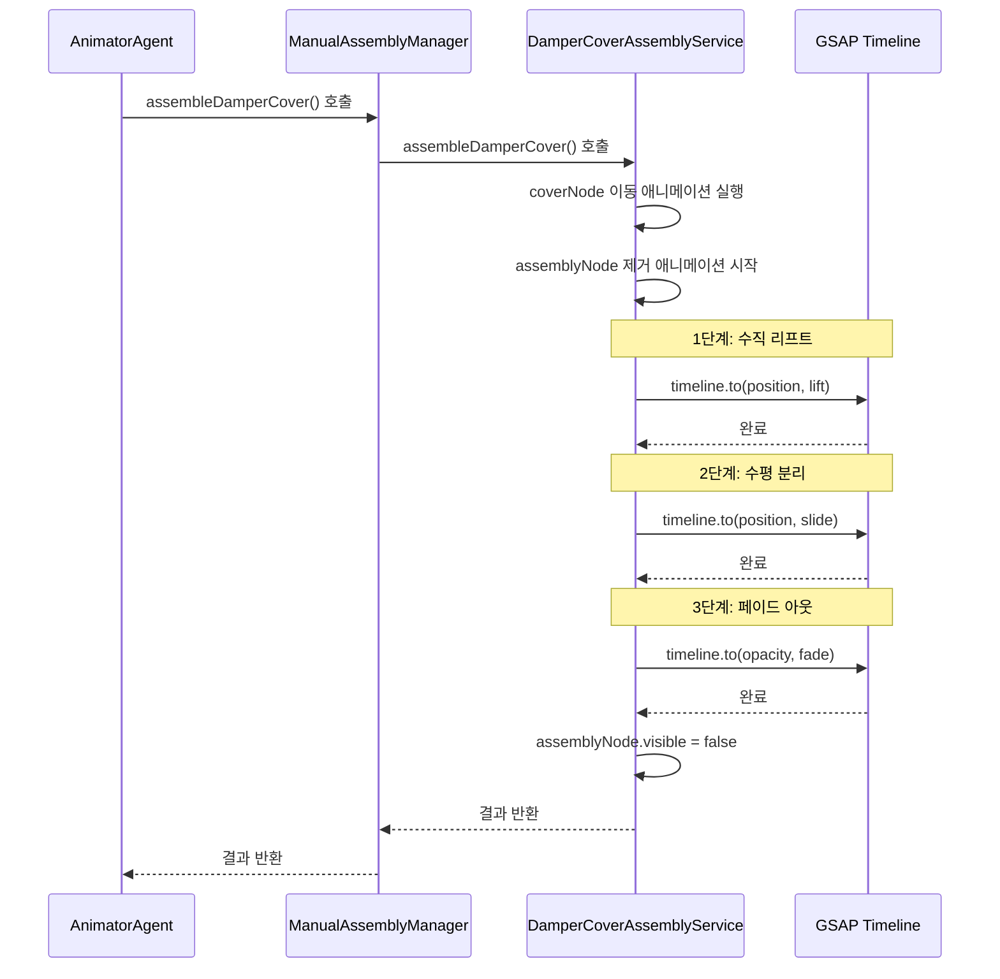

# AssemblyNode 제거 3단계 애니메이션 구현 계획

---
tags:
상태: Plan
중요: 1
생성일: 26-02-11T00:00:00
수정일: 26-02-11T00:00:00
종료일:
라벨:
  - 댐퍼
  - 애니메이션
  - 조립
---

## 0. 참고 레퍼런스
- `src/services/AnimatorAgent.ts:1007-1035` - `manualAssemblyManager.assembleDamperCover` 호출 위치
- `src/services/fridge/DamperCoverAssemblyService.ts` - `assembleDamperCover` 함수 구현
- `src/shared/utils/commonUtils.ts` - `getPreciseBoundingBox` 함수 참조

## 1. 개요

### 1-1. 목적
`assembleDamperCover` 함수 실행 후, `assemblyNode` 노드를 단순히 제거하는 것이 아니라 **홈을 따라 이동한 후 분리되는 3단계 애니메이션**으로 구현하여 자연스러운 분해 과정을 시각화합니다.

### 1-2. 대상 노드
- **assemblyNode**: `fridge.leftDoorDamper.damperAssembly` (댐퍼 어셈블리 노드)
- **coverNode**: `fridge.leftDoorDamper.damperCoverBody` (댐퍼 커버 바디 노드)

## 2. 구현 방식

### 2-1. 추천 방식: GSAP Timeline + 3단계 순차 애니메이션

GSAP의 `Timeline` 기능을 사용하여 3단계 애니메이션을 순차적으로 실행합니다.

```typescript
// 기본 구조 예시
const timeline = gsap.timeline({
  onComplete: () => {
    // 최종적으로 노드 제거
    assemblyNode.visible = false;
  }
});

// 1단계: 수직 리프트
timeline.to(assemblyNode.position, {
  y: assemblyNode.position.y + liftDistance,
  duration: 0.5,
  ease: 'power2.out'
});

// 2단계: 수평 분리
timeline.to(assemblyNode.position, {
  z: assemblyNode.position.z - slideDistance,
  duration: 0.5,
  ease: 'power2.inOut'
});

// 3단계: 페이드 아웃
timeline.to(assemblyNode.material, {
  opacity: 0,
  duration: 0.3,
  ease: 'power2.in'
});
```

### 2-2. 홈 방향 계산 방식

홈의 방향을 정확히 파악하기 위해 다음 두 가지 방식 중 하나를 선택합니다:

#### 방식 A: 탐지된 홈(Hole) 정보 활용 (권장)
`DamperCoverAssemblyService`에서 이미 탐지된 `detectedHoles` 정보를 활용하여 홈의 방향을 계산합니다.

```typescript
// 탐지된 홈의 insertionDirection 사용
const holeDirection = this.detectedHoles[0]?.insertionDirection;
if (holeDirection) {
  // 홈의 삽입 방향 반대로 이동
  const liftDirection = holeDirection.clone().normalize();
  const slideDirection = holeDirection.clone().normalize();
}
```

#### 방식 B: Bounding Box 기반 방향 계산
`getPreciseBoundingBox`를 사용하여 노드의 크기와 방향을 계산합니다.

```typescript
import { getPreciseBoundingBox } from '@/shared/utils/commonUtils';

const box = getPreciseBoundingBox(assemblyNode);
const size = new THREE.Vector3();
box.getSize(size);

// 가장 긴 축을 홈의 방향으로 가정
const longestAxis = size.x > size.y ? (size.x > size.z ? 'x' : 'z') : (size.y > size.z ? 'y' : 'z');
```

## 3. 3단계 애니메이션 상세 동작

### 3-1. 1단계: 수직 리프트 (Lift Up)

| 항목 | 설명 |
|------|------|
| **동작** | 홈(Groove)의 깊이만큼 부품을 수직 방향으로 살짝 들어 올립니다. |
| **이동 방향** | 홈의 삽입 방향(`insertionDirection`) 반대 방향 |
| **이동 거리** | 홈 깊이의 50~70% (예: `0.005 ~ 0.01` units) |
| **지속 시간** | `300 ~ 500ms` |
| **이징(Easing)** | `power2.out` (부드러운 감속) |

```typescript
// 1단계: 수직 리프트
const liftDistance = 0.008; // 홈 깊이에 따라 조정
const liftDirection = holeDirection.clone().normalize().negate();

timeline.to(assemblyNode.position, {
  x: assemblyNode.position.x + liftDirection.x * liftDistance,
  y: assemblyNode.position.y + liftDirection.y * liftDistance,
  z: assemblyNode.position.z + liftDirection.z * liftDistance,
  duration: 0.4,
  ease: 'power2.out'
});
```

### 3-2. 2단계: 수평 분리 (Slide Out)

| 항목 | 설명 |
|------|------|
| **동작** | 홈에서 완전히 벗어나도록 부품을 바깥쪽으로 이동시킵니다. |
| **이동 방향** | 홈의 삽입 방향과 수직인 방향 (또는 카메라 방향) |
| **이동 거리** | 노드 Bounding Box 크기의 100~150% |
| **지속 시간** | `500 ~ 700ms` |
| **이징(Easing)** | `power2.inOut` (가속 후 감속) |

```typescript
// 2단계: 수평 분리
const box = getPreciseBoundingBox(assemblyNode);
const boxSize = new THREE.Vector3();
box.getSize(boxSize);

const slideDistance = Math.max(boxSize.x, boxSize.y, boxSize.z) * 1.2;
const slideDirection = new THREE.Vector3(0, 0, -1); // 또는 카메라 방향

timeline.to(assemblyNode.position, {
  x: assemblyNode.position.x + slideDirection.x * slideDistance,
  y: assemblyNode.position.y + slideDirection.y * slideDistance,
  z: assemblyNode.position.z + slideDirection.z * slideDistance,
  duration: 0.6,
  ease: 'power2.inOut'
});
```

### 3-3. 3단계: 페이드 아웃 (Hide/Fade)

| 항목 | 설명 |
|------|------|
| **동작** | 분리된 부품을 서서히 투명하게 만들거나 `visible = false` 처리합니다. |
| **투명도 변화** | `opacity: 1 → 0` |
| **지속 시간** | `300 ~ 500ms` |
| **이징(Easing)** | `power2.in` (가속) |
| **완료 후 처리** | `assemblyNode.visible = false` |

```typescript
// 3단계: 페이드 아웃
// 먼저 투명도 활성화
assemblyNode.traverse((child) => {
  if (child instanceof THREE.Mesh && child.material) {
    child.material.transparent = true;
    child.material.opacity = 1;
  }
});

timeline.to({}, {
  duration: 0.4,
  ease: 'power2.in',
  onUpdate: () => {
    const progress = timeline.progress();
    assemblyNode.traverse((child) => {
      if (child instanceof THREE.Mesh && child.material) {
        child.material.opacity = 1 - progress;
      }
    });
  },
  onComplete: () => {
    assemblyNode.visible = false;
  }
});
```

## 4. 구현 순서

### 4-1. 전체 동작 순서도



### 4-2. 코드 구현 순서

1. **DamperCoverAssemblyService.ts 수정**
   - `assembleDamperCover` 함수 내에 `assemblyNode` 제거 애니메이션 로직 추가
   - `removeAssemblyNode` 메서드 생성 (3단계 애니메이션 구현)

2. **ManualAssemblyManager.ts 수정**
   - `assembleDamperCover` 함수에서 `assemblyNode` 제거 애니메이션 호출

3. **AnimatorAgent.ts 수정**
   - 기존 코드는 변경 없음 (자동으로 새로운 애니메이션 실행됨)

## 5. 구현 시 고려사항

### 5-1. 홈 방향 계산

- `detectedHoles[0].insertionDirection`이 존재하는 경우 이를 활용
- 존재하지 않는 경우 Bounding Box 기준으로 방향 계산
- 홈의 깊이는 메타데이터 또는 Bounding Box 크기에서 추정

### 5-2. 애니메이션 파라미터

| 파라미터 | 기본값 | 설명 |
|----------|--------|------|
| `liftDistance` | `0.008` | 수직 리프트 거리 |
| `slideDistance` | `boxSize * 1.2` | 수평 분리 거리 |
| `liftDuration` | `400ms` | 1단계 지속 시간 |
| `slideDuration` | `600ms` | 2단계 지속 시간 |
| `fadeDuration` | `400ms` | 3단계 지속 시간 |

### 5-3. 예외 처리

- `assemblyNode`가 존재하지 않는 경우 처리
- `detectedHoles`가 비어있는 경우 fallback 방식 사용
- 애니메이션 중단 시 정리 로직 추가

### 5-4. 성능 고려사항

- `traverse` 호출 최소화 (페이드 아웃 시)
- 불필요한 Bounding Box 계산 회피
- GSAP Timeline 재사용 고려

## 6. 메서드 시그니처

### 6-1. DamperCoverAssemblyService.ts

```typescript
/**
 * assemblyNode를 3단계 애니메이션으로 제거합니다.
 * @param assemblyNode 제거할 어셈블리 노드
 * @param options 애니메이션 옵션
 */
private async removeAssemblyNode(
    assemblyNode: THREE.Object3D,
    options?: {
        liftDistance?: number;
        slideDistance?: number;
        liftDuration?: number;
        slideDuration?: number;
        fadeDuration?: number;
        onComplete?: () => void;
    }
): Promise<void>;
```

## 7. 테스트 시나리오

1. **정상 동작 테스트**
   - `assembleDamperCover` 호출 후 `assemblyNode`가 3단계로 제거되는지 확인

2. **방향 계산 테스트**
   - 홈 방향이 올바르게 계산되는지 확인
   - 수직/수평 이동이 올바른 방향으로 실행되는지 확인

3. **예외 상황 테스트**
   - `assemblyNode`가 없는 경우
   - `detectedHoles`가 비어있는 경우

4. **애니메이션 품질 테스트**
   - 각 단계의 부드러움 확인
   - 전체 지속 시간 확인
