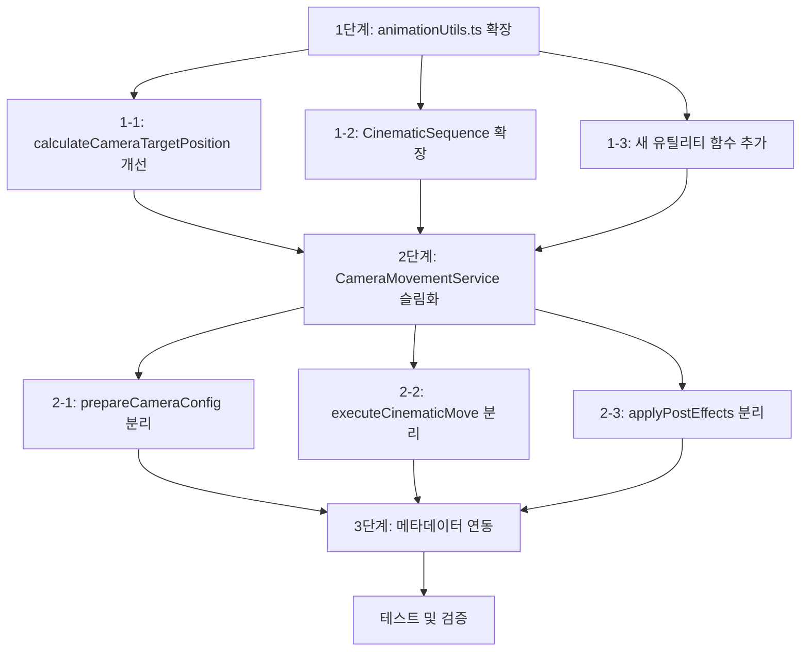

# CameraMovementService 리팩토링 상세 계획

## 1. 현재 상황 분석

### 1.1 CameraMovementService.ts 문제점
- **272줄의 단일 파일**에 모든 로직이 집중
- **관심사 분리 미흡**: 수학 연산, 애니메이션 실행, 하이라이트 처리가 섞여 있음
- **하드코딩**: `damperCoverBody` 노드에 특화된 방향 강제 로직 존재
- **재사용성 부족**: 다른 부품(컴프레서, 선반 등)에 적용하기 어려운 구조

### 1.2 animationUtils.ts 활용 가능 현황
| 기능 | 현재 상태 | 개선 필요 |
|------|----------|----------|
| `calculateCameraTargetPosition` | 기본 구현됨 | `distance` 파라미터 미지원 |
| `CinematicSequence.addBezierPath` | 베지에 곡선 생성 가능 | UP 벡터 보간 미지원 |
| `CinematicSequence.addCameraMove` | 기본 이동 지원 | CameraControls 연동 미지원 |

---

## 2. 리팩토링 실행 계획

### [1단계] animationUtils.ts 확장

#### 1-1. `calculateCameraTargetPosition` 함수 개선
```typescript
// 추가할 파라미터
export interface CameraTargetOptions {
    zoomRatio?: number;
    direction?: THREE.Vector3;
    distance?: number;  // ← NEW: 명시적 거리 지정
    fov?: number;       // ← NEW: 커스텀 FOV
}
```

#### 1-2. `CinematicSequence` 클래스 확장
```typescript
// 추가할 메서드
class CinematicSequence {
    // UP 벡터 보간 기능 추가
    addUpVectorTransition(params: {
        startUp: THREE.Vector3;
        endUp: THREE.Vector3;
        duration?: number;
        easing?: string;
    }): this;

    // CameraControls 연동 메서드 추가
    setCameraControls(controls: any): this;
    
    // 타겟 lerp 기능 추가
    addTargetLerp(params: {
        startTarget: THREE.Vector3;
        endTarget: THREE.Vector3;
        duration?: number;
    }): this;
}
```

#### 1-3. 새로운 유틸리티 함수 추가
```typescript
// 베지에 곡선 제어점 계산 함수
export const calculateBezierControlPoint = (
    startPos: THREE.Vector3,
    endPos: THREE.Vector3,
    targetSize: THREE.Vector3,
    options?: { heightOffset?: number }
): THREE.Vector3;

// 카메라 거리 계산 함수
export const calculateCameraDistance = (
    targetBox: THREE.Box3,
    fov: number,
    options?: { zoomRatio?: number; distance?: number }
): number;

// UP 벡터 계산 함수
export const calculateUpVector = (
    nodeQuat: THREE.Quaternion,
    lookDir: THREE.Vector3
): THREE.Vector3;
```

---

### [2단계] CameraMovementService.ts 슬림화

#### 2-1. 리팩토링 후 구조
```typescript
export class CameraMovementService {
    private cameraControls: any;
    private sceneRoot: THREE.Object3D | null = null;
    private nodeNameManager = getNodeNameManager();

    // 진입점 메서드 (간소화)
    public async moveCameraCinematic(
        nodeName: string, 
        options: CameraMoveOptions = {}
    ): Promise<void> {
        // 1. 타겟 노드 조회
        const targetNode = this.getNodeByName(nodeName);
        if (!targetNode) return;

        // 2. 유틸리티 함수로 연산 위임
        const config = this.prepareCameraConfig(targetNode, options);

        // 3. CinematicSequence로 애니메이션 실행
        await this.executeCinematicMove(config, options);

        // 4. 후처리 (하이라이트)
        await this.applyPostEffects(nodeName);
    }

    // 설정 준비 (연산 로직 분리)
    private prepareCameraConfig(
        targetNode: THREE.Object3D, 
        options: CameraMoveOptions
    ): CameraConfig {
        // 유틸리티 함수 호출로 대체
    }

    // 애니메이션 실행 (CinematicSequence 활용)
    private async executeCinematicMove(
        config: CameraConfig, 
        options: CameraMoveOptions
    ): Promise<void> {
        // CinematicSequence 사용으로 대체
    }

    // 후처리 (비즈니스 로직만 남김)
    private async applyPostEffects(nodeName: string): Promise<void> {
        // 하이라이트 로직 유지
    }
}
```

#### 2-2. 예상 코드 감소량
| 항목 | 리팩토링 전 | 리팩토링 후 |
|------|------------|------------|
| 전체 라인 수 | ~272줄 | ~120줄 |
| `moveCameraCinematic` | ~190줄 | ~30줄 |
| 연산 로직 | 서비스 내부 | 유틸리티로 이관 |

---

### [3단계] 메타데이터 연동 강화

#### 3-1. 확장된 인터페이스 정의
```typescript
export interface CameraMoveOptions {
    duration?: number;
    zoomRatio?: number;
    distance?: number;
    direction?: THREE.Vector3;
    easing?: string;
    onProgress?: (progress: number) => void;
    
    // NEW: 메타데이터 기반 설정
    preset?: 'default' | 'closeup' | 'overview' | 'cinematic';
    upVectorMode?: 'fixed' | 'dynamic' | 'node-based';
    highlightOnComplete?: boolean;
    highlightColors?: number[];
}
```

#### 3-2. 메타데이터 JSON 스키마 확장
```json
{
  "cameraPresets": {
    "default": {
      "zoomRatio": 1.2,
      "duration": 2500,
      "easing": "power3.inOut"
    },
    "closeup": {
      "zoomRatio": 2.0,
      "duration": 2000,
      "easing": "power2.out"
    }
  }
}
```

---

## 3. 구현 순서



---

## 4. 기대 효과

### 4.1 정량적 효과
- **코드 감소**: CameraMovementService 약 50% 감소
- **재사용성**: 5개 이상의 시나리오에서 즉시 활용 가능
- **유지보수성**: 카메라 알고리즘 수정 시 1개 파일만 변경

### 4.2 정성적 효과
- **관심사 분리**: 수학 연산 / 애니메이션 / 비즈니스 로직 명확히 구분
- **확장성**: 새로운 부품(컴프레서, 선반 등)에 대한 시네마틱 뷰 손쉽게 추가
- **테스트 용이성**: 유틸리티 함수 단위 테스트 가능

---

## 5. 작업 파일 목록

| 파일 | 작업 유형 | 주요 변경사항 |
|------|----------|--------------|
| `src/shared/utils/animationUtils.ts` | 수정 | 함수 개선 및 새 함수 추가 |
| `src/services/camera/CameraMovementService.ts` | 수정 | 로직 분리 및 슬림화 |
| `public/metadata/assembly-offsets.json` | 수정 | 카메라 프리셋 추가 (선택) |
