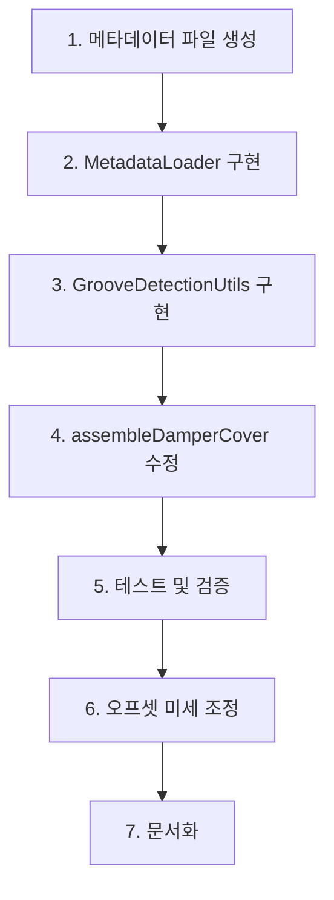

# 댐퍼 어셈블리 더미 노드 분석 및 구현 방안

## 1. 더미 노드 존재 여부 분석

### 1.1 디버깅 결과 분석

```
=== Damper Assembly 노드 구조 ===
prefix>> ACV74674704_Damper_Assembly_13473

=== Damper Cover 노드 구조 ===
prefix>> MCK71751101_Cover,Body_3117001
```

### 1.2 분석 결론

**더미 노드가 존재하지 않음**

**근거:**
1. `printNodeNames()` 함수는 재귀적으로 모든 자식 노드를 순회하도록 구현됨
2. 출력 결과에 최상위 노드 이름만 표시되고 자식 노드가 없음
3. `socket`, `plug`, `hole`, `pin` 등의 더미 노드 명명 규칙을 따르는 노드가 발견되지 않음
4. GLB 모델링 단계에서 조립 기준점(Pivot/Socket)이 미리 심어지지 않은 것으로 판단됨

---

## 2. Bounding Box & Offset + Metadata Mapping 방식 검토

### 2.1 방식 개요

**Bounding Box & Offset 기반 방식**과 **Metadata Mapping(메타데이터 매핑)**을 결합하여 구현

### 2.2 방식의 장점

| 장점 | 설명 |
|------|------|
| **모델링 의존성 제거** | GLB 파일 수정 없이 코드 레벨에서 조립 로직 구현 가능 |
| **유연한 오프셋 조정** | JSON 설정 파일을 통해 미세 조정값을 동적으로 관리 |
| **유지보수 용이성** | 오프셋 값이 코드에 하드코딩되지 않아 수정이 쉬움 |
| **확장성** | 새로운 부품 추가 시 설정 파일만 업데이트하면 됨 |
| **버전 관리 용이** | 설정 파일을 별도로 관리하여 변경 이력 추적 가능 |

### 2.3 방식의 한계점

| 한계점 | 완화 방안 |
|--------|----------|
| **비대칭 모델의 오차** | 바운딩 박스 중심이 실제 홈 위치와 다를 수 있음 | Metadata Mapping으로 오프셋 보정 |
| **삽입 깊이 불확실성** | 바운딩 박스는 전체 부피만 잡음 | Metadata에 삽입 깊이 정보 추가 |
| **회전 정렬 복잡성** | 홈의 방향이 기울어진 경우 | 노드의 월드 쿼터니언 활용 |

### 2.4 결론

**Bounding Box & Offset + Metadata Mapping 방식은 현재 상황에서 가장 적합한 솔루션**

- 더미 노드가 없는 상황에서 엔터프라이즈급 솔루션으로 충분히 기능함
- 모델링 파일 수정 없이 구현 가능하므로 개발 기간 단축
- Metadata Mapping을 통해 정밀도 요구사항 충족 가능

---

## 3. Metadata Mapping 구조 설계

### 3.1 메타데이터 파일 구조

**파일 위치:** `public/metadata/assembly-offsets.json`

```json
{
  "version": "1.0.0",
  "lastUpdated": "2026-01-28",
  "assemblies": {
    "damper_cover_assembly": {
      "targetNode": "ACV74674704_Damper_Assembly_13473",
      "partNode": "MCK71751101_Cover,Body_3117001",
      "grooveDetection": {
        "method": "bounding_box",
        "innerBoundRatio": 0.3,
        "normalFilter": { "x": 0, "y": 0, "z": 1 },
        "normalTolerance": 0.2
      },
      "insertion": {
        "offset": { "x": 0, "y": 0, "z": 0.5 },
        "depth": 0.8,
        "rotationOffset": { "x": 0, "y": 0, "z": 0 }
      },
      "animation": {
        "duration": 1500,
        "easing": "power2.inOut",
        "stages": [
          {
            "name": "approach",
            "progress": 0.7,
            "description": "홈 근처까지 접근"
          },
          {
            "name": "insert",
            "progress": 1.0,
            "description": "홈에 삽입"
          }
        ]
      }
    }
  }
}
```

### 3.2 메타데이터 로더 구현

**파일:** `src/shared/utils/MetadataLoader.ts`

```typescript
import * as THREE from 'three';

export interface AssemblyOffsetMetadata {
  version: string;
  lastUpdated: string;
  assemblies: {
    [key: string]: AssemblyConfig;
  };
}

export interface AssemblyConfig {
  targetNode: string;
  partNode: string;
  grooveDetection: {
    method: 'bounding_box' | 'normal_filter';
    innerBoundRatio: number;
    normalFilter: THREE.Vector3;
    normalTolerance: number;
  };
  insertion: {
    offset: THREE.Vector3;
    depth: number;
    rotationOffset: THREE.Euler;
  };
  animation: {
    duration: number;
    easing: string;
    stages: Array<{
      name: string;
      progress: number;
      description: string;
    }>;
  };
}

export class MetadataLoader {
  private static instance: MetadataLoader;
  private cache: Map<string, AssemblyConfig> = new Map();

  private constructor() {}

  public static getInstance(): MetadataLoader {
    if (!MetadataLoader.instance) {
      MetadataLoader.instance = new MetadataLoader();
    }
    return MetadataLoader.instance;
  }

  public async loadMetadata(filePath: string): Promise<AssemblyOffsetMetadata> {
    const response = await fetch(filePath);
    if (!response.ok) {
      throw new Error(`Failed to load metadata: ${response.statusText}`);
    }
    return await response.json();
  }

  public getAssemblyConfig(assemblyName: string): AssemblyConfig | null {
    return this.cache.get(assemblyName) || null;
  }

  public async loadAssemblyConfig(
    assemblyName: string,
    metadataPath: string = '/metadata/assembly-offsets.json'
  ): Promise<AssemblyConfig | null> {
    // 캐시 확인
    if (this.cache.has(assemblyName)) {
      return this.cache.get(assemblyName)!;
    }

    try {
      const metadata = await this.loadMetadata(metadataPath);
      const config = metadata.assemblies[assemblyName];

      if (config) {
        // Vector3, Euler 변환
        config.grooveDetection.normalFilter = new THREE.Vector3(
          config.grooveDetection.normalFilter.x,
          config.grooveDetection.normalFilter.y,
          config.grooveDetection.normalFilter.z
        );

        config.insertion.offset = new THREE.Vector3(
          config.insertion.offset.x,
          config.insertion.offset.y,
          config.insertion.offset.z
        );

        config.insertion.rotationOffset = new THREE.Euler(
          config.insertion.rotationOffset.x,
          config.insertion.rotationOffset.y,
          config.insertion.rotationOffset.z
        );

        this.cache.set(assemblyName, config);
        return config;
      }

      return null;
    } catch (error) {
      console.error(`Failed to load assembly config: ${assemblyName}`, error);
      return null;
    }
  }

  public clearCache(): void {
    this.cache.clear();
  }
}
```

---

## 4. 구현 프로세스

### 4.1 단계별 구현 계획



### 4.2 상세 단계

#### 단계 1: 메타데이터 파일 생성
- **파일:** `public/metadata/assembly-offsets.json`
- **작업:** 초기 오프셋 값 설정 (0, 0, 0.5)
- **기간:** 1일

#### 단계 2: MetadataLoader 구현
- **파일:** `src/shared/utils/MetadataLoader.ts`
- **작업:** 메타데이터 로딩 및 캐싱 로직 구현
- **기간:** 1일

#### 단계 3: GrooveDetectionUtils 구현
- **파일:** `src/shared/utils/GrooveDetectionUtils.ts`
- **작업:** 
  - Bounding Box 기반 홈 중심점 계산
  - 법선 벡터 기반 필터링 (선택적)
- **기간:** 2일

#### 단계 4: assembleDamperCover 수정
- **파일:** `src/services/fridge/ManualAssemblyManager.ts`
- **작업:**
  - MetadataLoader 통합
  - 홈 중심점 계산 로직 추가
  - 오프셋 적용
  - GSAP 애니메이션 구현
- **기간:** 2일

#### 단계 5: 테스트 및 검증
- **작업:**
  - 홈 중심점 정확성 확인
  - 삽입 애니메이션 부드러움 확인
  - 최종 위치 정확성 확인
  - 다양한 카메라 각도에서 테스트
- **기간:** 2일

#### 단계 6: 오프셋 미세 조정
- **작업:** 테스트 결과에 따라 메타데이터 오프셋 값 조정
- **기간:** 1일

#### 단계 7: 문서화
- **작업:** 구현 가이드 및 사용법 문서 작성
- **기간:** 1일

---

## 5. 기술적 고려사항

### 5.1 좌표계 변환

```typescript
// 월드 좌표 → 로컬 좌표 변환
const targetLocalPos = damperCover.parent
  ? CoordinateTransformUtils.worldToLocal(targetPosition, damperCover.parent)
  : targetPosition;
```

### 5.2 월드 매트릭스 업데이트

```typescript
// 정확한 좌표 추출을 위해 필수
targetNode.updateMatrixWorld(true);
```

### 5.3 바운딩 박스 계산

```typescript
// 기존 getPreciseBoundingBox 활용
const box = getPreciseBoundingBox(targetNode);
const center = new THREE.Vector3();
box.getCenter(center);
```

### 5.4 오프셋 적용 순서

1. 홈 중심점 계산 (Bounding Box 기반)
2. 메타데이터 오프셋 적용
3. 월드 좌표 → 로컬 좌표 변환
4. GSAP 애니메이션으로 부드러운 이동

---

## 6. 예상 이슈 및 대응 방안

### 6.1 홈 중심점 오차

**이슈:** Bounding Box 중심이 실제 홈 위치와 다름

**대응:**
- Metadata Mapping으로 오프셋 보정
- 법선 벡터 기반 필터링으로 정밀도 향상

### 6.2 삽입 깊이 불확실성

**이슈:** 얼마나 깊이 밀어 넣어야 하는지 알 수 없음

**대응:**
- Metadata에 `depth` 파라미터 추가
- 시각적 피드백으로 사용자가 확인 가능하도록 구현

### 6.3 회전 정렬 문제

**이슈:** 홈의 방향이 기울어진 경우

**대응:**
- 노드의 월드 쿼터니언 활용
- Metadata에 `rotationOffset` 파라미터 추가

---

## 7. 성능 최적화

### 7.1 캐싱 전략

- 메타데이터 캐싱 (MetadataLoader)
- 노드 검색 결과 캐싱
- 바운딩 박스 계산 결과 캐싱

### 7.2 비동기 로딩

- 메타데이터 비동기 로딩
- 필요 시점에만 계산 수행

---

## 8. 결론

1. **더미 노드가 존재하지 않음**을 확인
2. **Bounding Box & Offset + Metadata Mapping 방식**이 가장 적합한 솔루션
3. 총 **10일** 예상 기간으로 구현 가능
4. 모델링 파일 수정 없이 코드 레벨에서 구현 가능
5. Metadata Mapping을 통해 유연한 오프셋 조정 가능
6. 유지보수 및 확장성 우수

---

## 9. 참고 자료

- `.kilocode/rules/홈영역 파악 및 돌출부 삽입.md`
- `src/shared/utils/commonUtils.ts` (getPreciseBoundingBox 함수)
- `src/shared/utils/CoordinateTransformUtils.ts`
- `plans/damper-cover-assembly-plan.md`
