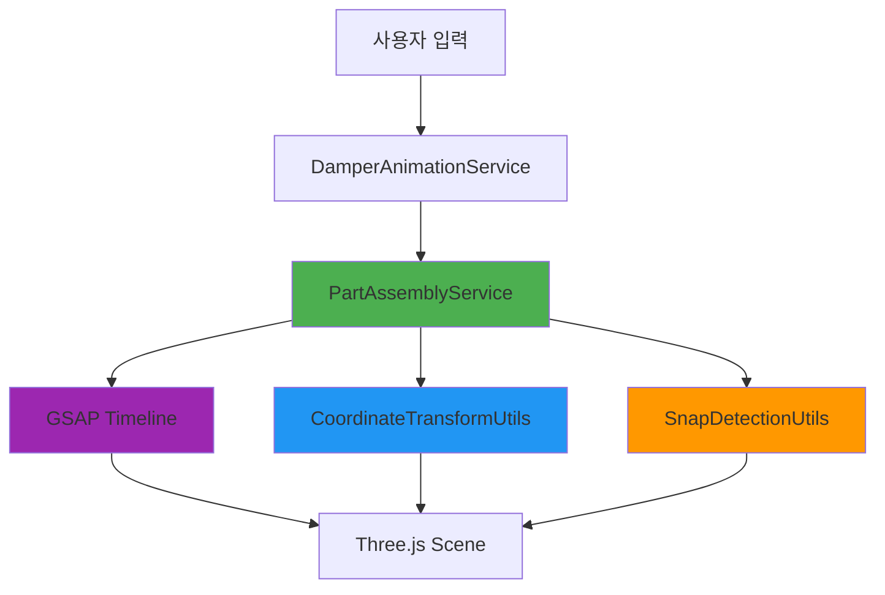
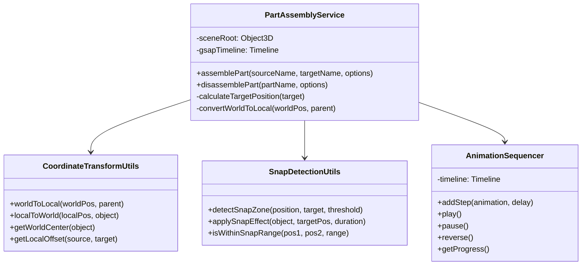
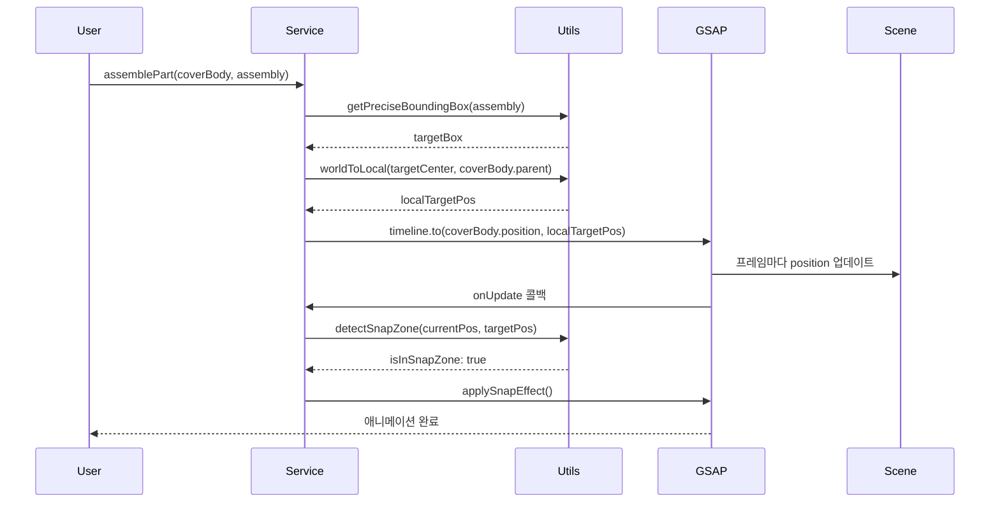

# 댐퍼 조립 애니메이션 아키텍처 설계서

## 📋 목차
1. [프로젝트 현황 분석](#1-프로젝트-현황-분석)
2. [요구사항 정의](#2-요구사항-정의)
3. [아키텍처 설계](#3-아키텍처-설계)
4. [핵심 구현 전략](#4-핵심-구현-전략)
5. [API 설계](#5-api-설계)
6. [구현 예시 코드](#6-구현-예시-코드)
7. [성능 최적화 전략](#7-성능-최적화-전략)
8. [테스트 시나리오](#8-테스트-시나리오)

---

## 1. 프로젝트 현황 분석

### 1.1 현재 구조
```
src/
├── services/
│   └── fridge/
│       ├── CameraMovementService.ts    # 카메라 이동 로직 (GSAP 기반)
│       └── DamperAnimationService.ts   # 댐퍼 애니메이션 명령 처리
├── shared/
│   └── utils/
│       ├── commonUtils.ts              # getPreciseBoundingBox 등
│       ├── fridgeConstants.ts          # 노드 이름 상수
│       └── findNodeHeight.ts           # 노드 하이라이트 유틸
```

### 1.2 기술 스택
- **Three.js** `0.152.2`: 3D 렌더링 엔진
- **React Three Fiber** `8.15.12`: React 기반 Three.js 래퍼
- **GSAP** `3.14.2`: 고급 애니메이션 라이브러리
- **@react-three/drei** `9.88.6`: Three.js 헬퍼 컴포넌트

### 1.3 기존 구현 분석
#### 강점
- [`CameraMovementService.ts`](src/services/fridge/CameraMovementService.ts)에 GSAP 기반 시네마틱 카메라 워킹 구현됨
- [`getPreciseBoundingBox()`](src/shared/utils/commonUtils.ts:9) 함수로 정밀한 바운딩 박스 계산 가능
- 월드 좌표계 기반 계산 로직 존재

#### 개선 필요 사항
- 부품 간 정밀 이동 및 결합 로직 부재
- 좌표계 변환(World ↔ Local) 유틸리티 미구현
- 스냅(Snap) 및 충돌 감지 로직 없음
- 복잡한 시퀀스 제어 메커니즘 부족

---

## 2. 요구사항 정의

### 2.1 핵심 요구사항
> **목표**: `LEFT_DOOR_DAMPER_COVER_BODY_NODE`를 `LEFT_DOOR_DAMPER_ASSEMBLY_NODE`의 정확한 위치로 이동하여 결합

### 2.2 기능 요구사항
| 번호 | 요구사항 | 우선순위 | 비고 |
|------|---------|---------|------|
| FR-01 | 동적 타겟 좌표 추출 | 필수 | 하드코딩 금지, 실시간 계산 |
| FR-02 | 월드-로컬 좌표계 변환 | 필수 | 부모 노드 계층 구조 고려 |
| FR-03 | GSAP Timeline 기반 시퀀스 제어 | 필수 | 단계별 애니메이션 관리 |
| FR-04 | 스냅(Snap) 효과 구현 | 권장 | 최종 결합 시 자석 효과 |
| FR-05 | 충돌 감지 | 선택 | 물리 엔진 없이 거리 기반 |
| FR-06 | 애니메이션 되돌리기 | 권장 | 히스토리 관리 |

### 2.3 비기능 요구사항
- **성능**: 60fps 유지, 프레임 드랍 최소화
- **정확도**: 좌표 오차 ±0.01 이내
- **유지보수성**: 모듈화된 구조, 재사용 가능한 유틸리티
- **확장성**: 다른 부품 조립에도 적용 가능

---

## 3. 아키텍처 설계

### 3.1 시스템 아키텍처



### 3.2 클래스 다이어그램



### 3.3 데이터 플로우



---

## 4. 핵심 구현 전략

### 4.1 좌표계 변환 전략

#### 4.1.1 문제 정의
Three.js에서 부모-자식 계층 구조가 있을 때, 월드 좌표를 로컬 좌표로 변환해야 정확한 위치 설정이 가능합니다.

#### 4.1.2 해결 방법
```typescript
// World → Local 변환 공식
localPosition = parentWorldMatrixInverse × worldPosition
```

#### 4.1.3 구현 핵심
```typescript
/**
 * 월드 좌표를 특정 부모의 로컬 좌표로 변환
 * @param worldPosition 월드 좌표
 * @param parentObject 부모 객체
 * @returns 로컬 좌표
 */
export function worldToLocal(
    worldPosition: THREE.Vector3,
    parentObject: THREE.Object3D
): THREE.Vector3 {
    // 1. 부모의 월드 매트릭스 업데이트
    parentObject.updateMatrixWorld(true);
    
    // 2. 역행렬 계산
    const inverseMatrix = new THREE.Matrix4()
        .copy(parentObject.matrixWorld)
        .invert();
    
    // 3. 월드 좌표를 로컬 좌표로 변환
    return worldPosition.clone().applyMatrix4(inverseMatrix);
}
```

### 4.2 GSAP Timeline 기반 시퀀스 제어

#### 4.2.1 타임라인 구조
```typescript
const timeline = gsap.timeline({
    onComplete: () => console.log('조립 완료'),
    onUpdate: () => checkSnapZone()
});

// 단계 1: 커버를 들어올림 (0.5초)
timeline.to(coverBody.position, {
    y: '+=2',
    duration: 0.5,
    ease: 'power2.out'
});

// 단계 2: 타겟 위치로 이동 (1.0초)
timeline.to(coverBody.position, {
    x: targetLocalPos.x,
    y: targetLocalPos.y,
    z: targetLocalPos.z,
    duration: 1.0,
    ease: 'power3.inOut'
}, '+=0.2'); // 0.2초 딜레이

// 단계 3: 스냅 효과 (0.3초)
timeline.to(coverBody.position, {
    x: finalSnapPos.x,
    y: finalSnapPos.y,
    z: finalSnapPos.z,
    duration: 0.3,
    ease: 'back.out(2)' // 오버슈트 효과
});
```

### 4.3 스냅(Snap) 감지 및 적용

#### 4.3.1 스냅 존 감지
```typescript
/**
 * 스냅 존 진입 여부 확인
 * @param currentPos 현재 위치
 * @param targetPos 타겟 위치
 * @param threshold 임계값 (기본 0.1)
 */
export function isInSnapZone(
    currentPos: THREE.Vector3,
    targetPos: THREE.Vector3,
    threshold: number = 0.1
): boolean {
    return currentPos.distanceTo(targetPos) < threshold;
}
```

#### 4.3.2 자석 효과 구현
```typescript
/**
 * 스냅 존 진입 시 자석처럼 끌어당기는 효과
 */
export function applySnapEffect(
    object: THREE.Object3D,
    targetPos: THREE.Vector3,
    duration: number = 0.3
): Promise<void> {
    return new Promise((resolve) => {
        gsap.to(object.position, {
            x: targetPos.x,
            y: targetPos.y,
            z: targetPos.z,
            duration,
            ease: 'back.out(3)', // 강한 오버슈트
            onComplete: resolve
        });
    });
}
```

### 4.4 동적 좌표 추출 전략

#### 4.4.1 타겟 중심점 계산
```typescript
/**
 * Assembly 노드의 정확한 월드 중심점 추출
 */
export function getAssemblyTargetPosition(
    assemblyNode: THREE.Object3D
): THREE.Vector3 {
    // 1. 바운딩 박스 계산
    const bbox = getPreciseBoundingBox(assemblyNode);
    
    // 2. 중심점 추출
    const center = new THREE.Vector3();
    bbox.getCenter(center);
    
    // 3. 오프셋 적용 (필요시)
    // 예: 커버가 Assembly 위쪽에 위치해야 한다면
    const size = new THREE.Vector3();
    bbox.getSize(size);
    center.y += size.y * 0.5; // 위쪽으로 절반 높이만큼 이동
    
    return center;
}
```

---

## 5. API 설계

### 5.1 PartAssemblyService API

```typescript
export interface AssemblyOptions {
    duration?: number;           // 전체 애니메이션 시간 (ms)
    liftHeight?: number;         // 들어올리는 높이
    snapThreshold?: number;      // 스냅 감지 임계값
    easing?: string;             // GSAP easing
    onProgress?: (progress: number) => void;
    onSnap?: () => void;         // 스냅 진입 시 콜백
    onComplete?: () => void;
}

export class PartAssemblyService {
    /**
     * 부품을 타겟 위치로 조립
     * @param sourceNodeName 이동할 부품 노드 이름
     * @param targetNodeName 목적지 노드 이름
     * @param options 애니메이션 옵션
     */
    public async assemblePart(
        sourceNodeName: string,
        targetNodeName: string,
        options?: AssemblyOptions
    ): Promise<void>;
    
    /**
     * 조립된 부품을 분해
     * @param partNodeName 분해할 부품 노드 이름
     * @param options 애니메이션 옵션
     */
    public async disassemblePart(
        partNodeName: string,
        options?: AssemblyOptions
    ): Promise<void>;
    
    /**
     * 현재 애니메이션 일시정지
     */
    public pause(): void;
    
    /**
     * 애니메이션 재개
     */
    public resume(): void;
    
    /**
     * 애니메이션 되돌리기
     */
    public reverse(): Promise<void>;
}
```

### 5.2 CoordinateTransformUtils API

```typescript
export class CoordinateTransformUtils {
    /**
     * 월드 좌표를 로컬 좌표로 변환
     */
    static worldToLocal(
        worldPosition: THREE.Vector3,
        parentObject: THREE.Object3D
    ): THREE.Vector3;
    
    /**
     * 로컬 좌표를 월드 좌표로 변환
     */
    static localToWorld(
        localPosition: THREE.Vector3,
        object: THREE.Object3D
    ): THREE.Vector3;
    
    /**
     * 객체의 월드 중심점 가져오기
     */
    static getWorldCenter(object: THREE.Object3D): THREE.Vector3;
    
    /**
     * 두 객체 간 로컬 오프셋 계산
     */
    static getLocalOffset(
        source: THREE.Object3D,
        target: THREE.Object3D
    ): THREE.Vector3;
}
```

### 5.3 SnapDetectionUtils API

```typescript
export class SnapDetectionUtils {
    /**
     * 스냅 존 진입 여부 확인
     */
    static isInSnapZone(
        currentPos: THREE.Vector3,
        targetPos: THREE.Vector3,
        threshold?: number
    ): boolean;
    
    /**
     * 스냅 효과 적용
     */
    static applySnapEffect(
        object: THREE.Object3D,
        targetPos: THREE.Vector3,
        duration?: number
    ): Promise<void>;
    
    /**
     * 거리 기반 스냅 강도 계산
     */
    static calculateSnapStrength(
        distance: number,
        maxDistance: number
    ): number;
}
```

---

## 6. 구현 예시 코드

### 6.1 CoordinateTransformUtils.ts

```typescript
import * as THREE from 'three';

export class CoordinateTransformUtils {
    /**
     * 월드 좌표를 특정 부모의 로컬 좌표로 변환
     * 
     * @example
     * const worldPos = new THREE.Vector3(10, 5, 3);
     * const localPos = CoordinateTransformUtils.worldToLocal(worldPos, parentNode);
     */
    static worldToLocal(
        worldPosition: THREE.Vector3,
        parentObject: THREE.Object3D
    ): THREE.Vector3 {
        // 부모의 월드 매트릭스 최신화
        parentObject.updateMatrixWorld(true);
        
        // 역행렬 계산
        const inverseMatrix = new THREE.Matrix4()
            .copy(parentObject.matrixWorld)
            .invert();
        
        // 변환 적용
        return worldPosition.clone().applyMatrix4(inverseMatrix);
    }
    
    /**
     * 로컬 좌표를 월드 좌표로 변환
     */
    static localToWorld(
        localPosition: THREE.Vector3,
        object: THREE.Object3D
    ): THREE.Vector3 {
        object.updateMatrixWorld(true);
        return localPosition.clone().applyMatrix4(object.matrixWorld);
    }
    
    /**
     * 객체의 정확한 월드 중심점 계산
     * getPreciseBoundingBox를 활용
     */
    static getWorldCenter(object: THREE.Object3D): THREE.Vector3 {
        const bbox = this.getPreciseBoundingBox(object);
        const center = new THREE.Vector3();
        bbox.getCenter(center);
        return center;
    }
    
    /**
     * 두 객체 간 로컬 오프셋 계산
     * source를 target 위치로 이동시키기 위한 로컬 좌표 반환
     */
    static getLocalOffset(
        source: THREE.Object3D,
        target: THREE.Object3D
    ): THREE.Vector3 {
        // 타겟의 월드 중심점
        const targetWorldCenter = this.getWorldCenter(target);
        
        // source의 부모 기준 로컬 좌표로 변환
        if (source.parent) {
            return this.worldToLocal(targetWorldCenter, source.parent);
        }
        
        return targetWorldCenter;
    }
    
    /**
     * 정밀 바운딩 박스 계산 (commonUtils에서 가져옴)
     */
    private static getPreciseBoundingBox(targetNode: THREE.Object3D): THREE.Box3 {
        const box = new THREE.Box3();
        let hasMesh = false;
        
        targetNode.updateMatrixWorld(true);
        
        targetNode.traverse((child) => {
            if (child instanceof THREE.Mesh && child.geometry) {
                child.geometry.computeBoundingBox();
                const geomBox = child.geometry.boundingBox;
                if (geomBox && !geomBox.isEmpty()) {
                    const worldBox = geomBox.clone();
                    worldBox.applyMatrix4(child.matrixWorld);
                    box.union(worldBox);
                    hasMesh = true;
                }
            }
        });
        
        if (!hasMesh || box.isEmpty()) {
            const pos = new THREE.Vector3();
            targetNode.getWorldPosition(pos);
            box.setFromCenterAndSize(pos, new THREE.Vector3(1, 1, 1));
        }
        
        return box;
    }
}
```

### 6.2 SnapDetectionUtils.ts

```typescript
import * as THREE from 'three';
import gsap from 'gsap';

export interface SnapZoneConfig {
    threshold: number;      // 스냅 감지 거리
    strength: number;       // 스냅 강도 (0~1)
    duration: number;       // 스냅 애니메이션 시간
    easing: string;         // GSAP easing
}

export class SnapDetectionUtils {
    private static readonly DEFAULT_CONFIG: SnapZoneConfig = {
        threshold: 0.15,
        strength: 1.0,
        duration: 0.3,
        easing: 'back.out(3)'
    };
    
    /**
     * 스냅 존 진입 여부 확인
     */
    static isInSnapZone(
        currentPos: THREE.Vector3,
        targetPos: THREE.Vector3,
        threshold: number = this.DEFAULT_CONFIG.threshold
    ): boolean {
        return currentPos.distanceTo(targetPos) < threshold;
    }
    
    /**
     * 거리 기반 스냅 강도 계산 (0~1)
     * 가까울수록 1에 가까움
     */
    static calculateSnapStrength(
        distance: number,
        maxDistance: number
    ): number {
        if (distance >= maxDistance) return 0;
        return 1 - (distance / maxDistance);
    }
    
    /**
     * 스냅 효과 적용 (자석처럼 끌어당김)
     */
    static applySnapEffect(
        object: THREE.Object3D,
        targetPos: THREE.Vector3,
        config: Partial<SnapZoneConfig> = {}
    ): Promise<void> {
        const finalConfig = { ...this.DEFAULT_CONFIG, ...config };
        
        return new Promise((resolve) => {
            gsap.to(object.position, {
                x: targetPos.x,
                y: targetPos.y,
                z: targetPos.z,
                duration: finalConfig.duration,
                ease: finalConfig.easing,
                onComplete: () => {
                    console.log('[Snap] 부품이 정확히 결합되었습니다.');
                    resolve();
                }
            });
        });
    }
    
    /**
     * 점진적 스냅 (거리에 따라 끌어당기는 힘 조절)
     */
    static applyGradualSnap(
        object: THREE.Object3D,
        targetPos: THREE.Vector3,
        currentDistance: number,
        maxSnapDistance: number
    ): void {
        const strength = this.calculateSnapStrength(currentDistance, maxSnapDistance);
        
        if (strength > 0) {
            // 타겟 방향으로 끌어당김
            const direction = new THREE.Vector3()
                .subVectors(targetPos, object.position)
                .normalize();
            
            const pullForce = direction.multiplyScalar(strength * 0.05);
            object.position.add(pullForce);
        }
    }
}
```

### 6.3 PartAssemblyService.ts

```typescript
import * as THREE from 'three';
import gsap from 'gsap';
import { CoordinateTransformUtils } from '../../shared/utils/CoordinateTransformUtils';
import { SnapDetectionUtils } from '../../shared/utils/SnapDetectionUtils';
import { getPreciseBoundingBox } from '../../shared/utils/commonUtils';

export interface AssemblyOptions {
    duration?: number;           // 전체 애니메이션 시간 (ms)
    liftHeight?: number;         // 들어올리는 높이
    snapThreshold?: number;      // 스냅 감지 임계값
    easing?: string;             // GSAP easing
    onProgress?: (progress: number) => void;
    onSnap?: () => void;
    onComplete?: () => void;
}

export class PartAssemblyService {
    private sceneRoot: THREE.Object3D;
    private timeline: gsap.core.Timeline | null = null;
    private isAnimating: boolean = false;
    
    constructor(sceneRoot: THREE.Object3D) {
        this.sceneRoot = sceneRoot;
    }
    
    /**
     * 부품을 타겟 위치로 조립
     * 
     * @example
     * await assemblyService.assemblePart(
     *     'LEFT_DOOR_DAMPER_COVER_BODY_NODE',
     *     'LEFT_DOOR_DAMPER_ASSEMBLY_NODE',
     *     { duration: 2000, liftHeight: 2 }
     * );
     */
    public async assemblePart(
        sourceNodeName: string,
        targetNodeName: string,
        options: AssemblyOptions = {}
    ): Promise<void> {
        // 기본값 설정
        const config = {
            duration: options.duration || 2000,
            liftHeight: options.liftHeight || 1.5,
            snapThreshold: options.snapThreshold || 0.15,
            easing: options.easing || 'power3.inOut',
            ...options
        };
        
        // 노드 찾기
        const sourceNode = this.sceneRoot.getObjectByName(sourceNodeName);
        const targetNode = this.sceneRoot.getObjectByName(targetNodeName);
        
        if (!sourceNode || !targetNode) {
            console.error('[Assembly] 노드를 찾을 수 없습니다:', {
                source: sourceNodeName,
                target: targetNodeName
            });
            return;
        }
        
        // 1. 타겟의 월드 중심점 계산
        const targetWorldCenter = CoordinateTransformUtils.getWorldCenter(targetNode);
        
        // 2. source의 부모 기준 로컬 좌표로 변환
        const targetLocalPos = sourceNode.parent
            ? CoordinateTransformUtils.worldToLocal(targetWorldCenter, sourceNode.parent)
            : targetWorldCenter;
        
        // 3. 시작 위치 저장
        const startPos = sourceNode.position.clone();
        
        // 4. 중간 지점 (들어올린 위치)
        const liftPos = startPos.clone();
        liftPos.y += config.liftHeight;
        
        // 5. GSAP Timeline 생성
        this.timeline = gsap.timeline({
            onComplete: () => {
                this.isAnimating = false;
                config.onComplete?.();
            }
        });
        
        this.isAnimating = true;
        
        // 단계 1: 부품 들어올리기 (0.5초)
        this.timeline.to(sourceNode.position, {
            x: liftPos.x,
            y: liftPos.y,
            z: liftPos.z,
            duration: 0.5,
            ease: 'power2.out'
        });
        
        // 단계 2: 타겟 위치로 이동 (메인 애니메이션)
        const mainDuration = (config.duration - 800) / 1000; // 0.5초(들어올림) + 0.3초(스냅) 제외
        
        this.timeline.to(sourceNode.position, {
            x: targetLocalPos.x,
            y: targetLocalPos.y,
            z: targetLocalPos.z,
            duration: mainDuration,
            ease: config.easing,
            onUpdate: () => {
                // 스냅 존 감지
                const currentWorldPos = new THREE.Vector3();
                sourceNode.getWorldPosition(currentWorldPos);
                
                if (SnapDetectionUtils.isInSnapZone(
                    currentWorldPos,
                    targetWorldCenter,
                    config.snapThreshold
                )) {
                    // 스냅 존 진입 시 콜백
                    config.onSnap?.();
                }
                
                // 진행률 콜백
                const progress = this.timeline?.progress() || 0;
                config.onProgress?.(progress);
            }
        }, '+=0.2'); // 0.2초 딜레이
        
        // 단계 3: 스냅 효과 (0.3초)
        this.timeline.to(sourceNode.position, {
            x: targetLocalPos.x,
            y: targetLocalPos.y,
            z: targetLocalPos.z,
            duration: 0.3,
            ease: 'back.out(3)', // 오버슈트 효과
            onStart: () => {
                console.log('[Assembly] 스냅 효과 시작');
            }
        });
        
        // 애니메이션 완료 대기
        return new Promise((resolve) => {
            this.timeline?.eventCallback('onComplete', () => {
                console.log('[Assembly] 조립 완료:', sourceNodeName);
                resolve();
            });
        });
    }
    
    /**
     * 조립된 부품을 원래 위치로 분해
     */
    public async disassemblePart(
        partNodeName: string,
        originalPosition: THREE.Vector3,
        options: AssemblyOptions = {}
    ): Promise<void> {
        const config = {
            duration: options.duration || 1500,
            liftHeight: options.liftHeight || 1.5,
            easing: options.easing || 'power2.inOut',
            ...options
        };
        
        const partNode = this.sceneRoot.getObjectByName(partNodeName);
        if (!partNode) {
            console.error('[Disassembly] 노드를 찾을 수 없습니다:', partNodeName);
            return;
        }
        
        // Timeline 생성
        this.timeline = gsap.timeline({
            onComplete: () => {
                this.isAnimating = false;
                config.onComplete?.();
            }
        });
        
        this.isAnimating = true;
        
        // 역순으로 애니메이션
        const currentPos = partNode.position.clone();
        const liftPos = currentPos.clone();
        liftPos.y += config.liftHeight;
        
        // 1. 들어올리기
        this.timeline.to(partNode.position, {
            y: liftPos.y,
            duration: 0.3,
            ease: 'power2.out'
        });
        
        // 2. 원래 위치로 이동
        this.timeline.to(partNode.position, {
            x: originalPosition.x,
            y: originalPosition.y + config.liftHeight,
            z: originalPosition.z,
            duration: (config.duration - 600) / 1000,
            ease: config.easing
        }, '+=0.1');
        
        // 3. 내려놓기
        this.timeline.to(partNode.position, {
            y: originalPosition.y,
            duration: 0.3,
            ease: 'power2.in'
        });
        
        return new Promise((resolve) => {
            this.timeline?.eventCallback('onComplete', () => {
                console.log('[Disassembly] 분해 완료:', partNodeName);
                resolve();
            });
        });
    }
    
    /**
     * 애니메이션 일시정지
     */
    public pause(): void {
        if (this.timeline && this.isAnimating) {
            this.timeline.pause();
        }
    }
    
    /**
     * 애니메이션 재개
     */
    public resume(): void {
        if (this.timeline) {
            this.timeline.resume();
        }
    }
    
    /**
     * 애니메이션 되돌리기
     */
    public async reverse(): Promise<void> {
        if (this.timeline) {
            return new Promise((resolve) => {
                this.timeline?.reverse();
                this.timeline?.eventCallback('onReverseComplete', resolve);
            });
        }
    }
    
    /**
     * 현재 진행률 가져오기 (0~1)
     */
    public getProgress(): number {
        return this.timeline?.progress() || 0;
    }
}
```

### 6.4 사용 예시

```typescript
// ManualEditorPage.tsx 또는 ModelViewer.tsx에서 사용

import { PartAssemblyService } from '../services/fridge/PartAssemblyService';
import { 
    LEFT_DOOR_DAMPER_COVER_BODY_NODE,
    LEFT_DOOR_DAMPER_ASSEMBLY_NODE 
} from '../shared/utils/fridgeConstants';

// 서비스 초기화
const assemblyService = new PartAssemblyService(sceneRoot);

// 조립 실행
await assemblyService.assemblePart(
    LEFT_DOOR_DAMPER_COVER_BODY_NODE,
    LEFT_DOOR_DAMPER_ASSEMBLY_NODE,
    {
        duration: 2500,
        liftHeight: 2.0,
        snapThreshold: 0.2,
        onProgress: (progress) => {
            console.log(`조립 진행률: ${(progress * 100).toFixed(1)}%`);
        },
        onSnap: () => {
            console.log('스냅 존 진입!');
            // 사운드 효과나 시각 효과 추가 가능
        },
        onComplete: () => {
            console.log('조립 완료!');
        }
    }
);
```

---

## 7. 성능 최적화 전략

### 7.1 렌더링 최적화

#### 7.1.1 프레임 레이트 관리
```typescript
// GSAP의 ticker를 Three.js 렌더 루프와 동기화
gsap.ticker.fps(60);
gsap.ticker.lagSmoothing(500, 33); // 렉 발생 시 부드럽게 처리
```

#### 7.1.2 불필요한 업데이트 방지
```typescript
// 애니메이션 중이 아닐 때는 매트릭스 업데이트 스킵
if (!this.isAnimating) {
    return;
}
object.updateMatrixWorld(true);
```

### 7.2 메모리 최적화

#### 7.2.1 Timeline 재사용
```typescript
// 매번 새로 생성하지 않고 clear() 후 재사용
if (this.timeline) {
    this.timeline.clear();
} else {
    this.timeline = gsap.timeline();
}
```

#### 7.2.2 이벤트 리스너 정리
```typescript
public dispose(): void {
    if (this.timeline) {
        this.timeline.kill();
        this.timeline = null;
    }
}
```

### 7.3 좌표 계산 최적화

#### 7.3.1 캐싱 전략
```typescript
private boundingBoxCache = new Map<string, THREE.Box3>();

private getCachedBoundingBox(nodeName: string): THREE.Box3 {
    if (!this.boundingBoxCache.has(nodeName)) {
        const node = this.sceneRoot.getObjectByName(nodeName);
        if (node) {
            this.boundingBoxCache.set(
                nodeName,
                getPreciseBoundingBox(node)
            );
        }
    }
    return this.boundingBoxCache.get(nodeName)!;
}
```

### 7.4 성능 모니터링

```typescript
export class PerformanceMonitor {
    private frameCount = 0;
    private lastTime = performance.now();
    
    public measureFPS(): number {
        this.frameCount++;
        const currentTime = performance.now();
        
        if (currentTime >= this.lastTime + 1000) {
            const fps = Math.round((this.frameCount * 1000) / (currentTime - this.lastTime));
            this.frameCount = 0;
            this.lastTime = currentTime;
            return fps;
        }
        
        return 60; // 기본값
    }
    
    public logPerformance(label: string): void {
        console.log(`[Performance] ${label}:`, {
            fps: this.measureFPS(),
            memory: (performance as any).memory?.usedJSHeapSize / 1048576 || 'N/A'
        });
    }
}
```

---

## 8. 테스트 시나리오

### 8.1 단위 테스트

#### 8.1.1 좌표 변환 테스트
```typescript
describe('CoordinateTransformUtils', () => {
    test('월드 좌표를 로컬 좌표로 정확히 변환', () => {
        const parent = new THREE.Object3D();
        parent.position.set(10, 5, 3);
        parent.updateMatrixWorld(true);
        
        const worldPos = new THREE.Vector3(15, 10, 8);
        const localPos = CoordinateTransformUtils.worldToLocal(worldPos, parent);
        
        expect(localPos.x).toBeCloseTo(5);
        expect(localPos.y).toBeCloseTo(5);
        expect(localPos.z).toBeCloseTo(5);
    });
    
    test('로컬 좌표를 월드 좌표로 정확히 변환', () => {
        const object = new THREE.Object3D();
        object.position.set(10, 5, 3);
        object.updateMatrixWorld(true);
        
        const localPos = new THREE.Vector3(5, 5, 5);
        const worldPos = CoordinateTransformUtils.localToWorld(localPos, object);
        
        expect(worldPos.x).toBeCloseTo(15);
        expect(worldPos.y).toBeCloseTo(10);
        expect(worldPos.z).toBeCloseTo(8);
    });
});
```

#### 8.1.2 스냅 감지 테스트
```typescript
describe('SnapDetectionUtils', () => {
    test('임계값 내에서 스냅 존 감지', () => {
        const pos1 = new THREE.Vector3(0, 0, 0);
        const pos2 = new THREE.Vector3(0.1, 0.05, 0.03);
        
        const isInZone = SnapDetectionUtils.isInSnapZone(pos1, pos2, 0.15);
        expect(isInZone).toBe(true);
    });
    
    test('임계값 밖에서 스냅 존 미감지', () => {
        const pos1 = new THREE.Vector3(0, 0, 0);
        const pos2 = new THREE.Vector3(1, 1, 1);
        
        const isInZone = SnapDetectionUtils.isInSnapZone(pos1, pos2, 0.15);
        expect(isInZone).toBe(false);
    });
});
```

### 8.2 통합 테스트

#### 8.2.1 전체 조립 시나리오
```typescript
describe('PartAssemblyService Integration', () => {
    let scene: THREE.Scene;
    let assemblyService: PartAssemblyService;
    
    beforeEach(() => {
        scene = new THREE.Scene();
        // 테스트용 노드 생성
        const coverBody = new THREE.Mesh(
            new THREE.BoxGeometry(1, 1, 1),
            new THREE.MeshBasicMaterial()
        );
        coverBody.name = 'CoverBody';
        coverBody.position.set(0, 0, 0);
        
        const assembly = new THREE.Mesh(
            new THREE.BoxGeometry(1, 1, 1),
            new THREE.MeshBasicMaterial()
        );
        assembly.name = 'Assembly';
        assembly.position.set(5, 3, 2);
        
        scene.add(coverBody);
        scene.add(assembly);
        
        assemblyService = new PartAssemblyService(scene);
    });
    
    test('부품이 타겟 위치로 정확히 이동', async () => {
        await assemblyService.assemblePart('CoverBody', 'Assembly', {
            duration: 100 // 테스트용 짧은 시간
        });
        
        const coverBody = scene.getObjectByName('CoverBody');
        const assembly = scene.getObjectByName('Assembly');
        
        expect(coverBody?.position.distanceTo(assembly!.position)).toBeLessThan(0.01);
    });
});
```

### 8.3 시각적 검증 체크리스트

- [ ] 부품이 부드럽게 들어올려지는가?
- [ ] 이동 경로가 자연스러운가?
- [ ] 스냅 효과가 명확하게 보이는가?
- [ ] 최종 위치가 정확한가?
- [ ] 프레임 드랍이 없는가? (60fps 유지)
- [ ] 다른 부품과 충돌하지 않는가?
- [ ] 되돌리기가 정상 작동하는가?

### 8.4 엣지 케이스 테스트

```typescript
describe('Edge Cases', () => {
    test('부모가 회전된 경우에도 정확한 좌표 변환', () => {
        const parent = new THREE.Object3D();
        parent.rotation.set(Math.PI / 4, Math.PI / 4, 0);
        parent.updateMatrixWorld(true);
        
        const worldPos = new THREE.Vector3(10, 10, 10);
        const localPos = CoordinateTransformUtils.worldToLocal(worldPos, parent);
        const backToWorld = CoordinateTransformUtils.localToWorld(localPos, parent);
        
        expect(backToWorld.distanceTo(worldPos)).toBeLessThan(0.001);
    });
    
    test('매우 작은 부품도 정확히 처리', () => {
        const tinyMesh = new THREE.Mesh(
            new THREE.BoxGeometry(0.01, 0.01, 0.01),
            new THREE.MeshBasicMaterial()
        );
        
        const bbox = getPreciseBoundingBox(tinyMesh);
        expect(bbox.isEmpty()).toBe(false);
    });
});
```

---

## 9. 구현 우선순위 및 마일스톤

### Phase 1: 기초 인프라 구축
- [x] 프로젝트 분석 완료
- [ ] [`CoordinateTransformUtils.ts`](src/shared/utils/CoordinateTransformUtils.ts) 구현
- [ ] [`SnapDetectionUtils.ts`](src/shared/utils/SnapDetectionUtils.ts) 구현
- [ ] 단위 테스트 작성

### Phase 2: 핵심 서비스 개발
- [ ] [`PartAssemblyService.ts`](src/services/fridge/PartAssemblyService.ts) 구현
- [ ] GSAP Timeline 통합
- [ ] 기본 조립/분해 기능 구현

### Phase 3: 고급 기능 추가
- [ ] 스냅 효과 구현
- [ ] 애니메이션 되돌리기 기능
- [ ] 진행률 콜백 시스템

### Phase 4: 최적화 및 테스트
- [ ] 성능 최적화
- [ ] 통합 테스트
- [ ] 시각적 검증

### Phase 5: 문서화 및 배포
- [ ] API 문서 작성
- [ ] 사용 예시 추가
- [ ] 코드 리뷰 및 배포

---

## 10. 참고 자료

### 10.1 Three.js 공식 문서
- [Matrix4 - Three.js Docs](https://threejs.org/docs/#api/en/math/Matrix4)
- [Object3D.worldToLocal](https://threejs.org/docs/#api/en/core/Object3D.worldToLocal)
- [Box3 - Three.js Docs](https://threejs.org/docs/#api/en/math/Box3)

### 10.2 GSAP 공식 문서
- [GSAP Timeline](https://greensock.com/docs/v3/GSAP/Timeline)
- [GSAP Easing](https://greensock.com/docs/v3/Eases)
- [GSAP Best Practices](https://greensock.com/docs/v3/GSAP/gsap.to())

### 10.3 프로젝트 내부 참조
- [`CameraMovementService.ts`](src/services/fridge/CameraMovementService.ts): GSAP 기반 카메라 이동 참고
- [`commonUtils.ts`](src/shared/utils/commonUtils.ts): `getPreciseBoundingBox` 함수
- [`fridgeConstants.ts`](src/shared/utils/fridgeConstants.ts): 노드 이름 상수

---

## 11. 질문 및 논의 사항

### 11.1 기술적 결정 필요 사항
1. **스냅 임계값**: 기본값 0.15가 적절한가? 부품 크기에 따라 동적으로 조정해야 하는가?
2. **애니메이션 시간**: 2.5초가 적절한가? 사용자 피드백에 따라 조정 필요
3. **이징 함수**: `power3.inOut`과 `back.out(3)` 조합이 최적인가?

### 11.2 확장성 고려사항
1. 다른 부품(나사, 케이블 등)에도 동일한 서비스를 사용할 수 있는가?
2. 여러 부품을 동시에 조립하는 시나리오는 어떻게 처리할 것인가?
3. 물리 엔진(CANNON.js 등) 통합이 필요한가?

---

## 12. 다음 단계

이 설계서를 검토하신 후, 다음 중 하나를 선택해 주세요:

1. **즉시 구현 시작**: Code 모드로 전환하여 [`CoordinateTransformUtils.ts`](src/shared/utils/CoordinateTransformUtils.ts)부터 구현
2. **설계 수정**: 특정 부분에 대한 수정 요청
3. **추가 논의**: 기술적 결정 사항에 대한 논의

이 계획에 동의하시나요? 아니면 수정이 필요한 부분이 있나요?
