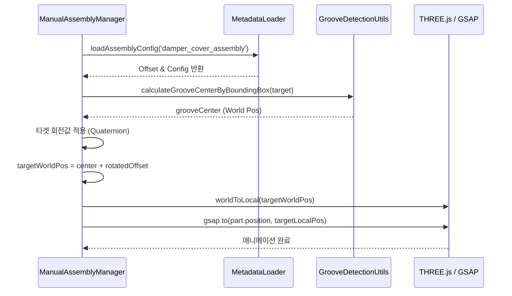

# 댐퍼 커버 조립 로직 분석 보고서 (assembleDamperCover)

본 문서는 `ManualAssemblyManager.ts` 파일의 `assembleDamperCover` 함수에 구현된 **Bounding Box & Offset + Metadata Mapping** 방식의 조립 메커니즘을 분석한 결과입니다.

## 1. 개요
이 방식은 3D 모델 내에 별도의 '더미 노드(Socket/Pivot)'가 존재하지 않을 때, 객체의 기하학적 정보(Bounding Box)와 외부 설정 데이터(Metadata)를 결합하여 정밀한 조립 위치를 계산하는 방식입니다.

## 2. 주요 작업 흐름 (Workflow)

### 단계 1: 대상 노드 확보 (Node Acquisition)
- `sceneRoot`에서 조립의 대상이 되는 타겟 노드(`damperAssembly`)와 이동할 부품 노드(`damperCover`)를 이름 기반으로 찾습니다.
- 사용되는 노드 이름은 `fridgeConstants.ts`에 정의된 상수를 사용합니다.

### 단계 2: 메타데이터 로드 (Metadata Loading)
- `MetadataLoader`를 통해 `public/metadata/assembly-offsets.json` 파일에서 `damper_cover_assembly` 설정을 읽어옵니다.
- 주요 설정값:
    - `insertion.offset`: 타겟 중심점으로부터의 미세 조정값 (Vector3)
    - `grooveDetection.innerBoundRatio`: 바운딩 박스 내에서 홈을 식별할 범위 비율

### 단계 3: 홈 중심점 계산 (Groove Center Calculation)
- `GrooveDetectionUtils.calculateGrooveCenterByBoundingBox`를 호출합니다.
- 타겟 노드의 `Bounding Box`를 구하고, 설정된 `innerBoundRatio`를 적용하여 홈의 기하학적 중심점(`grooveCenter`)을 World Space 좌표로 산출합니다.

### 단계 4: 타겟 월드 좌표 계산 (Target World Position)
- 타겟 노드의 현재 회전 상태(`World Quaternion`)를 가져옵니다.
- 메타데이터의 `insertionOffset`에 타겟의 회전값을 적용(`applyQuaternion`)하여, 타겟이 기울어져 있더라도 올바른 방향으로 오프셋이 적용되도록 합니다.
- 계산된 `grooveCenter`에 회전된 오프셋을 더해 최종 목적지(`targetWorldPos`)를 결정합니다.

### 단계 5: 로컬 좌표 변환 (Coordinate Transformation)
- 이동할 부품(`damperCover`)의 부모 노드 기준 로컬 좌표로 변환합니다.
- `worldToLocal` 메서드를 사용하기 전, 부모의 `updateMatrixWorld(true)`를 호출하여 최신 행렬 정보를 반영함으로써 변환 오차를 방지합니다.

### 단계 6: 애니메이션 실행 (Animation)
- `GSAP` 라이브러리를 사용하여 부품의 `position`을 계산된 로컬 좌표로 부드럽게 이동시킵니다.
- 현재 구현에서는 X, Y 축 위주로 이동하며, `power2.inOut` 이징을 적용하여 자연스러운 움직임을 연출합니다.

## 3. 동작 방식의 특징

| 특징 | 설명 |
| :--- | :--- |
| **비침습적 방식** | 3D 모델링 데이터를 직접 수정(더미 노드 추가 등)하지 않고도 조립 로직 구현 가능 |
| **유연한 유지보수** | 조립 위치가 미세하게 어긋날 경우, 코드 수정 없이 `assembly-offsets.json`의 오프셋 값만 변경하여 대응 가능 |
| **회전 대응** | 타겟 노드의 World Quaternion을 계산에 포함하여, 냉장고 본체가 어떤 각도로 배치되어 있어도 정확한 조립 방향 유지 |
| **정밀도 제어** | `innerBoundRatio`를 통해 복잡한 메쉬 구조 내에서도 특정 영역을 조립 기준으로 설정 가능 |

## 4. Mermaid 시퀀스 다이어그램

