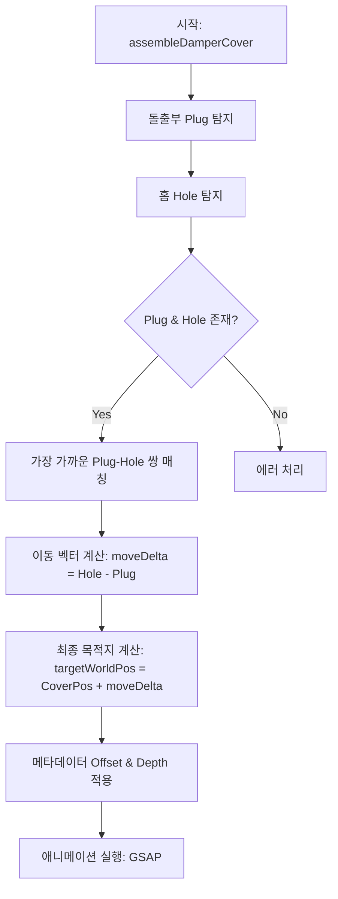

# 댐퍼 커버 조립 로직 개선 계획 (돌출부-홈 좌표 기반)

## 1. 개요
현재 `assembleDamperCover` 함수는 `coverNode`의 중심 좌표를 기준으로 이동을 계산하고 있습니다. 사용자의 피드백에 따라, 탐지된 **돌출부(Plug)**와 **홈(Hole)**의 좌표를 직접 매칭하여 `coverNode`를 정확한 위치로 이동시키도록 로직을 개선합니다.

## 2. 핵심 로직 변경 사항

### 2.1 이동 벡터(`moveDelta`) 계산 방식 변경
- **기존**: `targetWorldPos = currentCoverWorldPos + moveDelta` (여기서 `moveDelta`는 `primaryHole - primaryPlug`)
- **개선**: `moveDelta`의 정의는 동일하지만, 이를 `coverNode` 전체의 이동량으로 적용하는 과정을 명확히 합니다.
  1. `primaryPlugWorldPos` (커버의 돌출부) 추출
  2. `primaryHoleWorldPos` (본체의 홈) 추출
  3. `moveDelta = primaryHoleWorldPos - primaryPlugWorldPos`
  4. `targetWorldPos = currentCoverWorldPos + moveDelta`

### 2.2 메타데이터 오프셋 적용 순서
1. **기본 조립 위치**: `moveDelta`를 적용한 `targetWorldPos`
2. **미세 조정 (Offset)**: `targetWorldPos.add(metadata.offset)`
3. **삽입 깊이 (Depth)**: `targetWorldPos.add(insertionDirection * depth)`

## 3. 상세 구현 계획

## 4. 시각화 개선
- `visualizeAssemblyPath` 호출 시 전달되는 좌표들이 실제 계산에 사용된 `Plug`, `Hole`, `Target` 좌표와 일치하도록 보장합니다.
- 시각화된 파란색 구(Plug)가 자홍색 구(Hole) 위치로 정확히 이동하는지 확인하는 용도로 활용합니다.

## 5. 기대 효과
- 커버의 중심점이 아닌 실제 결합 부위를 기준으로 이동하므로, 모델의 피벗 위치에 상관없이 정확한 조립이 가능해집니다.
- 메타데이터를 통한 미세 조정이 실제 결합 지점을 기준으로 이루어지므로 예측 가능성이 높아집니다.

이 계획에 동의하시면 Code 모드로 전환하여 구현을 시작하겠습니다.
