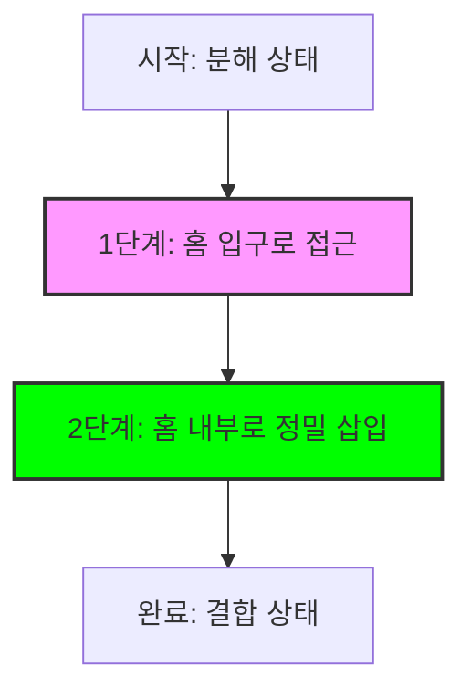

# 댐퍼 커버 조립 구현 계획 (Damper Cover Assembly Plan)

이 문서는 `coverNode`를 `assemblyNode`에 결합하기 위해 탐지된 돌출부(`detectedPlugs`)와 홈 중심점(`holeCenters`) 좌표를 활용하는 상세 구현 계획을 담고 있습니다.

## 1. 조립 알고리즘 설계 (Assembly Logic)

탐지된 기하학적 특징점들을 매칭하여 `coverNode`의 최종 목적지 좌표를 계산합니다.

### 1.1 특징점 매칭 및 이동 벡터 계산
1.  **돌출부(Plug) 선정**: `detectedPlugs` 중 가장 신뢰도가 높은(정점 수가 많거나 특정 위치에 있는) 메인 돌출부를 선택합니다.
2.  **홈(Hole) 선정**: 선택된 돌출부와 가장 가까운 거리에 있는 홈 중심점(`holeCenters`)을 타겟으로 설정합니다.
3.  **이동 델타(Delta) 계산**:
    ```typescript
    const moveDelta = new THREE.Vector3().subVectors(targetHolePos, mainPlugPos);
    ```
4.  **최종 목적지 설정**: `coverNode`의 현재 로컬 위치에 `moveDelta`를 더하여 `targetPosition`을 산출합니다.

### 1.2 메타데이터 기반 미세 조정 (Offset Mapping)
모델링 데이터의 오차나 조립 깊이를 보정하기 위해 `assembly-offsets.json`의 설정을 적용합니다.
-   **Position Offset**: `insertion.offset` 값을 최종 좌표에 추가하여 정밀 정렬.
-   **Insertion Depth**: `insertion.depth`를 활용하여 홈 내부로 삽입되는 깊이 조절.

## 2. 시네마틱 조립 애니메이션 (GSAP Sequence)

단순한 직선 이동이 아닌, 실제 조립 과정을 모사한 2단계 시퀀스를 제안합니다.

### 2.1 애니메이션 단계
1.  **접근 단계 (Approach)**: 홈의 입구 근처(약 70% 지점)까지 부드럽게 이동합니다.
2.  **삽입 단계 (Insert)**: 정해진 삽입 방향(`insertionDirection`)을 따라 홈 내부로 정밀하게 결합됩니다.



## 3. 권장 구현 방식 (Best Practices)

### 3.1 가상 피벗(Virtual Pivot) 방식 활용
-   **이유**: 부품의 중심점이 아닌, 실제 결합 부위(돌출부/홈)를 기준으로 계산해야 모델의 Pivot 위치에 상관없이 정확한 조립이 가능합니다.
-   **장점**: 다양한 모델링 데이터에 대해 범용적으로 대응 가능합니다.
-   **프로젝트 내 활용 가능 함수**:
    -   [`NormalBasedHighlight.calculateVirtualPivotByNormalAnalysis()`](src/shared/utils/NormalBasedHighlight.ts:884): 단일 가상 피벗 계산
    -   [`NormalBasedHighlight.calculateMultipleVirtualPivotsByNormalAnalysis()`](src/shared/utils/NormalBasedHighlight.ts:797): 다중 가상 피벗 계산 (홈이 여러 개인 경우)
    -   **현재 활용 상태**: [`DamperCoverAssemblyService.ts`](src/services/fridge/DamperCoverAssemblyService.ts:92)에서 `calculatePlugByEdgeAnalysis()`를 통해 돌출부를 탐지하고 있으며, 이는 가상 피벗 방식의 일부로 활용됨

### 3.2 추가 고려 방식 (Alternative Approaches)

#### 3.2.1 더미 노드(Pivot/Socket) 활용 방식 (가장 안정적)
-   **개요**: 3D 모델링 단계에서 홈의 정중앙에 'Socket' 역할을 하는 빈(Empty) 객체를 미리 배치하는 방식
-   **구현 방법**:
    1.  홈 내부에 `socket_hole_01`이라는 이름의 더미 노드 배치
    2.  돌출부 끝단에는 `plug_pin_01`이라는 이름의 노드 배치
    3.  두 노드의 **World Position과 Quaternion(회전값)** 을 일치시킴
-   **장점**: 셰이더나 기하학적 계산 없이도 완벽한 삽입 각도와 깊이를 보장하며, 유지보수가 매우 쉬움
-   **확인 필요**: GLB 파일 내에 해당 노드가 실제로 존재하는지, 그리고 이름이 규칙에 맞게 명명되었는지 확인 필요
-   **참고**: [`home-area-identification-and-protrusion-insertion.md`](.kilocode/rules/home-area-identification-and-protrusion-insertion.md)

#### 3.2.2 Bounding Box & Offset 기반 방식 (가장 빠르고 경제적)
-   **개요**: 홈(Hole) 노드의 Bounding Box를 구한 뒤, 그 중심점(Center)을 타겟 좌표로 설정
-   **구현 방법**:
    1.  [`getPreciseBoundingBox()`](src/shared/utils/commonUtils.ts) 함수로 홈 노드의 바운딩 박스 계산
    2.  바운딩 박스의 중심점을 타겟 좌표로 설정
    3.  모델링 데이터의 오프셋을 고려하여 한쪽 축(예: Z축)으로 미세하게 조정
-   **장점**: 계산이 빠르고 구현이 간단함
-   **한계**: 홈의 형상이 비대칭이거나 복잡할 경우 정확도가 떨어질 수 있음
-   **참고**: [`home-area-identification-and-protrusion-insertion.md`](.kilocode/rules/home-area-identification-and-protrusion-insertion.md)

#### 3.2.3 OBB(Oriented Bounding Box) 기반 충돌 체크
-   **개요**: 객체가 기울어져 있을 때 일반적인 AABB(Axis-Aligned Bounding Box)는 오차가 발생하므로, 회전된 박스 모델인 OBB를 사용
-   **구현 방법**: `three-mesh-bvh` 라이브러리를 사용하여 홈 내부의 빈 공간(Volume)을 계산하고, 돌출부의 메쉬가 해당 볼륨 안으로 진입했는지 체크
-   **추천 상황**: 사용자가 직접 마우스로 부품을 드래그해서 끼워 넣는 **인터랙티브 교육 콘텐츠**를 제작할 때 필수적
-   **참고**: [`home-area-identification-and-protrusion-insertion.md`](.kilocode/rules/home-area-identification-and-protrusion-insertion.md)

#### 3.2.4 Metadata Mapping (메타데이터 매핑)
-   **개요**: 모델링 파일을 수정할 수 없는 상황에서 외부 설정 파일(JSON 등)에 각 부품별 오정렬(Offset) 값을 관리
-   **구현 방법**:
    1.  기존의 [`getPreciseBoundingBox()`](src/shared/utils/commonUtils.ts)를 사용하여 기본 좌표를 잡음
    2.  해당 부품의 ID(이름)를 키(Key)로 하는 설정 파일에서 미세 조정값($\vec{\delta}$)을 가져와 더함
-   **장점**: 엔터프라이즈급 솔루션으로 유지보수가 용이하고, 다양한 모델에 대응 가능
-   **현재 활용 상태**: [`assembly-offsets.json`](public/metadata/assembly-offsets.json)에 이미 구현되어 있으며, [`DamperCoverAssemblyService.ts`](src/services/fridge/DamperCoverAssemblyService.ts:72)에서 활용 중

### 3.3 방식별 비교 및 추천

| 방식 | 정확도 | 구현 난이도 | 유지보수 | 추천 상황 |
|------|--------|------------|----------|----------|
| 가상 피벗 (Virtual Pivot) | 높음 | 중간 | 중간 | 모델링 데이터가 복잡하고 다양한 경우 |
| 더미 노드 (Pivot/Socket) | 매우 높음 | 낮음 (모델링 단계) | 매우 쉬움 | 모델링 수정이 가능하고 최고 정밀도 필요 시 |
| Bounding Box & Offset | 중간 | 낮음 | 쉬움 | 빠른 개발이 필요하고 단순한 형상일 때 |
| OBB 기반 충돌 체크 | 매우 높음 | 높음 | 중간 | 인터랙티브 드래그 앤 드롭 기능 구현 시 |
| Metadata Mapping | 높음 | 낮음 | 매우 쉬움 | 모델링 수정 불가능하고 엔터프라이즈급 솔루션 필요 시 |

### 3.4 상태 관리 및 예외 처리
-   **검증**: 조립 시작 전 `detectedPlugs`와 `holeCenters`가 유효한지 반드시 체크합니다.
-   **상태 잠금**: 애니메이션이 진행되는 동안 사용자의 중복 클릭이나 카메라 간섭을 방지하기 위해 [`AssemblyStateManager`](src/shared/utils/AssemblyStateManager.ts)를 활용합니다.

### 3.5 시각적 피드백 (Visual Debugging)
-   조립 경로를 [`AssemblyPathVisualizer`](src/shared/utils/AssemblyPathVisualizer.ts)를 통해 선으로 표시하여, 계산된 궤적이 올바른지 개발 단계에서 즉시 확인할 수 있도록 합니다.

---
**위 계획에 대해 검토 부탁드립니다. 승인 시 해당 로직을 `DamperCoverAssemblyService.ts`에 구현하도록 하겠습니다.**
