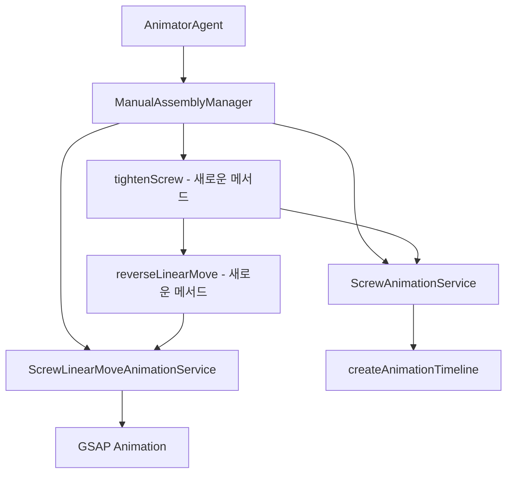

# 스크류 조립(다시 조이는) 애니메이션 구현 계획

## 1. 개요

[`AnimatorAgent.ts`](src/services/AnimatorAgent.ts:1036-1067)의 스크류 분리 애니메이션에 의해 분리된 스크류 노드를 다시 조이는(조립하는) 애니메이션 기능을 구현하기 위한 계획입니다.

---

## 2. 현재 스크류 분리 애니메이션 분석

### 2.1 분리 애니메이션 코드 (AnimatorAgent.ts:1036-1067)

```typescript
// 스크류 분리 애니매이션 실행
try {
  const metadataLoader = getMetadataLoader();

  // 왼쪽 스크류 1 분리
  if (screw1NodeName) {
    const metadataKey1 = extractMetadataKey(screw1NodePath);
    const config1 = metadataLoader.getScrewAnimationConfig(metadataKey1);
    await this.manualAssemblyManager.loosenScrew(screw1NodePath, config1 || {});
  }

  // 왼쪽 스크류 2 분리
  if (screw2NodeName) {
    const metadataKey2 = extractMetadataKey(screw2NodePath);
    const config2 = metadataLoader.getScrewAnimationConfig(metadataKey2);
    await this.manualAssemblyManager.loosenScrew(screw2NodePath, config2 || {});
  }
} catch (error) {
  console.error('Error during screw loosening:', error);
}
```

### 2.2 분리 애니메이션 동작 순서

1. **스크류 1 분리**: `loosenScrew(screw1NodePath, config1)` 호출
2. **스크류 2 분리**: `loosenScrew(screw2NodePath, config2)` 호출
3. 각 스크류는 회전(720도) + 이동(extractDistance) 동시에 수행

---

## 3. 관련 서비스 구조 분석

### 3.1 ManualAssemblyManager.ts

| 메서드 | 설명 | 재활용 가능성 |
|--------|------|---------------|
| [`loosenScrew(screwNodePath, options)`](src/services/fridge/ManualAssemblyManager.ts:163-214) | 스크류 분리 애니메이션 실행 | ⭐⭐⭐ (대칭 메서드로 활용) |
| [`moveScrewLinearToDamperCaseBody(screwNodePath, options)`](src/services/fridge/ManualAssemblyManager.ts:221-234) | 스크류 선형 이동 애니메이션 | ⭐⭐ (역방향 이동 필요) |

### 3.2 ScrewAnimationService.ts

| 메서드 | 설명 | 재활용 가능성 |
|--------|------|---------------|
| [`animateScrewRotation(nodePath, metadataKey, options)`](src/services/fridge/ScrewAnimationService.ts:91-206) | 회전+이동 동시 애니메이션 | ⭐⭐⭐ (역방향 옵션 추가) |
| [`reverse()`](src/services/fridge/ScrewAnimationService.ts:230-241) | 애니메이션 되돌리기 | ⭐⭐⭐ (직접 활용 가능) |

### 3.3 ScrewLinearMoveAnimationService.ts

| 메서드 | 설명 | 재활용 가능성 |
|--------|------|---------------|
| [`animateScrewLinearMoveToDamperCaseBody(screwNodePath, options)`](src/services/fridge/ScrewLinearMoveAnimationService.ts:30-172) | 선형 이동 애니메이션 | ⭐⭐ (역방향 이동 필요) |

### 3.4 animationUtils.ts

| 함수 | 설명 | 재활용 가능성 |
|------|------|---------------|
| [`createAnimationTimeline(targetObj, config, callbacks)`](src/shared/utils/animationUtils.ts:346-392) | 회전+이동 동시 애니메이션 생성 | ⭐⭐⭐ (역방향 옵션 추가) |

---

## 4. 메타데이터 구조 분석

### 4.1 assembly-offsets.json

```json
"screwAnimations": {
  "screw1Customized": {
    "rotationAxis": "z",
    "rotationAngle": 720,
    "extractDirection": [0, 0, 1],
    "extractDistance": 10,
    "duration": 1500,
    "easing": "power2.inOut"
  },
  "screw2Customized": {
    "rotationAxis": "z",
    "rotationAngle": 720,
    "extractDirection": [0, 0, 1],
    "extractDistance": 50,
    "duration": 1500,
    "easing": "power2.inOut"
  }
}
```

### 4.2 메타데이터 활용 방식

- **분리 애니메이션**: `rotationAngle`만큼 회전하면서 `extractDirection` 방향으로 `extractDistance`만큼 이동
- **조립 애니메이션**: `-rotationAngle`만큼 회전하면서 `-extractDirection` 방향으로 `extractDistance`만큼 이동

---

## 5. 재활용 가능한 코드

### 5.1 ScrewAnimationService.reverse()

```typescript
public async reverse(): Promise<void> {
  if (this.timeline) {
    console.log('애니메이션 되돌리기 시작');
    return new Promise((resolve) => {
      this.timeline?.reverse();
      this.timeline?.eventCallback('onReverseComplete', () => {
        console.log('애니메이션 되돌리기 완료');
        resolve();
      });
    });
  }
}
```

**활용 방안**: 분리 애니메이션 후 timeline을 유지하면 `reverse()`로 조립 애니메이션 실행 가능

### 5.2 createAnimationTimeline()

```typescript
export function createAnimationTimeline(
  targetObj: THREE.Object3D,
  config: {
    rotationAxis: string;
    rotationAngle: number;
    extractDirection: THREE.Vector3;
    translationDistance: number;
    duration: number;
    easing: string;
  },
  callbacks?: {
    onStart?: () => void;
    onComplete?: () => void;
    onProgress?: (progress: number) => void;
  }
): AnimationResult
```

**활용 방안**: `reverse` 옵션을 추가하여 역방향 애니메이션 생성 가능

---

## 6. 구현 방식 비교

### 6.1 방식 1: GSAP Timeline.reverse() 사용

**장점**
- 이미 존재하는 `reverse()` 메서드 활용
- 코드 추가 최소화
- 분리/조립 애니메이션 동기화 용이

**단점**
- 분리 애니메이션 후 timeline이 유지되어야 함
- 메모리 누수 가능성 (timeline 정리 필요)
- 유연성 제한

**구현 난이도**: ⭐⭐ (쉬움)

### 6.2 방식 2: 새로운 조립 애니메이션 생성

**장점**
- 독립적인 애니메이션 제어 가능
- timeline 유지 불필요
- 유연한 옵션 설정 가능

**단점**
- 코드 중복 발생 가능
- 메타데이터 역방향 계산 필요

**구현 난이도**: ⭐⭐⭐ (중간)

### 6.3 방식 3: 통합 애니메이션 서비스 (추천)

**장점**
- 분리/조립 애니메이션을 하나의 서비스에서 관리
- 코드 중복 최소화
- 유지보수 용이
- 메타데이터 재활용

**단점**
- 새로운 서비스 구현 필요
- 기존 코드 리팩토링 필요

**구현 난이도**: ⭐⭐⭐⭐ (어려움)

---

## 7. 추천 구현 방식: 방식 2 (새로운 조립 애니메이션 생성)

### 7.1 선정 이유

1. **독립성**: 분리/조립 애니메이션이 서로 독립적으로 동작
2. **유연성**: 조립 애니메이션에 별도의 옵션 적용 가능
3. **안정성**: timeline 유지로 인한 메모리 누수 방지
4. **확장성**: 향후 다른 부품의 조립 애니메이션에도 적용 가능

### 7.2 구현 아키텍처



---

## 8. 상세 구현 계획

### 8.1 ManualAssemblyManager에 tightenScrew() 메서드 추가

```typescript
/**
 * Screw를 돌려서 조이는 애니메이션을 실행합니다.
 * @param screwNodeNameOrPath 노드 이름 또는 경로
 * @param options 애니메이션 옵션
 */
public async tightenScrew(
  screwNodePath: string,
  options?: {
    duration?: number;
    rotationAngle?: number;
    rotationAxis?: 'x' | 'y' | 'z';
    insertDirection?: [number, number, number];
    pushDistance?: number;
    screwPitch?: number;
    onComplete?: () => void;
  }
): Promise<void> {
  // 경로이면 실제 노드 이름으로 변환
  const actualNodeName = this.nodeNameManager.getNodeName(screwNodePath);

  if (!actualNodeName) {
    console.warn(`${screwNodePath}에 해당하는 노드 이름을 찾을 수 없음`);
    return;
  }

  if (!this.screwAnimationService.isScrewNode(actualNodeName)) {
    console.warn(`${actualNodeName}은 Screw 노드가 아님`);
    return;
  }

  // 메타데이터 키 추출
  const metadataKey = extractMetadataKey(screwNodePath);
  const usedConfig = await this.screwAnimationService.animateScrewRotationReverse(
    screwNodePath,
    metadataKey,
    options
  );

  // 애니메이션 히스토리 기록
  if (this.animationHistoryService) {
    const screwMessage = `${actualNodeName} 스크류 조립 완료`;
    this.animationHistoryService.addAnimationHistory(
      {
        door: 'top_left' as any,
        action: AnimationAction.SCREW_TIGHTEN, // 새로운 액션 타입 필요
        duration: usedConfig.duration,
        easing: usedConfig.easing,
        rotationAngle: usedConfig.rotationAngle,
        rotationAxis: usedConfig.rotationAxis,
        insertDirection: usedConfig.insertDirection,
        translationDistance: usedConfig.insertDistance
      },
      screwMessage
    );
  }
}
```

### 8.2 ScrewAnimationService에 animateScrewRotationReverse() 메서드 추가

```typescript
/**
 * Screw 회전+이동 역방향 애니메이션을 실행 (조립용)
 * @param nodePath 노드 경로
 * @param metadataKey 메타데이터 키
 * @param options 애니메이션 옵션
 */
public async animateScrewRotationReverse(
  nodePath: string,
  metadataKey: string,
  options: ScrewAnimationOptions = {}
): Promise<ScrewAnimationMetadata> {
  if (!this.sceneRoot) {
    console.error('Scene root not initialized.');
    throw new Error('Scene root not initialized.');
  }

  // 기존 애니메이션 정리
  if (this.timeline) {
    this.timeline.kill();
    this.timeline = null;
  }

  // 메타데이터가 로드될 때까지 대기
  await this.loadMetadata();

  // 메타데이터에서 설정 가져오기
  const metadata = this.metadataLoader.getScrewAnimationConfig(metadataKey);
  const hasMetadata = metadata !== null;

  // 옵션과 메타데이터 병합
  const config = {
    duration: options.duration ?? 1500,
    rotationAngle: options.rotationAngle ?? 720,
    screwPitch: options.screwPitch ?? 0.005,
    rotationAxis: options.rotationAxis ?? 'z',
    easing: options.easing ?? 'power2.inOut',
    insertDirection: options.insertDirection ?? [0, 0, -1], // 역방향
    ...options
  };

  const screwNodeName = this.nodeNameManager.getNodeName(nodePath);
  if (!screwNodeName) {
    console.error(`노드 이름을 찾을 수 없습니다: ${nodePath}`);
    throw new Error(`노드 이름을 찾을 수 없습니다: ${nodePath}`);
  }

  const screwNodeObj = this.sceneRoot.getObjectByName(screwNodeName);
  if (!screwNodeObj) {
    console.error(`노드를 찾을 수 없습니다: ${screwNodeName}`);
    throw new Error(`노드를 찾을 수 없습니다: ${screwNodeName}`);
  }

  // pushDistance가 있으면 우선 사용, 없으면 메타데이터에서 추출
  const translationDistance = options.pushDistance ?? metadata?.extractDistance ?? (config.rotationAngle! / 360) * config.screwPitch!;

  // 실제 사용된 설정값 (반환용)
  const usedConfig: ScrewAnimationMetadata = {
    rotationAxis: config.rotationAxis!,
    rotationAngle: config.rotationAngle!,
    extractDirection: config.insertDirection! as any, // 역방향
    extractDistance: translationDistance,
    duration: config.duration!,
    easing: config.easing!,
    finalPosition: screwNodeObj.position.clone(),
    finalRotation: screwNodeObj.rotation.clone()
  };

  // Promise 내부에서 애니메이션 생성 및 실행
  return new Promise((resolve) => {
    const animationResult = createAnimationTimeline(
      screwNodeObj,
      {
        rotationAxis: config.rotationAxis!,
        rotationAngle: config.rotationAngle!,
        extractDirection: new THREE.Vector3(...config.insertDirection!), // 역방향
        translationDistance,
        duration: config.duration!,
        easing: config.easing!
      },
      {
        onStart: () => {
          this.isAnimating = true;
          console.log(`${screwNodeName} 조립 시작 (메타데이터: ${hasMetadata ? '사용' : '미사용'})`);
        },
        onComplete: () => {
          this.isAnimating = false;
          console.log(`${screwNodeName} 조립 완료`);
          // 최종 좌표 업데이트
          usedConfig.finalPosition = screwNodeObj.position.clone();
          usedConfig.finalRotation = screwNodeObj.rotation.clone();
          console.log('최종 위치:', usedConfig.finalPosition);
          console.log('최종 회전:', usedConfig.finalRotation);

          // 사용자 콜백 실행
          config.onComplete?.();

          // Promise 완료
          resolve(usedConfig);
        },
        onProgress: (progress) => {
          config.onProgress?.(progress);
        }
      }
    );

    this.timeline = animationResult.timeline;

    // Timeline 재생 시작
    this.timeline.play();
  });
}
```

### 8.3 ScrewLinearMoveAnimationService에 역방향 이동 메서드 추가

```typescript
/**
 * 스크류 노드를 원래 위치로 선형 이동시킵니다 (조립용).
 * @param screwNodePath 스크류 노드 경로
 * @param options 애니메이션 옵션
 */
public async animateScrewLinearMoveReverse(
  screwNodePath: string,
  options: {
    duration?: number;
    easing?: string;
    onComplete?: () => void;
  } = {}
): Promise<{
  position: { x: number; y: number; z: number };
  duration: number;
  easing: string;
} | null> {
  try {
    if (!this.sceneRoot) {
      console.error('Scene Root가 설정되지 않았습니다.');
      return null;
    }

    // 스크류 노드 이름 가져오기
    const screwNodeName = this.nodeNameManager.getNodeName(screwNodePath);
    if (!screwNodeName) {
      console.error(`스크류 노드 이름을 찾을 수 없습니다: ${screwNodePath}`);
      return null;
    }

    // 스크류 노드 찾기
    const screwNode = this.sceneRoot.getObjectByName(screwNodeName);
    if (!screwNode) {
      console.error(`스크류 노드를 찾을 수 없습니다: ${screwNodeName}`);
      return null;
    }

    // damperCaseBody 노드 찾기
    const damperCaseBodyNodeName = this.nodeNameManager.getNodeName('fridge.leftDoorDamper.damperCaseBody');
    if (!damperCaseBodyNodeName) {
      console.error('damperCaseBody 노드 이름을 찾을 수 없습니다.');
      return null;
    }

    const damperCaseBodyNode = this.sceneRoot.getObjectByName(damperCaseBodyNodeName);
    if (!damperCaseBodyNode) {
      console.error(`damperCaseBody 노드를 찾을 수 없습니다: ${damperCaseBodyNodeName}`);
      return null;
    }

    // 스크류별 선형 이동 설정 가져오기
    const metadataKey = screwNodePath.split('.').pop() || screwNodePath;
    const screwLinearMoveConfig = this.metadataLoader.getScrewLinearMoveConfig(metadataKey);
    if (!screwLinearMoveConfig) {
      console.error('스크류 선형 이동 설정을 찾을 수 없습니다.');
      return null;
    }

    // 애니메이션 옵션 병합
    const mergedOptions = {
      duration: options.duration ?? screwLinearMoveConfig.duration,
      easing: options.easing ?? screwLinearMoveConfig.easing,
      onComplete: options.onComplete
    };

    // 스크류 노드의 현재 월드 위치 가져오기
    screwNode.updateMatrixWorld();
    const screwCurrentWorldPosition = new THREE.Vector3();
    screwNode.getWorldPosition(screwCurrentWorldPosition);

    // 스크류 선형 이동 오프셋 가져오기
    const offset = new THREE.Vector3(
      screwLinearMoveConfig.offset?.x || 0,
      screwLinearMoveConfig.offset?.y || 0,
      screwLinearMoveConfig.offset?.z || 0
    );

    // damperCaseBody의 이동 벡터 계산 (역방향)
    damperCaseBodyNode.updateMatrixWorld();
    const startVec = damperCaseBodyNode.localToWorld(new THREE.Vector3(0, 0, 0));
    const endVec = damperCaseBodyNode.localToWorld(offset.clone());
    const moveVector = endVec.sub(startVec).negate(); // 역방향

    // 스크류 타겟 위치 계산 (현재 위치 + 역방향 이동 벡터)
    const targetWorldPosition = screwCurrentWorldPosition.clone().add(moveVector);

    // 월드 타겟 좌표를 스크류 부모의 로컬 좌표계로 변환
    const localTargetPosition = targetWorldPosition.clone();
    const screwParent = screwNode.parent;
    if (screwParent) {
      screwParent.updateMatrixWorld();
      screwParent.worldToLocal(localTargetPosition);
    }

    // GSAP를 사용한 선형 이동 애니메이션
    return new Promise<{
      position: { x: number; y: number; z: number };
      duration: number;
      easing: string;
    } | null>((resolve) => {
      gsap.to(screwNode.position, {
        x: localTargetPosition.x,
        y: localTargetPosition.y,
        z: localTargetPosition.z,
        duration: mergedOptions.duration / 1000,
        ease: mergedOptions.easing,
        onComplete: () => {
          console.log(`스크류 ${screwNodeName} 원래 위치로 선형 이동 완료`);

          if (mergedOptions.onComplete) {
            mergedOptions.onComplete();
          }

          const result = {
            position: {
              x: localTargetPosition.x,
              y: localTargetPosition.y,
              z: localTargetPosition.z
            },
            duration: mergedOptions.duration,
            easing: mergedOptions.easing
          };

          resolve(result);
        }
      });
    });

  } catch (error) {
    console.error('스크류 원래 위치 선형 이동 애니메이션 실행 중 오류:', error);
    return null;
  }
}
```

### 8.4 AnimatorAgent.ts에 조립 애니메이션 추가

```typescript
// 스크류 조립 애니메이션 실행
try {
  const metadataLoader = getMetadataLoader();

  // 왼쪽 스크류 2 조립 (선형 이동 역방향)
  if (screw2NodeName) {
    await this.manualAssemblyManager.moveScrewLinearReverse(screw2NodePath, {
      duration: 1000,
      easing: 'power2.inOut',
      onComplete: () => {
        console.log('Left screw 2 linear move reverse completed');
      }
    });
  }

  // 왼쪽 스크류 1 조립 (회전+이동 역방향)
  if (screw1NodeName) {
    const metadataKey1 = extractMetadataKey(screw1NodePath);
    const config1 = metadataLoader.getScrewAnimationConfig(metadataKey1);
    await this.manualAssemblyManager.tightenScrew(screw1NodePath, config1 || {});
    console.log('Left screw 1 tightened');
  }

  // 왼쪽 스크류 2 조립 (회전+이동 역방향)
  if (screw2NodeName) {
    const metadataKey2 = extractMetadataKey(screw2NodePath);
    const config2 = metadataLoader.getScrewAnimationConfig(metadataKey2);
    await this.manualAssemblyManager.tightenScrew(screw2NodePath, config2 || {});
    console.log('Left screw 2 tightened');
  }
} catch (error) {
  console.error('Error during screw tightening:', error);
}
```

---

## 9. AnimationAction 타입 확장

```typescript
export const AnimationAction = {
  OPEN: 'open',
  CLOSE: 'close',
  SET_DEGREES: 'set_degrees',
  SET_SPEED: 'set_speed',
  CAMERA_MOVE: 'camera_move',
  SCREW_LOOSEN: 'screw_loosen',
  SCREW_TIGHTEN: 'screw_tighten', // 새로 추가
  DAMPER_COVER_BODY: 'damper_cover_body',
  DAMPER_CASE_BODY_MOVE: 'damper_case_body_move'
} as const;
```

---

## 10. 구현 순서

1. **AnimationAction 타입 확장** - `SCREW_TIGHTEN` 액션 추가
2. **ScrewAnimationService.ts** - `animateScrewRotationReverse()` 메서드 추가
3. **ScrewLinearMoveAnimationService.ts** - `animateScrewLinearMoveReverse()` 메서드 추가
4. **ManualAssemblyManager.ts** - `tightenScrew()` 및 `moveScrewLinearReverse()` 메서드 추가
5. **AnimatorAgent.ts** - 조립 애니메이션 코드 추가
6. **테스트** - 분리/조립 애니메이션 순차 실행 테스트

---

## 11. 고려사항

### 11.1 애니메이션 순서

조립 애니메이션은 분리 애니메이션의 역순으로 실행해야 합니다:

1. **스크류 2 선형 이동 역방향**: damperCaseBody 방향으로 이동한 스크류를 원래 위치로 되돌림
2. **스크류 1 조립**: 회전+이동 역방향으로 조임
3. **스크류 2 조립**: 회전+이동 역방향으로 조임

### 11.2 메타데이터 활용

- 분리 애니메이션 메타데이터를 그대로 재활용
- 역방향 계산은 코드에서 자동 처리
- `insertDirection` = `-extractDirection`
- `pushDistance` = `extractDistance`

### 11.3 애니메이션 히스토리

- 조립 애니메이션도 히스토리에 기록
- `AnimationAction.SCREW_TIGHTEN` 사용
- 분리/조립 히스토리를 통해 Undo/Redo 기능 구현 가능

---

## 12. 요약

| 항목 | 내용 |
|------|------|
| **구현 방식** | 새로운 조립 애니메이션 생성 (방식 2) |
| **필요한 메서드** | `tightenScrew()`, `animateScrewRotationReverse()`, `animateScrewLinearMoveReverse()` |
| **재활용 코드** | `createAnimationTimeline()`, 메타데이터, GSAP Timeline |
| **구현 난이도** | ⭐⭐⭐ (중간) |
| **예상 작업량** | 4개 파일 수정, 약 200-300줄 코드 추가 |
