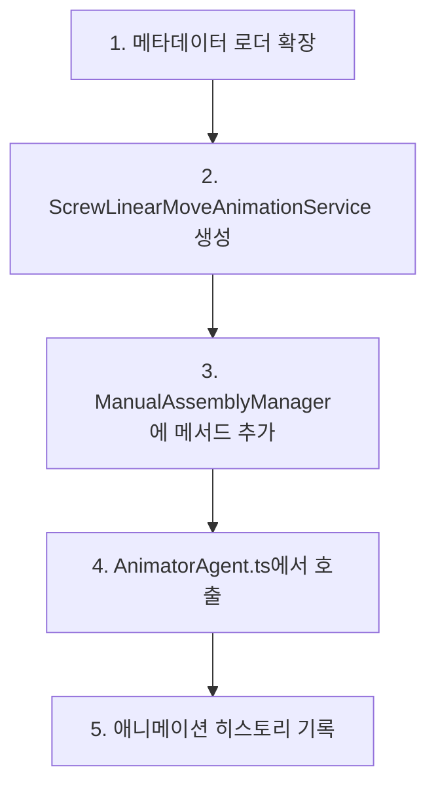

# 스크류2 선형 이동 구현 계획 [구현 완료]

## 0. 참고 레퍼런스
- [`AnimatorAgent.ts`](../src/services/AnimatorAgent.ts:1059-1067) - 스크류2 분리 코드
- [`AnimatorAgent.ts`](../src/services/AnimatorAgent.ts:1113) - 선형 이동 구현 위치
- [`DamperCaseBodyAnimationService.ts`](../src/services/fridge/DamperCaseBodyAnimationService.ts) - 선형 이동 애니메이션 참고
- [`ScrewAnimationService.ts`](../src/services/fridge/ScrewAnimationService.ts) - 스크류 애니메이션 서비스
- [`assembly-offsets.json`](../public/metadata/assembly-offsets.json:84-113) - 메타데이터 설정
- [`ScrewLinearMoveAnimationService.ts`](../src/services/fridge/ScrewLinearMoveAnimationService.ts) - **[신규 구현됨]** 스크류 선형 이동 서비스

---

## 1. ■■ Description ■■

### 1-1. 요구사항
- **1059-1067 라인**에 의해 분리된 스크류2 노드의 위치에서 **오른쪽 방향으로 선형이동** 시키고 싶다.
- **1113 라인** 주석 아래에 이 기능을 구현해야 한다.

### 1-2. 현재 상황 분석

#### 구현된 코드 흐름
```typescript
// 1059-1067 라인: 왼쪽 스크류 2 분리
if (screw2NodeName) {
  // ... 스크류 분리 로직 ...
}

// 1113 라인: 분리된 왼쪽 스크류2 노드의 위치에서 오른쪽 방향으로 선형이동
// (이미 구현됨)
try {
    console.log('스크류2 오른쪽 방향 선형 이동 시작!!!');
    const animationResult = await this.manualAssemblyManager.moveScrewLinear(screw2NodePath, {
        duration: 1000,
        easing: 'power2.inOut',
        onComplete: () => { console.log('스크류2 오른쪽 방향 선형 이동 완료!!!'); }
    });
    // ... 히스토리 기록 ...
} catch (error) { ... }
```

#### 메타데이터 설정 확인
[`assembly-offsets.json`](../public/metadata/assembly-offsets.json)에 설정이 존재함:

1.  **개별 설정 (우선순위 높음)**: `screwLinearMovements.screw2Customized`
2.  **공통 설정 (Fallback)**: `damperCaseBodyAnimations.linearMovement`

---

## 2. 구현 방식 (확정)

### 2-1. 최종 방식: 방식 1 (새로운 서비스 클래스 생성)

**이유:**
1.  **단일 책임 원칙 (SRP)**: 스크류 선형 이동만 담당하는 전용 서비스 (`ScrewLinearMoveAnimationService`)
2.  **메타데이터 기반**: 기존 메타데이터 패턴을 따라 유연한 설정 관리
3.  **재사용성**: 다른 스크류 노드에도 동일한 패턴 적용 가능

---

## 3. 구현 상세 (실제 코드 기준)

### 3-1. 단계별 구현 순서



### 3-2. 상세 구현 내용

#### 단계 1: 메타데이터 로더 확장

**파일:** [`MetadataLoader.ts`](../src/shared/utils/MetadataLoader.ts)

- **인터페이스**: 별도의 `ScrewLinearMoveConfig`를 만들지 않고, 기존 `LinearMovementAnimationConfig`를 재사용하여 유지보수성을 높임.
- **로직**: `getScrewLinearMoveConfig(metadataKey)` 메서드 추가됨.
    - `screwLinearMovements[key]`를 먼저 찾고, 없으면 `damperCaseBodyAnimations.linearMovement`를 반환하는 Fallback 구조 적용.

#### 단계 2: ScrewLinearMoveAnimationService 생성

**파일:** `src/services/fridge/ScrewLinearMoveAnimationService.ts` (구현 완료)

- **주요 기능**:
    - `animateScrewLinearMove`: 스크류 노드를 월드 좌표계 기준 오프셋만큼 이동.
    - 부모의 로컬 좌표계로 역변환(`worldToLocal`)하여 정확한 이동 구현.
    - GSAP를 사용한 부드러운 애니메이션.

#### 단계 3: ManualAssemblyManager에 메서드 추가

**파일:** [`ManualAssemblyManager.ts`](../src/services/fridge/ManualAssemblyManager.ts)

- `moveScrewLinear` 메서드가 추가되어 `ScrewLinearMoveAnimationService`를 래핑함.

#### 단계 4: AnimatorAgent.ts에서 호출

**파일:** [`AnimatorAgent.ts`](../src/services/AnimatorAgent.ts:1113)

- 스크류 분리 후 `manualAssemblyManager.moveScrewLinear`를 호출하도록 구현됨.

#### 단계 5: 애니메이션 히스토리 기록

**파일:** [`AnimatorAgent.ts`](../src/services/AnimatorAgent.ts)

- `AnimationAction.SCREW_LOOSEN` 액션을 재사용하여 히스토리에 기록.

---

## 4. 고려사항 및 검증

### 4-1. 월드 좌표계 vs 로컬 좌표계
- **구현**: 월드 좌표계 기준의 오프셋을 부모 노드의 로컬 좌표계로 변환하여 적용함. 이는 회전된 부모 안에서도 정확히 "월드 기준 오른쪽"으로 이동하게 함. ✅

### 4-2. 오른쪽 방향 정의
- 메타데이터 `offset.x: 1`이 월드 X축 양의 방향(오른쪽)을 의미.

### 4-3. 에러 처리
- 노드 미발견, 메타데이터 누락 시 `null` 반환 및 에러 로그 출력 처리됨.

---
