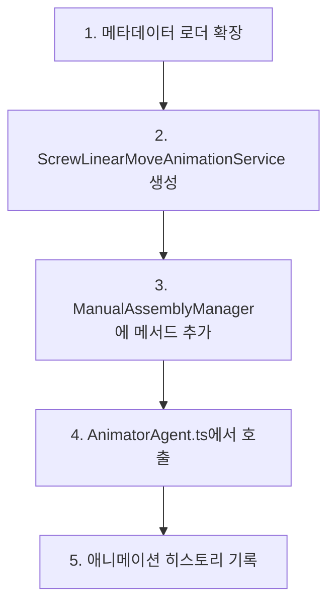
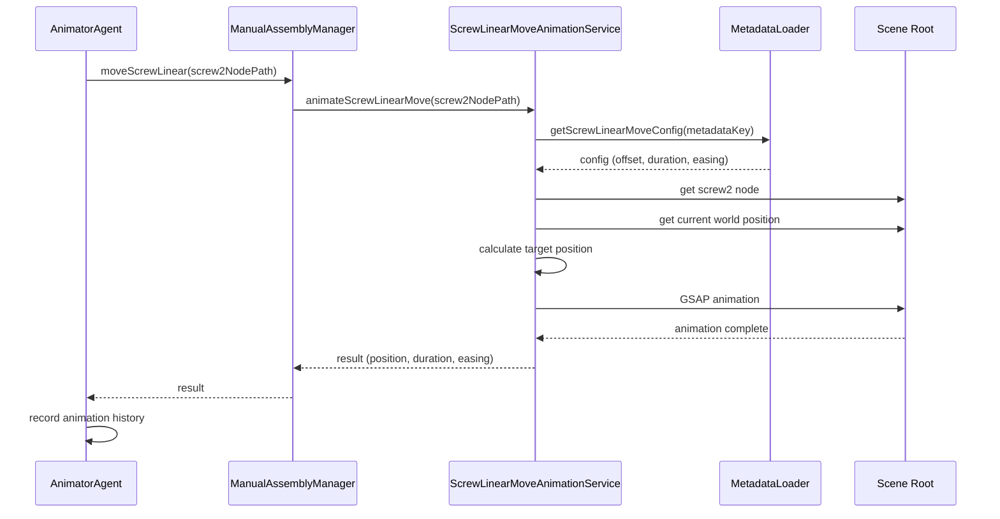

# 스크류2 선형 이동 구현 계획

## 0. 참고 레퍼런스
- [`AnimatorAgent.ts`](src/services/AnimatorAgent.ts:1059-1067) - 스크류2 분리 코드
- [`AnimatorAgent.ts`](src/services/AnimatorAgent.ts:1113) - 선형 이동 구현 위치
- [`DamperCaseBodyAnimationService.ts`](src/services/fridge/DamperCaseBodyAnimationService.ts) - 선형 이동 애니메이션 참고
- [`ScrewAnimationService.ts`](src/services/fridge/ScrewAnimationService.ts) - 스크류 애니메이션 서비스
- [`assembly-offsets.json`](public/metadata/assembly-offsets.json:84-113) - 메타데이터 설정

---

## 1. ■■ Description ■■

### 1-1. 요구사항
- **1059-1067 라인**에 의해 분리된 스크류2 노드의 위치에서 **오른쪽 방향으로 선형이동** 시키고 싶다
- **1113 라인** 주석 아래에 이 기능을 구현해야 한다

### 1-2. 현재 상황 분석

#### 기존 코드 흐름
```typescript
// 1059-1067 라인: 왼쪽 스크류 2 분리
if (screw2NodeName) {
  const metadataKey2 = extractMetadataKey(screw2NodePath);
  const config2 = metadataLoader.getScrewAnimationConfig(metadataKey2);

  await this.manualAssemblyManager.loosenScrew(screw2NodePath, config2 || {});
  console.log('Left screw 2 loosened');
}

// 1113 라인: 분리된 왼쪽 스크류2 노드의 위치에서 오른쪽 방향으로 선형이동
// (구현 필요)
```

#### 메타데이터 설정 확인
[`assembly-offsets.json`](public/metadata/assembly-offsets.json:84-113)에 이미 `damperCaseBodyAnimations.linearMovement` 설정이 존재함:

```json
"damperCaseBodyAnimations": {
    "linearMovement": {
        "method": "screwPositionBased",
        "targetScrewNode": "fridge.leftDoorDamper.screw2Customized",
        "offset": {
            "x": 1,   // 오른쪽 방향 (X축 양의 방향)
            "y": 0,
            "z": 0
        },
        "duration": 1000,
        "easing": "power2.inOut"
    }
}
```

---

## 2. 추천 구현 방식

### 2-1. 방식 비교

| 방식 | 장점 | 단점 | 추천도 |
|------|------|------|--------|
| **방식 1: 새로운 서비스 클래스 생성** (`ScrewLinearMoveAnimationService`) | - 코드 모듈화<br>- 재사용성 높음<br>- 메타데이터 기반 유연한 설정 | - 새로운 파일 추가 필요<br>- 초기 구현 비용 | ⭐⭐⭐⭐⭐ |
| **방식 2: 기존 `DamperCaseBodyAnimationService` 확장** | - 기존 코드 재사용<br>- 파일 추가 불필요 | - 서비스 책임이 모호해짐<br>- 유지보수 어려움 | ⭐⭐⭐ |
| **방식 3: `ManualAssemblyManager`에 직접 구현** | - 간단한 구현<br>- 빠른 개발 | - 책임 분리 안됨<br>- 테스트 어려움 | ⭐⭐ |

### 2-2. 최종 추천: 방식 1 (새로운 서비스 클래스 생성)

**이유:**
1. **단일 책임 원칙 (SRP)**: 스크류 선형 이동만 담당하는 전용 서비스
2. **메타데이터 기반**: 기존 메타데이터 패턴을 따라 유연한 설정 관리
3. **재사용성**: 다른 스크류 노드에도 동일한 패턴 적용 가능
4. **테스트 용이성**: 독립적인 서비스로 단위 테스트 가능

---

## 3. 구현 순서

### 3-1. 단계별 구현 순서



### 3-2. 상세 구현 단계

#### 단계 1: 메타데이터 로더 확장

**파일:** [`MetadataLoader.ts`](src/shared/utils/MetadataLoader.ts)

```typescript
// 스크류 선형 이동 설정 인터페이스 추가
export interface ScrewLinearMoveConfig {
    method: string;
    targetScrewNode: string;
    offset: { x: number; y: number; z: number };
    duration: number;
    easing: string;
}

// 메서드 추가
public getScrewLinearMoveConfig(metadataKey: string): ScrewLinearMoveConfig | null {
    const config = this.metadata?.damperCaseBodyAnimations?.linearMovement;
    return config || null;
}
```

#### 단계 2: ScrewLinearMoveAnimationService 생성

**파일:** `src/services/fridge/ScrewLinearMoveAnimationService.ts` (새 파일)

```typescript
import * as THREE from 'three';
import { getMetadataLoader } from '@/shared/utils/MetadataLoader';
import { getNodeNameManager } from '@/shared/utils/NodeNameManager';
import gsap from 'gsap';

export class ScrewLinearMoveAnimationService {
    private static instance: ScrewLinearMoveAnimationService | null = null;
    private nodeNameManager = getNodeNameManager();
    private metadataLoader = getMetadataLoader();
    private sceneRoot: THREE.Object3D | null = null;

    public setSceneRoot(sceneRoot: THREE.Object3D): void {
        this.sceneRoot = sceneRoot;
    }

    public static getInstance(): ScrewLinearMoveAnimationService {
        if (!ScrewLinearMoveAnimationService.instance) {
            ScrewLinearMoveAnimationService.instance = new ScrewLinearMoveAnimationService();
        }
        return ScrewLinearMoveAnimationService.instance;
    }

    /**
     * 스크류 노드를 기준으로 선형 이동 애니메이션 실행
     * @param screwNodePath 스크류 노드 경로 (예: 'fridge.leftDoorDamper.screw2Customized')
     * @param options 애니메이션 옵션
     */
    public async animateScrewLinearMove(
        screwNodePath: string,
        options: {
            duration?: number;
            easing?: string;
            onComplete?: () => void;
        } = {}
    ): Promise<{
        position: { x: number; y: number; z: number };
        duration: number;
        easing: string;
    } | null> {
        try {
            if (!this.sceneRoot) {
                console.error('Scene Root가 설정되지 않았습니다.');
                return null;
            }

            // 스크류 노드 이름 가져오기
            const screwNodeName = this.nodeNameManager.getNodeName(screwNodePath);
            if (!screwNodeName) {
                console.error(`스크류 노드 이름을 찾을 수 없습니다: ${screwNodePath}`);
                return null;
            }

            // 스크류 노드 찾기
            const screwNode = this.sceneRoot.getObjectByName(screwNodeName);
            if (!screwNode) {
                console.error(`스크류 노드를 찾을 수 없습니다: ${screwNodeName}`);
                return null;
            }

            // 메타데이터 설정 가져오기
            const metadataKey = screwNodePath.split('.').pop() || screwNodePath;
            const animationConfig = this.metadataLoader.getScrewLinearMoveConfig(metadataKey);
            if (!animationConfig) {
                console.error(`스크류 선형 이동 설정을 찾을 수 없습니다: ${metadataKey}`);
                return null;
            }

            // 애니메이션 옵션 병합
            const mergedOptions = {
                duration: options.duration ?? animationConfig.duration,
                easing: options.easing ?? animationConfig.easing,
                onComplete: options.onComplete
            };

            // 스크류 노드의 현재 월드 위치 가져오기
            screwNode.updateMatrixWorld();
            const currentWorldPosition = new THREE.Vector3();
            screwNode.getWorldPosition(currentWorldPosition);

            // 오른쪽 방향 오프셋 계산 (월드 좌표계 기준)
            const offset = new THREE.Vector3(
                animationConfig.offset.x,
                animationConfig.offset.y,
                animationConfig.offset.z
            );

            // 타겟 위치 계산 (월드 좌표)
            const targetWorldPosition = currentWorldPosition.clone().add(offset);

            // 월드 타겟 좌표를 부모의 로컬 좌표계로 변환
            const localTargetPosition = targetWorldPosition.clone();
            const parent = screwNode.parent;
            if (parent) {
                parent.updateMatrixWorld();
                parent.worldToLocal(localTargetPosition);
            }

            // GSAP를 사용한 선형 이동 애니메이션
            return new Promise<{
                position: { x: number; y: number; z: number };
                duration: number;
                easing: string;
            } | null>((resolve) => {
                gsap.to(screwNode.position, {
                    x: localTargetPosition.x,
                    y: localTargetPosition.y,
                    z: localTargetPosition.z,
                    duration: mergedOptions.duration / 1000,
                    ease: mergedOptions.easing,
                    onComplete: () => {
                        console.log(`스크류 ${screwNodeName} 선형 이동 완료`);

                        if (mergedOptions.onComplete) {
                            mergedOptions.onComplete();
                        }

                        const result = {
                            position: {
                                x: localTargetPosition.x,
                                y: localTargetPosition.y,
                                z: localTargetPosition.z
                            },
                            duration: mergedOptions.duration,
                            easing: mergedOptions.easing
                        };

                        resolve(result);
                    }
                });
            });

        } catch (error) {
            console.error('스크류 선형 이동 애니메이션 실행 중 오류:', error);
            return null;
        }
    }
}

export function getScrewLinearMoveAnimationService(): ScrewLinearMoveAnimationService {
    return ScrewLinearMoveAnimationService.getInstance();
}
```

#### 단계 3: ManualAssemblyManager에 메서드 추가

**파일:** [`ManualAssemblyManager.ts`](src/services/fridge/ManualAssemblyManager.ts)

```typescript
import { getScrewLinearMoveAnimationService } from './ScrewLinearMoveAnimationService';

export class ManualAssemblyManager {
    // ... 기존 코드 ...

    private screwLinearMoveAnimationService = getScrewLinearMoveAnimationService();

    public async initialize(sceneRoot: THREE.Object3D, cameraControls?: any): Promise<void> {
        // ... 기존 코드 ...
        this.screwLinearMoveAnimationService.setSceneRoot(sceneRoot);
    }

    /**
     * 스크류 노드를 기준으로 선형 이동 애니메이션을 실행합니다.
     * @param screwNodePath 스크류 노드 경로 (예: 'fridge.leftDoorDamper.screw2Customized')
     * @param options 애니메이션 옵션
     */
    public async moveScrewLinear(
        screwNodePath: string,
        options?: {
            duration?: number;
            easing?: string;
            onComplete?: () => void;
        }
    ): Promise<{
        position: { x: number; y: number; z: number };
        duration: number;
        easing: string;
    } | null> {
        return await this.screwLinearMoveAnimationService.animateScrewLinearMove(screwNodePath, options);
    }

    // ... 기존 코드 ...
}
```

#### 단계 4: AnimatorAgent.ts에서 호출

**파일:** [`AnimatorAgent.ts`](src/services/AnimatorAgent.ts:1113)

```typescript
// 1113 라인 주석 아래에 추가
// 분리된 왼쪽 스크류2 노드의 위치에서 오른쪽 방향으로 선형이동
try {
    console.log('스크류2 오른쪽 방향 선형 이동 시작!!!');

    const animationResult = await this.manualAssemblyManager.moveScrewLinear(screw2NodePath, {
        duration: 1000,
        easing: 'power2.inOut',
        onComplete: () => {
            console.log('스크류2 오른쪽 방향 선형 이동 완료!!!');
        }
    });

    // 애니메이션 히스토리 기록
    if (animationResult && this.animationHistoryService) {
        const animationCommand = {
            door: commandsArray[0].door,
            action: AnimationAction.SCREW_LOOSEN, // 또는 새로운 액션 타입 추가
            degrees: 0,
            speed: 1,
            position: animationResult.position,
            easing: animationResult.easing,
            duration: animationResult.duration
        };
        const animationMessage = '스크류2 오른쪽 방향 선형 이동 완료';
        this.animationHistoryService.addAnimationHistory(animationCommand, animationMessage);
        console.log('Animation history after screw2 linear move:', this.animationHistoryService.getAllHistory());
    } else if (!animationResult) {
        console.warn('스크류2 선형 이동 애니메이션이 null을 반환했습니다.');
    } else {
        console.warn('Animation history service not available');
    }

} catch (error) {
    console.error('스크류2 오른쪽 방향 선형 이동 실행 중 에러:', error);
}
```

#### 단계 5: 애니메이션 히스토리 기록

**파일:** [`AnimatorAgent.ts`](src/services/AnimatorAgent.ts)

- 이미 단계 4에서 구현됨
- 필요한 경우 새로운 `AnimationAction` 타입 추가 고려

---

## 4. 고려사항

### 4-1. 월드 좌표계 vs 로컬 좌표계

| 구분 | 설명 | 추천 |
|------|------|------|
| **월드 좌표계** | 절대적인 위치 기준, 카메라와 독립적 | ✅ 추천 (오른쪽 방향은 월드 기준) |
| **로컬 좌표계** | 노드 자체의 회전 상태 기준 | ⚠️ 주의 필요 |

### 4-2. 오른쪽 방향 정의

- **월드 X축 양의 방향**: `new THREE.Vector3(1, 0, 0)`
- 메타데이터 `offset.x: 1`이 이미 이를 반영하고 있음

### 4-3. 애니메이션 순서



### 4-4. 에러 처리

| 에러 상황 | 처리 방법 |
|----------|----------|
| Scene Root 미설정 | `console.error` 후 `null` 반환 |
| 노드 이름 찾기 실패 | `console.error` 후 `null` 반환 |
| 메타데이터 없음 | `console.error` 후 `null` 반환 |
| GSAP 애니메이션 실패 | `try-catch`로 감싸서 처리 |

---

## 5. 테스트 계획

### 5-1. 단위 테스트 항목

1. **메타데이터 로드 테스트**
   - `getScrewLinearMoveConfig()`가 올바른 설정을 반환하는지 확인

2. **위치 계산 테스트**
   - 스크류 노드의 현재 위치를 올바르게 가져오는지 확인
   - 타겟 위치가 올바르게 계산되는지 확인

3. **애니메이션 실행 테스트**
   - GSAP 애니메이션이 올바르게 실행되는지 확인
   - `onComplete` 콜백이 호출되는지 확인

### 5-2. 통합 테스트 항목

1. **전체 흐름 테스트**
   - 스크류 분리 → 선형 이동 → 히스토리 기록 순서가 올바른지 확인

2. **UI 반응 테스트**
   - 애니메이션 중 사용자 인터랙션이 차단되는지 확인

---

## 6. 추가 고려사항

### 6-1. 성능 최적화

- **캐싱**: 노드 검색 결과를 캐싱하여 반복 검색 방지
- **메모리 관리**: GSAP 타임라인 적절한 정리

### 6-2. 확장성

- **다른 스크류 노드**: `screw1Customized` 등 다른 스크류에도 동일한 패턴 적용 가능
- **다른 방향**: 메타데이터 `offset` 값만 변경하면 다른 방향으로 이동 가능

### 6-3. 유지보수

- **메타데이터 중심**: 코드 수정 없이 메타데이터만으로 동작 변경 가능
- **로그 출력**: 디버깅을 위한 적절한 로그 출력

---

## 7. 요약

### 7-1. 추천 구현 방식
**새로운 서비스 클래스 `ScrewLinearMoveAnimationService` 생성**

### 7-2. 구현 순서
1. 메타데이터 로더 확장
2. `ScrewLinearMoveAnimationService` 생성
3. `ManualAssemblyManager`에 메서드 추가
4. `AnimatorAgent.ts`에서 호출
5. 애니메이션 히스토리 기록

### 7-3. 핵심 기술 포인트
- **GSAP**를 사용한 부드러운 선형 이동 애니메이션
- **월드 좌표계** 기준의 오른쪽 방향 계산
- **메타데이터** 기반의 유연한 설정 관리
- **Promise** 기반의 비동기 애니메이션 처리
