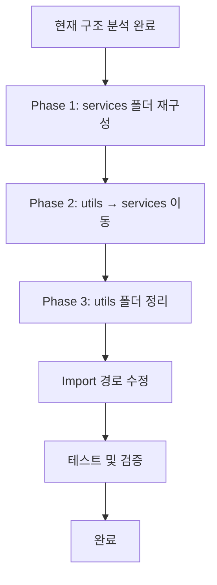

# Services 및 Utils 폴더 구조 개선 계획

## 1. 현재 상황 분석

### 1-1. `services/fridge` 폴더 내 파일 역할

| 파일명 | 역할 | 성격 |
|--------|------|------|
| [`CameraMovementService.ts`](src/services/fridge/CameraMovementService.ts) | GSAP 기반 시네마틱 카메라 이동 담당 | Service |
| [`DamperAnimationService.ts`](src/services/fridge/DamperAnimationService.ts) | 댐퍼 애니메이션 명령 관리 및 JSON 설정 로드 | Service |
| [`DamperAssemblyService.ts`](src/services/fridge/DamperAssemblyService.ts) | 댐퍼 조립 서비스 (현재는 디버깅용 기능만 유지) | Service |
| [`DamperCaseBodyAnimationService.ts`](src/services/fridge/DamperCaseBodyAnimationService.ts) | 댐퍼 케이스 바디 선형 이동 애니메이션 | Service |
| [`DamperCoverAssemblyService.ts`](src/services/fridge/DamperCoverAssemblyService.ts) | 댐퍼 커버 조립/분해 로직 (돌출부/홈 결합) | Service |
| [`ManualAssemblyManager.ts`](src/services/fridge/ManualAssemblyManager.ts) | 수동 조립 관리자 (조립/분해 함수 중앙 관리) | Service |
| [`PartAssemblyService.ts`](src/services/fridge/PartAssemblyService.ts) | GSAP Timeline 기반 부품 조립 서비스 | Service |
| [`ScrewAnimationService.ts`](src/services/fridge/ScrewAnimationService.ts) | 스크류 회전 애니메이션 서비스 | Service |
| [`ScrewLinearMoveAnimationService.ts`](src/services/fridge/ScrewLinearMoveAnimationService.ts) | 스크류 선형 이동 애니메이션 서비스 | Service |

### 1-2. `services` 폴더 내 파일 역할

| 파일명 | 역할 | 성격 |
|--------|------|------|
| [`AnimatorAgent.ts`](src/services/AnimatorAgent.ts) | LLM 기반 애니메이션 에이전트 (도어 제어, 애니메이션 실행) | Service |
| [`AnimationHistoryService.ts`](src/services/AnimationHistoryService.ts) | 애니메이션 히스토리 관리 (localStorage 연동) | Service |

### 1-3. `shared/utils` 폴더 내 파일 분석

**순수 유틸리티 함수 (Utils 성격):**
| 파일명 | 역할 |
|--------|------|
| [`commonUtils.ts`](src/shared/utils/commonUtils.ts) | 범용 유틸리티 함수 (바운딩 박스, 좌표 변환 등) |
| [`animationUtils.ts`](src/shared/utils/animationUtils.ts) | 애니메이션 관련 유틸리티 함수 |
| [`fridgeConstants.ts`](src/shared/utils/fridgeConstants.ts) | 냉장고 관련 상수 정의 |
| [`isFastener.ts`](src/shared/utils/isFastener.ts) | 패스너 판별 유틸리티 |
| [`screwAnimationUtils.ts`](src/shared/utils/screwAnimationUtils.ts) | 스크류 애니메이션 계산 유틸리티 |
| [`highlightTreeNode.ts`](src/shared/utils/highlightTreeNode.ts) | 트리 노드 하이라이트 유틸리티 |
| [`removeClickedNode.ts`](src/shared/utils/removeClickedNode.ts) | 클릭된 노드 제거 유틸리티 |

**서비스 클래스 (Service 성격 - 잘못 배치됨):**
| 파일명 | 역할 | 문제점 |
|--------|------|--------|
| [`GrooveDetectionService.ts`](src/shared/utils/GrooveDetectionService.ts) | 홈 탐지 서비스 | Service인데 utils에 위치 |
| [`MetadataLoader.ts`](src/shared/utils/MetadataLoader.ts) | 메타데이터 로딩 서비스 (싱글톤) | Service인데 utils에 위치 |
| [`NormalBasedHighlight.ts`](src/shared/utils/NormalBasedHighlight.ts) | 법선 기반 하이라이트 서비스 | Service인데 utils에 위치 |
| [`HoleCenterManager.ts`](src/shared/utils/HoleCenterManager.ts) | 홈 중심점 관리 서비스 | Service인데 utils에 위치 |
| [`AssemblyPathVisualizer.ts`](src/shared/utils/AssemblyPathVisualizer.ts) | 조립 경로 시각화 서비스 | Service인데 utils에 위치 |
| [`AssemblyStateManager.ts`](src/shared/utils/AssemblyStateManager.ts) | 조립 상태 관리 서비스 | Service인데 utils에 위치 |
| [`NodeNameManager.ts`](src/shared/utils/NodeNameManager.ts) | 노드 이름 관리 서비스 | Service인데 utils에 위치 |
| [`NodeNameLoader.ts`](src/shared/utils/NodeNameLoader.ts) | 노드 이름 로딩 서비스 | Service인데 utils에 위치 |
| [`SelectionHandler.ts`](src/shared/utils/SelectionHandler.ts) | 선택 핸들러 서비스 | Service인데 utils에 위치 |
| [`DebugObjectManager.ts`](src/shared/utils/DebugObjectManager.ts) | 디버그 객체 관리 서비스 | Service인데 utils에 위치 |
| [`ClickPointMarker.ts`](src/shared/utils/ClickPointMarker.ts) | 클릭 포인트 마커 서비스 | Service인데 utils에 위치 |
| [`SnapDetectionUtils.ts`](src/shared/utils/SnapDetectionUtils.ts) | 스냅 감지 서비스 | Service인데 utils에 위치 |
| [`CoordinateTransformUtils.ts`](src/shared/utils/CoordinateTransformUtils.ts) | 좌표 변환 서비스 | Service인데 utils에 위치 |
| [`findNodeHeight.ts`](src/shared/utils/findNodeHeight.ts) | 노드 높이 탐지 서비스 | Service인데 utils에 위치 |
| [`GrooveDetectionUtils.ts`](src/shared/utils/GrooveDetectionUtils.ts) | 홈 탐지 유틸리티 서비스 | Service인데 utils에 위치 |
| [`StencilOutlineHighlight.ts`](src/shared/utils/StencilOutlineHighlight.ts) | 스텐실 아웃라인 하이라이트 서비스 | Service인데 utils에 위치 |

---

## 2. 문제점 진단

### 2-1. 폴더 역할 모호성

```
현재 구조의 문제점:
┌─────────────────────────────────────────────────────────────┐
│ services/                                                    │
│   ├── AnimatorAgent.ts          (Service - 올바른 위치)      │
│   ├── AnimationHistoryService.ts (Service - 올바른 위치)     │
│   └── fridge/                                               │
│       ├── CameraMovementService.ts (Service - 올바른 위치)   │
│       └── ...                                               │
│                                                             │
│ shared/utils/                                               │
│   ├── commonUtils.ts            (Utils - 올바른 위치)        │
│   ├── animationUtils.ts         (Utils - 올바른 위치)        │
│   ├── GrooveDetectionService.ts (Service - 잘못된 위치!)     │
│   ├── MetadataLoader.ts         (Service - 잘못된 위치!)     │
│   ├── NormalBasedHighlight.ts   (Service - 잘못된 위치!)     │
│   └── ... (여러 Service들이 섞여 있음)                       │
└─────────────────────────────────────────────────────────────┘
```

### 2-2. 핵심 문제

1. **Service와 Utils의 혼재**: `shared/utils`에 상태를 가진 서비스 클래스들이 다수 존재
2. **명명 규칙 불일치**: `~Service`, `~Utils`, `~Manager` 등이 혼재하며 역할 구분이 모호
3. **응집도 저하**: 관련된 기능들이 여러 폴더에 분산되어 있음
4. **의존성 복잡성**: services와 utils 간의 순환 참조 가능성

---

## 3. 개선 제안

### 3-1. 폴더 구조 재정의

```
제안하는 새로운 구조:
src/
├── services/                          # 비즈니스 로직 서비스
│   ├── core/                          # 핵심 서비스
│   │   ├── AnimatorAgent.ts
│   │   └── AnimationHistoryService.ts
│   │
│   ├── camera/                        # 카메라 관련 서비스
│   │   └── CameraMovementService.ts
│   │
│   ├── assembly/                      # 조립/분해 관련 서비스
│   │   ├── DamperAssemblyService.ts
│   │   ├── DamperCoverAssemblyService.ts
│   │   ├── PartAssemblyService.ts
│   │   └── ManualAssemblyManager.ts
│   │
│   ├── animation/                     # 애니메이션 관련 서비스
│   │   ├── DamperAnimationService.ts
│   │   ├── DamperCaseBodyAnimationService.ts
│   │   ├── ScrewAnimationService.ts
│   │   └── ScrewLinearMoveAnimationService.ts
│   │
│   ├── detection/                     # 탐지 관련 서비스
│   │   ├── GrooveDetectionService.ts
│   │   ├── GrooveDetectionUtils.ts
│   │   └── SnapDetectionService.ts
│   │
│   ├── visualization/                 # 시각화 관련 서비스
│   │   ├── NormalBasedHighlightService.ts
│   │   ├── AssemblyPathVisualizer.ts
│   │   ├── StencilOutlineHighlight.ts
│   │   └── ClickPointMarker.ts
│   │
│   └── data/                          # 데이터 관련 서비스
│       ├── MetadataLoader.ts
│       ├── NodeNameManager.ts
│       ├── NodeNameLoader.ts
│       ├── HoleCenterManager.ts
│       └── AssemblyStateManager.ts
│
├── shared/
│   ├── utils/                         # 순수 함수형 유틸리티
│   │   ├── commonUtils.ts
│   │   ├── animationUtils.ts
│   │   ├── coordinateUtils.ts
│   │   ├── screwAnimationUtils.ts
│   │   └── geometryUtils.ts
│   │
│   ├── constants/                     # 상수 정의
│   │   └── fridgeConstants.ts
│   │
│   └── types/                         # 타입 정의
│       └── three-examples.d.ts
│
└── components/                        # React 컴포넌트
    └── ...
```

### 3-2. Service vs Utils 구분 기준

| 구분 | Service | Utils |
|------|---------|-------|
| **상태** | 상태를 가짐 (멤버 변수) | 상태가 없음 (순수 함수) |
| **인스턴스** | 싱글톤 또는 인스턴스 생성 | 정적 함수만 제공 |
| **의존성** | 다른 서비스에 의존 가능 | 외부 의존성 최소화 |
| **명명** | `~Service`, `~Manager` | `~Utils`, `~Helper` |
| **예시** | `MetadataLoader`, `CameraMovementService` | `commonUtils`, `animationUtils` |

### 3-3. 파일 이동 계획

#### Phase 1: services 폴더 내 재구성
- [ ] `services/core/` 폴더 생성 및 핵심 서비스 이동
- [ ] `services/camera/` 폴더 생성 및 카메라 서비스 이동
- [ ] `services/assembly/` 폴더 생성 및 조립 서비스 이동
- [ ] `services/animation/` 폴더 생성 및 애니메이션 서비스 이동

#### Phase 2: utils → services 이동
- [ ] `GrooveDetectionService.ts` → `services/detection/`
- [ ] `MetadataLoader.ts` → `services/data/`
- [ ] `NormalBasedHighlight.ts` → `services/visualization/` (이름 변경: `NormalBasedHighlightService.ts`)
- [ ] `HoleCenterManager.ts` → `services/data/`
- [ ] `AssemblyPathVisualizer.ts` → `services/visualization/`
- [ ] `AssemblyStateManager.ts` → `services/data/`
- [ ] `NodeNameManager.ts` → `services/data/`
- [ ] `NodeNameLoader.ts` → `services/data/`
- [ ] `SelectionHandler.ts` → `services/detection/`
- [ ] `DebugObjectManager.ts` → `services/visualization/`
- [ ] `ClickPointMarker.ts` → `services/visualization/`
- [ ] `SnapDetectionUtils.ts` → `services/detection/` (이름 변경: `SnapDetectionService.ts`)
- [ ] `CoordinateTransformUtils.ts` → `shared/utils/` (이름 변경: `coordinateUtils.ts`)
- [ ] `findNodeHeight.ts` → `services/detection/`
- [ ] `GrooveDetectionUtils.ts` → `services/detection/`
- [ ] `StencilOutlineHighlight.ts` → `services/visualization/`

#### Phase 3: utils 폴더 정리
- [ ] `fridgeConstants.ts` → `shared/constants/`
- [ ] 순수 유틸리티 함수만 `shared/utils/`에 유지

---

## 4. 기대 효과

### 4-1. 명확한 책임 분리
- Service: 비즈니스 로직 및 상태 관리
- Utils: 순수 함수형 유틸리티
- Constants: 상수 정의

### 4-2. 유지보수성 향상
- 관련 기능들이 응집력 있게 그룹화
- 파일 위치만으로 역할 파악 가능

### 4-3. 확장성 확보
- 새로운 서비스 추가 시 명확한 배치 기준
- 도메인별 폴더 구분으로 기능 확장 용이

---

## 5. 실행 순서



---

## 6. 주의사항

1. **Import 경로 수정**: 파일 이동 후 모든 import 경로를 업데이트해야 함
2. **순환 참조 확인**: 서비스 간 의존성을 분석하여 순환 참조 방지
3. **점진적 적용**: 한 번에 모든 파일을 이동하지 않고 단계적으로 진행
4. **테스트 필수**: 각 단계마다 기능 동작 확인

---

## 7. 요약

현재 `shared/utils` 폴더에 서비스 클래스들이 다수 섞여 있어 역할이 모호해진 상황입니다. 이를 해결하기 위해:

1. **Service**는 상태를 가지며 비즈니스 로직을 담당 → `services/` 폴더로 이동
2. **Utils**는 순수 함수로 구성 → `shared/utils/` 폴더에 유지
3. 도메인별 하위 폴더 구성으로 응집도 향상

이러한 구조 개선을 통해 코드의 가독성, 유지보수성, 확장성을 모두 향상시킬 수 있습니다.
