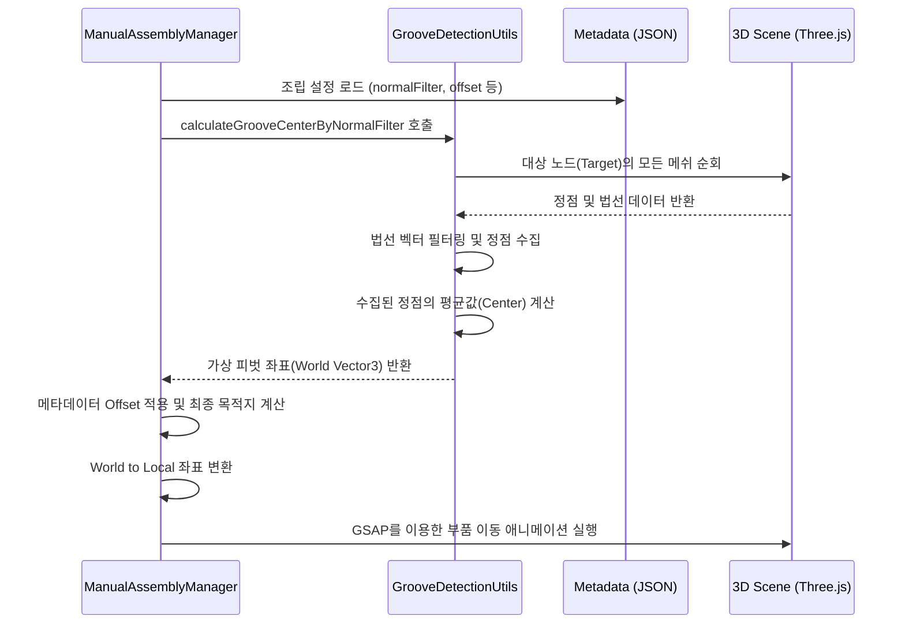

# 가상 피벗(Virtual Pivot) 기반 조립 구현 계획서

본 문서는 3D 모델 내에 물리적인 더미 노드(Socket/Pivot)가 없는 환경에서, **정점 법선 벡터 분석(Vertex Normal Analysis)**을 통해 가상의 조립 기준점을 추출하고 이를 활용해 정밀 조립을 수행하는 방식을 정의합니다.

## 1. 개요 (Overview)
*   **목적:** 수동 수치 조정(Ratio 등)을 최소화하고, 기하학적 특징을 기반으로 조립 위치를 자동 계산.
*   **핵심 기술:** Vertex Normal Filtering, World-to-Local Coordinate Transformation, GSAP Animation.
*   **대상 부품:** 댐퍼 커버(Moving Part) 및 댐퍼 어셈블리(Target Part).

## 2. 조립 프로세스 (Process Flow)

## 3. 주요 수정 및 참고 파일

### 3.1 [`src/shared/utils/GrooveDetectionUtils.ts`](src/shared/utils/GrooveDetectionUtils.ts) (수정 권장)
*   **역할:** 법선 벡터 분석을 통한 실제 좌표 계산 로직 담당.
*   **수정 사항:** 
    *   `calculateGrooveCenterByNormalFilter` 메서드 보강.
    *   인덱스가 없는(Non-indexed) 지오메트리에 대한 예외 처리 추가 (Robustness 확보).

### 3.2 [`src/services/fridge/ManualAssemblyManager.ts`](src/services/fridge/ManualAssemblyManager.ts) (수정 대상)
*   **역할:** 조립 시퀀스 제어 및 서비스 통합.
*   **수정 사항:**
    *   `assembleDamperCover` 함수 내 `grooveCenter` 계산 로직 교체.
    *   Bounding Box 기반에서 Normal Analysis 기반으로 변경.

### 3.3 [`public/metadata/assembly-offsets.json`](public/metadata/assembly-offsets.json) (참고)
*   **역할:** 부품별 법선 필터링 기준 및 미세 조정 오프셋 저장.
*   **주요 속성:**
    *   `normalFilter`: 추출하고자 하는 면의 방향 (예: `{x:0, y:0, z:1}`).
    *   `normalTolerance`: 법선 일치 허용 오차.
    *   `offset`: 가상 피벗으로부터의 최종 안착 위치 미세 조정값.

## 4. 단계별 구현 가이드

### Step 1: 기하학적 분석 로직 강화
`GrooveDetectionUtils`에서 `NormalBasedHighlight`의 견고한 분석 로직을 이식합니다. 단순히 면을 찾는 것을 넘어, 수집된 모든 정점의 산술 평균을 구해 월드 좌표로 반환합니다.

### Step 2: 가상 피벗 추출 및 검증
`ManualAssemblyManager`에서 계산된 `grooveCenter` 위치에 디버그용 구체(Sphere)를 생성하여, 시각적으로 홈의 중앙에 정확히 위치하는지 확인합니다.

### Step 3: 좌표계 변환 및 이동
1.  추출된 월드 좌표에 타겟 노드의 회전값이 반영된 `offset`을 더합니다.
2.  이동할 부품(Cover)의 부모 좌표계를 기준으로 `worldToLocal` 변환을 수행합니다.
3.  GSAP의 `power2.inOut` 이징을 적용하여 부드럽게 삽입합니다.

## 5. 기대 효과
*   **정밀도 향상:** Bounding Box의 빈 공간에 의한 오차 제거.
*   **유지보수성:** 모델링 데이터가 업데이트되어도 노드 이름과 방향성만 유지되면 코드 수정 없이 대응 가능.
*   **확장성:** 나사 체결, 플러그 삽입 등 다른 조립 시나리오에도 동일 로직 재사용 가능.
